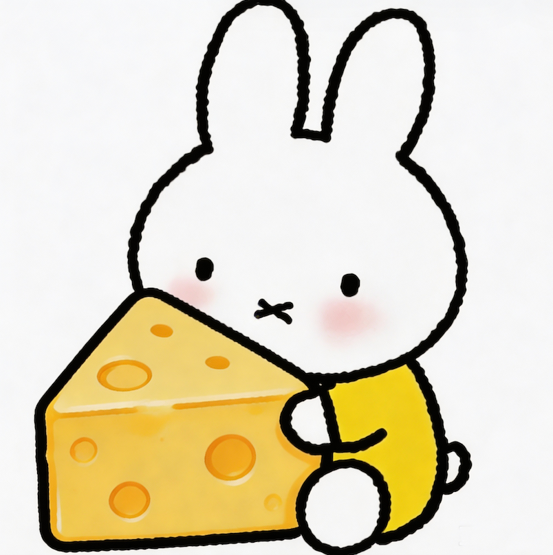

# 关于站点

我们叫 **“兔芝士”**

你没看错，这不是拼写错误，而是一次**用心的谐音梗**。

因为 **“芝士” = “知识”** 啦！

站长是一位热爱学习、乐于分享的人，创建这个站点的初衷很简单：
**把知识像芝士一样，一块一块地分享出去。**

而那只蹦蹦跳跳的小兔子？
它是我们站点的灵魂象征——
**好奇、敏捷、爱吃芝士，更爱探索世界。**

于是，“兔芝士”诞生了：
一只兔子，一块芝士，一个关于知识的故事。

