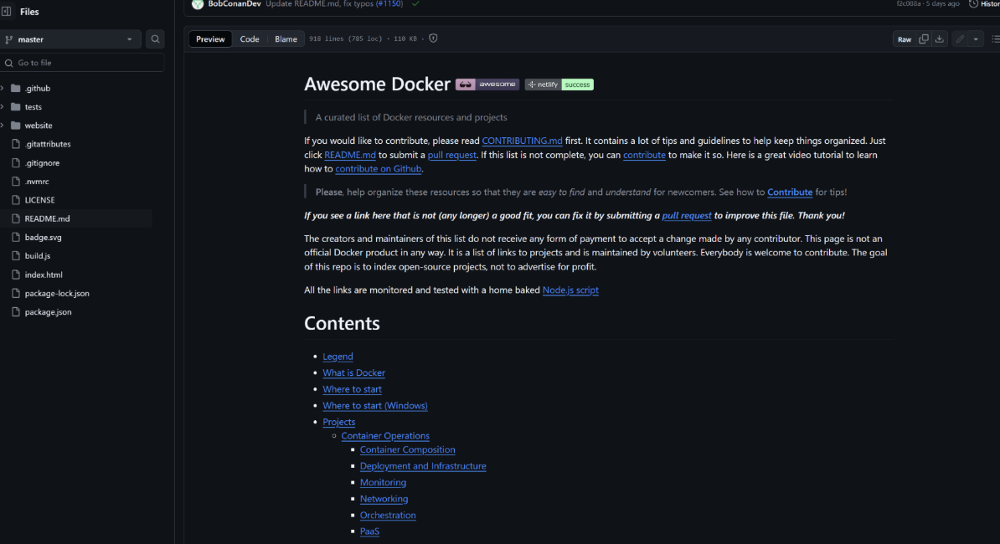
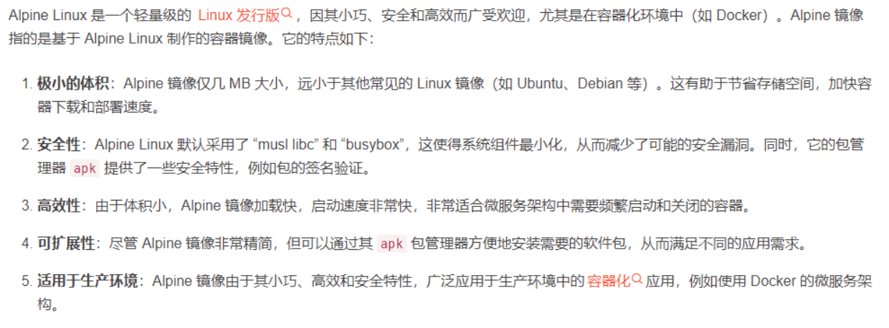
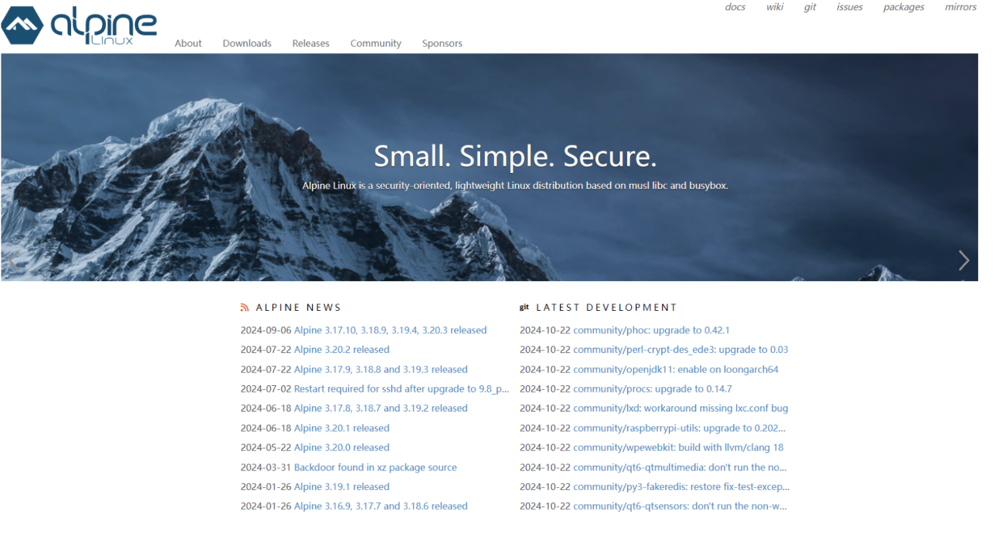
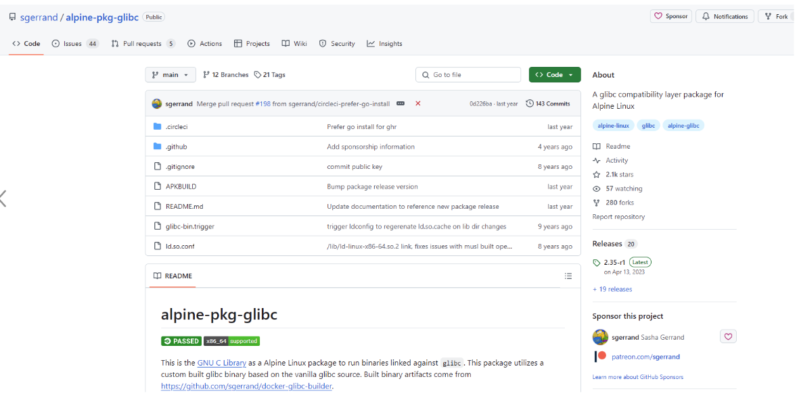
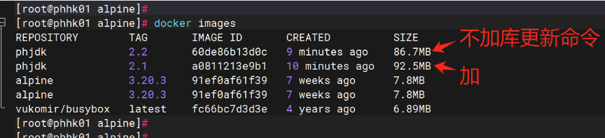
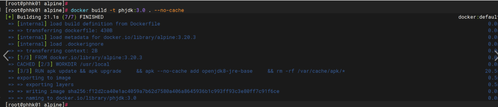
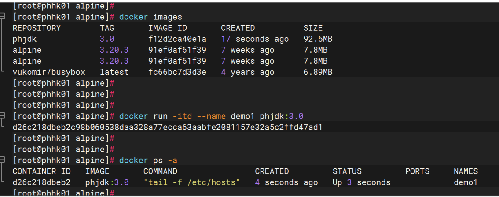
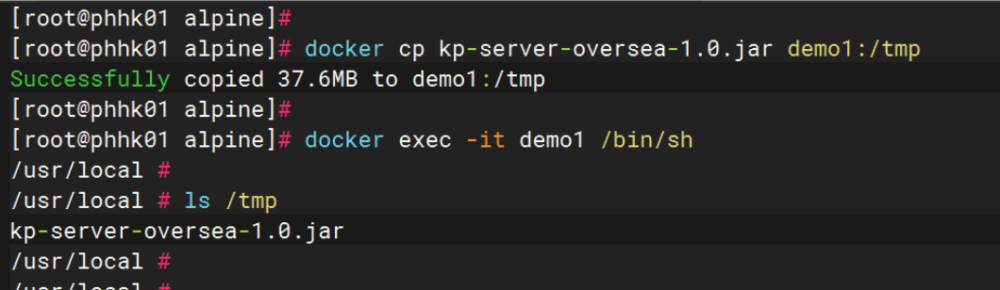
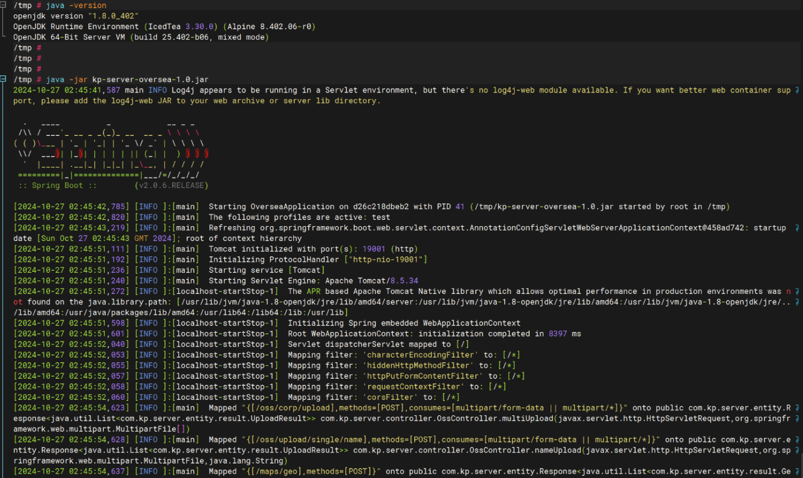
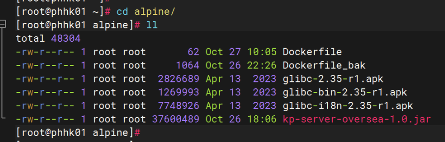

# Docker

[TOC]

docker学习章节

大量优秀的Docker学习工具：https://github.com/veggiemonk/awesome-docker/blob/master/README.md#terminal



## 1、下载与安装

### 1、RPM包安装

下载对应客户端和版本的rpm包安装即可，效率最快；

下载地址：https://download.docker.com/

### 2、源码安装

==待更新…==

### 3、在线安装

```go
//ubuntu-22.04 在线安装例子如下
sudo apt update
sudo apt upgrade
sudo apt install apt-transport-https ca-certificates curl software-properties-common gnupg lsb-release
curl -fsSL https://download.docker.com/linux/ubuntu/gpg | sudo gpg --dearmor -o /usr/share/keyrings/docker-archive-keyring.gpg
sudo echo "deb [arch=$(dpkg --print-architecture) signed-by=/usr/share/keyrings/docker-archive-keyring.gpg] https://download.docker.com/linux/ubuntu $(lsb_release -cs) stable" | sudo tee /etc/apt/sources.list.d/docker.list > /dev/null
sudo apt update
sudo apt install docker-ce docker-ce-cli containerd.io docker-compose-plugin

//安装docker-compose
sudo curl -L "https://github.com/docker/compose/releases/download/v2.6.1/docker-compose-$(uname -s)-$(uname -m)" -o /usr/local/bin/docker-compose
sudo chmod +x /usr/local/bin/docker-compose
docker-compose -v
```

## 2、镜像制作

记录Dockerfile镜像打包各种常用的中间件等

### 1、最小JDK制作

**前言：**制作一个jdk的docker images有很多方式，有简单的直接利用centos、ubuntu等底座构建，但是打包出来的镜像包就很大，光底座占用的就有几百MB，所以需用一种轻量级且又性能佳、安全性强的底座就非常重要了，此处我们选用业界非常流行的Alpine作为底座，其只有7MB左右，非常轻量且安全，接下来将操作基于Alpine制作一个jdk环境的images；Alpine能够如此小巧是因为它没有集成一些普通的Linux库，比如跑Java应用必须依赖的glibc相关的包，所以得像平常在Linux安装应用一样先为alpine安装这些包，主要需要的依赖包有 glibc、glibc-bin 和 glibc-i18n等。



**笔者环境：**宿主os为Rockey Liunx9.4，docker版本为1.26.x，Alpine版本为3.20.3，JDK为8.x

**Alpine官网：**https://www.alpinelinux.org/



**Glibc-Alpine下载地址：**

https://github.com/sgerrand/alpine-pkg-glibc

https://github.com/sgerrand/docker-glibc-builder  (new release)



#### 1、利用apk已有的在线库安装

```go
//最简单的方法是利用已有的apk包进行在线安装,如下所示；
//这里介绍进行apk在线安装
```

```go
//编写Dockerfile文件，安装一个最小的java8运行环境，即只安装应用程序环境jre即可，可以很好的减少镜像包的容量，且加强了容器安全，示例如下：
//如果dockerfile里面不加更新apk的库命令，正常来说最后的镜像包大小在86.7MB，加了update等更新命令时镜像包大小约为92.5MB左右,默认此处加更新；
vim Dockerfile
##########################
FROM alpine:3.20.3
LABEL author="penghao" date="2024-10-27"
WORKDIR /usr/local
#RUN echo http://mirrors.aliyun.com/alpine/v3.20/main/ > /etc/apk/repositories \       #阿里云源
#    && echo http://mirrors.aliyun.com/alpine/v3.20/community/ >> /etc/apk/repositories \      #阿里云源
RUN apk update && apk upgrade \     #库更新，会额外多几MB空间
    && apk --no-cache add openjdk8-jre-base \
    && rm -rf /var/cache/apk/*
CMD ["tail","-f","/etc/hosts"]
```



```go
//构建
docker build -t phjdk:3.0 . --no-cache
```



```go
//启动已制作好jdk包，并进行jar包启动测试,该处的jar包仅作启动测试与业务无关
docker run -itd --name demo1 phjdk:3.0
docker ps -a
docker cp kp-server-oversea-1.0.jar demo1:/tmp
```





```go
//可以看到jar已成功启动，说明我们的极简的jdk镜像包制作成功了
java -jar kp-server-oversea-1.0.jar
netstat -nap | grep 19001
```



#### 2、安装包自安装(==待更新==)

```go
//上面我们是利用官方库在线安装的jdk环境，下面我们介绍自己安装
//首先将需要的安装包下载到本地，如下所示
```



## 3、更换默认根目录

```go
docker info | grep -i root
// 创建新目录
mkdir /data/docker
// 完整同步原目录所有属性到新目录
rsync -avX /var/lib/docker/  /data/docker/

-a：归档模式，保留权限、属主、目录结构
-X：保留 SELinux 扩展属性（Rocky/CentOS 必须加，否则 Docker 启动报错权限拒绝）
```

```go
vim /etc/docker/daemon.json
---
{
  "data-root": "/data/docker",
  "log-driver": "json-file",
  "log-opts": {
    "max-size": "20m",
    "max-file": "5"
  }
}
---
// 重载 systemd 并启动，验证有效性
systemctl daemon-reload
systemctl start docker
// 校验根目录是否生效
docker info | grep "Docker Root Dir"
// 校验原有镜像、容器是否全部存在
docker images
docker ps -a
// 保留原目录 2~3 天，业务无故障再删除/var/lib/docker，方便回滚应急
```


