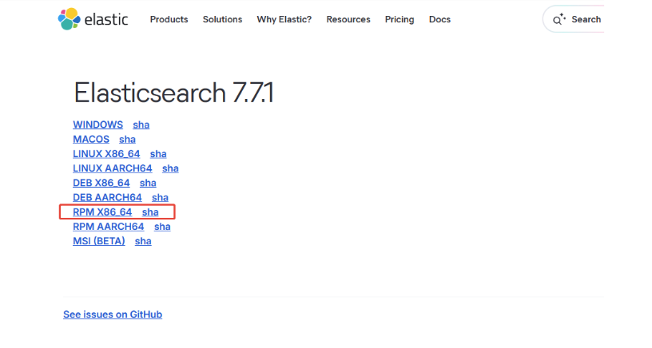
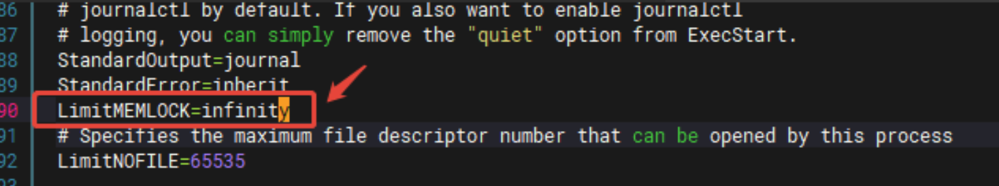
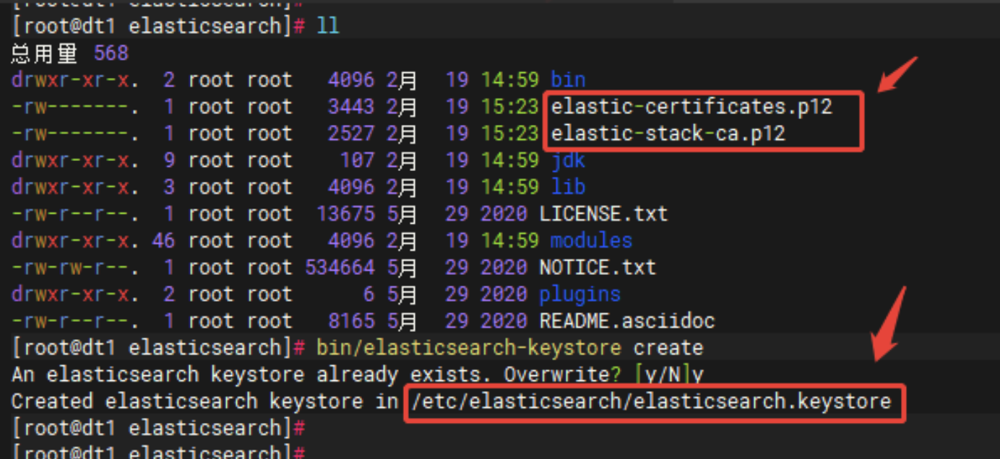
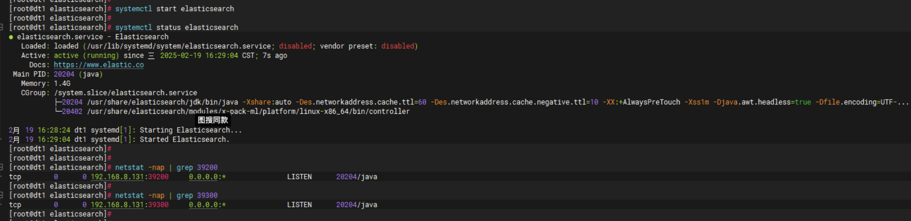
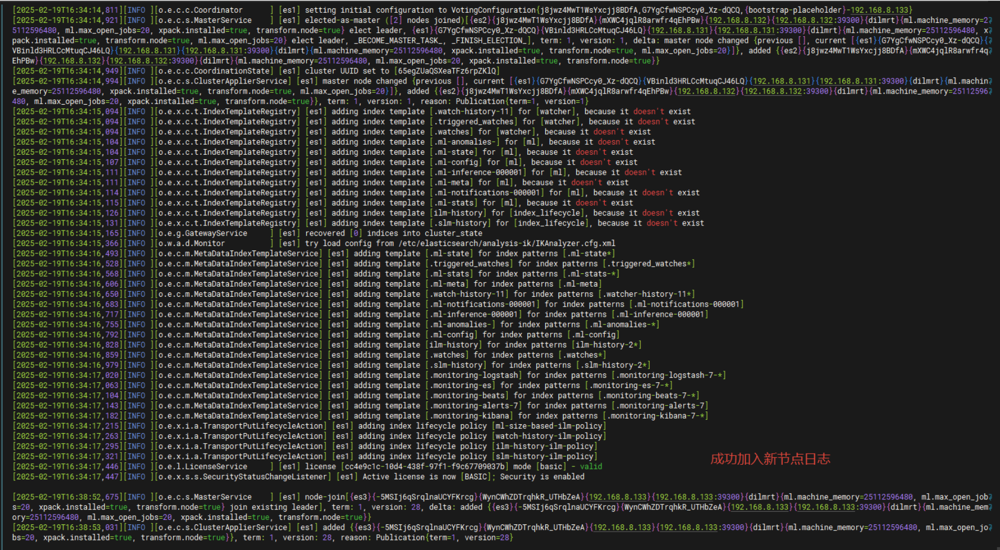
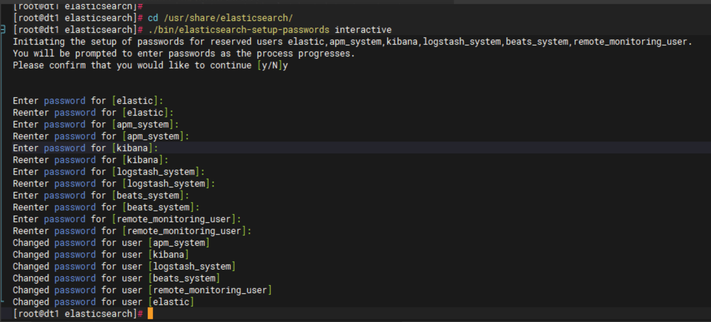
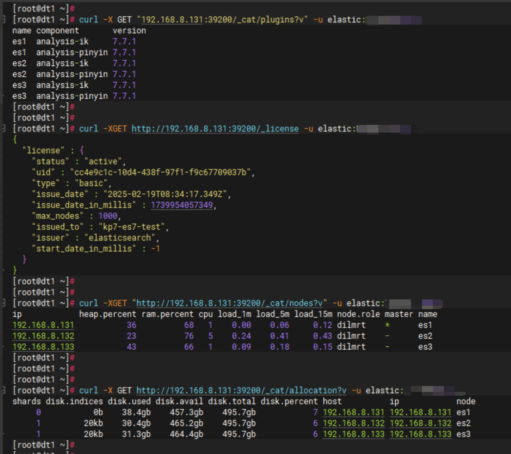

# ES

Elasticsearch 学习章节


## 1、安装与搭建

### 1、rpm方式搭建es3节点集群

rpm包下载地址，此处我们选择的版本号为 v7.7.1：https://www.elastic.co/downloads/past-releases/elasticsearch-7-7-1



主机规划如下:

| dt1  | 192.168.8.131 |
| ---- | ------------- |
| dt2  | 192.168.8.132 |
| dt3  | 192.168.8.133 |

```go
// 3台机器都操作，如有报错无java环境需自行安装
 rpm -ivh elasticsearch-7.7.1-x86_64.rpm
// 编辑配置文件 elasticsearch.yml，内如如下（注意可变的地方，不要照全抄）：
vim /etc/elasticsearch/elasticsearch.yml
cluster.name: kp7-es7-test
node.name: es1
path.data: /var/lib/elasticsearch
path.logs: /var/log/elasticsearch
bootstrap.memory_lock: true
network.host: 192.168.8.131
http.port: 39200
transport.port: 39300
discovery.seed_hosts: ["192.168.8.131", "192.168.8.132", "192.168.8.133"]
cluster.initial_master_nodes: ["192.168.8.131", "192.168.8.132", "192.168.8.133"]
xpack.security.enabled: true
xpack.security.transport.ssl:
  enabled: true
  verification_mode: none
  keystore.path: certs/elastic-certificates.p12
  truststore.path: certs/elastic-certificates.p12

// 修改 systemd 文件
vim /usr/lib/systemd/system/elasticsearch.service
//添加：LimitMEMLOCK=infinity
systemctl daemon-reload
```



```go
// 生成tls证书和设置密码，只在dt1上操作，最后把证书scp给其他2个节点即可：
cd /usr/share/elasticsearch/
./bin/elasticsearch-certutil ca          // 密码可空，回车
./bin/elasticsearch-certutil cert --ca elastic-stack-ca.p12     // 密码可空，回车
./bin/elasticsearch-keystore create
// 会得到3个文件，如下图所示
```



```go
// 分发证书给其他节点
cd /etc/elasticsearch/  &&  mkdir  certs
mv /usr/share/elasticsearch/elastic-* certs/   &&   chmod 770 certs/*
// 在其他2个节点相同目录建立 certs目录，然后把 elastic-certificates.p12、elastic-stack-ca.p12两个文件放到certs中，注意权限也要正确
// elasticsearch.keystore 文件也要scp过去，保持一致，注意目录结构要正确
```

```go
// 分词器安装，每台节点都进行
cd /usr/share/elasticsearch
bin/elasticsearch-plugin install https://get.infini.cloud/elasticsearch/analysis-ik/7.7.1
bin/elasticsearch-plugin install https://get.infini.cloud/elasticsearch/analysis-pinyin/7.7.1

// 启动ES，查看日志和端口是否正确开启
```





```go
// 设置集群密码
cd /usr/share/elasticsearch/
./bin/elasticsearch-setup-passwords interactive   // 本初设置为 pi@2025
```



```go
// 最后检查集群状态
curl -X GET "192.168.8.131:39200/_cat/plugins?v" -u elastic:pi@2025
curl -XGET http://192.168.8.131:39200/_license -u elastic:pi@2025
curl -XGET "http://192.168.8.131:39200/_cat/nodes?v" -u elastic:pi@2025
curl -X GET http://192.168.8.131:39200/_cat/allocation?v -u elastic:pi@2025
```



## 2、常用命令

### 1、集群检查

```go
1、查询集群状态命令
curl -XGET "http://ip:port/_cluster/health?pretty"
2、查询Es全局状态
curl -XGET "http://ip:port/_cluster/stats?pretty"
3、查询集群设置
curl -XGET "http://ip:port/_cluster/settings?pretty"
4、查看集群文档总数
curl -XGET "http://ip:port/_cat/count?v"
5、查看集群别名组
curl -XGET "http://ip:port/_cat/aliases"
6、查看当前集群索引分片信息
curl -XGET "http://ip:port/_cat/shards?v"   //查看某一个索引可用shards/索引名?v
7、查看集群实例存储详细信息
curl -XGET "http://ip:port/_cat/allocation?v"
8、查看当前集群的所有实例
curl -XGET "http://ip:port/_cat/nodes?v"
9、查看某索引分片转移进度
curl -XGET "http://ip:port/_cat/recovery/索引名?v"
10、查看当前集群等待任务
curl -XGET "http://ip:port/_cat/pending_tasks?v"
11、查看集群写入线程池任务
curl -XGET "http://ip:port/_cat/thread_pool/bulk?v"
12、查看集群查询线程池任务
curl -XGET "http://ip:port/_cat/thread_pool/search?v"
13、查看分片未分配的原因
curl -XGET "http://127.0.0.1:24100/_cat/shards?v&h=index,shard,prirep,state,node,unassigned.reason" | grep UNASSIGNED
```

### 2、集群设置

```go
1、设置集群分片恢复参数
curl -XPUT   "http://ip:httpport/_cluster/settings"  -H  'Content-Type: application/json' -d' { "transient": {"cluster.routing.allocation.node_initial_primaries_recoveries":60,"cluster.routing.allocation.node_concurrent_recoveries":30,   "cluster.routing.allocation.cluster_concurrent_rebalance":30} }'
2、根据实例名称使EsNodeX实例下线
curl -XPUT  "http://ip:httpport/_cluster/settings" -H 'Content-Type: application/json' -d' {"transient": { "cluster.routing.allocation.exclude._name": "EsNode2@ip" } }'
3、根据ip使ES数据节点下线
curl -XPUT  "http://ip:httpport/_cluster/settings" -H 'Content-Type: application/json' -d' {"transient": { "cluster.routing.allocation.exclude._ip": "ip1,ip2,ip3"} }'
4、设置分片恢复过程中的最大带宽速度
curl -XPUT "http://127.0.0.1:24100/_cluster/settings" -H 'Content-Type: application/json' -d'{ "transient":{"indices.recovery.max_bytes_per_sec":"500mb"}}'
5、重新分片为空的主分片
curl -XPOST  "http://127.0.0.1:24100/_cluster/reroute?pretty" -H 'Content-Type:application/json' -d '{"commands": [{ "allocate_empty_primary": {"index": "indexname", "shard": 2,"node": "EsNode1@81.20.5.24","accept_data_loss":true }}]}'
6、重新分配主分片，会尝试将过期副本分片分片为主
curl -XPOST "http://127.0.0.1:24100/_cluster/reroute?pretty" -H 'Content-Type:application/json' -d '{"commands": [{"allocate_stale_primary": {"index": "index1","shard": 2,"node": "EsNode1@189.39.172.103","accept_data_loss":true }}]}'
7、清理ES所有缓存
curl -XPOST "http://ip:port/_cache/clear"
8、关闭分片自动平衡
curl -XPUT "http://ip:port/_cluster/settings" -H 'Content-Type:application/json' -d '{   "transient":{   "cluster.routing.rebalance.enable":"none" }}'
9、手动刷新未分配的分片
curl -XPOST "http://127.0.0.1:24100/_cluster/reroute?retry_failed=true"
```

### 3、索引查看

```go
1、查询索引mapping和settings
curl -XGET --tlsv1.2  --negotiate -k -u : 'https://ip:port/my_index_name?pretty'
2、查询索引settings
curl -XGET--tlsv1.2  --negotiate -k -u : 'https://ip:port/my_index_name/_settings?pretty'
3、查看分片未分配详细命令
curl -XGET "http://127.0.0.1:24100/_cluster/allocation/explain?pretty" -H 'Content-Type:application/json' -d '{"index": "indexname","shard": 17,"primary": true}'
4、修改索引只读字段属性为null，放开写入
curl -XPUT  "http://127.0.0.1:24100/*/_settings" -H 'Content-Type: application/json' -d '{"index.blocks.read_only_allow_delete": null}'
5、查看已分配详情
curl -X GET http://es4:9200/_cat/allocation?v
6、查看所有索引的大小
curl -X GET "localhost:9200/_cat/indices?v&h=index,docs.count,store.size"
```

### 4、索引设置

```go
1、关闭索引
curl -XPOST 'http://ip:port/my_index/_close?pretty'
2、打开索引
curl -XPOST 'http://ip:port/my_index/_open?pretty'
3、修改索引刷新时间
curl -XPUT 'http://ip:port/my_index/_settings?pretty' -H 'Content-Type: application/json' -d'{"refresh_interval" : "60s"}'
4、修改translog文件保留时长，默认为12小时
curl -XPUT 'http://ip:port/my_index/_settings?pretty' -H 'Content-Type: application/json' -d'{"index.translog.retention.age" : "30m"}'
5、设置索引副本
curl -XPUT 'http://ip:port/my_index/_settings?pretty' -H 'Content-Type: application/json' -d'{"number_of_replicas" : 1}'
6、执行refresh，将内存数据刷新到磁盘缓存
curl -XPOST 'http://ip:port/myindex/_refresh'
7、执行flush，将磁盘缓存刷新到文件系统
curl -XPOST 'https://ip:port/myindex/_flush'
8、执行synced flush，生成syncid
curl -XPOST  'http://ip:port/_flush/synced'
9、强制执行段合并
curl -XPOST 'http://ip:httpport/myindex/_forcemerge?only_expunge_deletes=false&max_num_segments=1&flush=true&pretty'
10、设置索引在每个esnode上的分片个数
curl -XPUT 'http://ip:httpport/myindex/_settings?pretty' -H 'Content-Type: application/json' -d'{"index.routing.allocation.total_shards_per_node" : "2"}'
11、配置控制段合并的refresh、merge线程数等
curl -XPUT  "http://ip:port/my_index/_settings?pretty" -H 'Content-Type: application/json' -d'{"refresh_interval": "60s","merge":{"scheduler"：{"max_merge_count" : "100","max_thread_count" : "1"},"policy":{"segments_per_tier" : "100","floor_segment" : "1m","max_merged_segment" : "2g"}}}'
12、设置索引的刷新时间和translog配置参数（注意：设置translog参数，必须先关闭索引，设置完成后再打开）
curl -XPUT "http://ip:httpport/*/_settings" -H 'Content-Type: application/json' -d'{ "index":{ "refresh_interval" : "60s","translog":{ "flush_threshold_size": "1GB", "sync_interval": "120s", "durability": "async"}}}'
13、限制每个索引在每个实例上的分片个数
curl -XPUT  'http://ip:httpport/myindex/_settings?pretty' -H 'Content-Type:application/json' -d '{"index.routing.allocation.total_shards_per_node":"2"}'
```

### 5、实例查看

```go
1、查看实例所有别名
curl -XGET "http://ip:port/_cat/aliases"
2、查询指定ES实例的jvm参数
curl -XGET 'http://ip:port/_nodes/EsNode1*/stats/jvm?pretty'curl -XGET 'http://ip:port/_nodes/EsNode1@12.40.16.156/stats/jvm?pretty'
3、查询集群插件安装情况
curl -X GET "dt2:19200/_cat/plugins?v"
```

### 6、license问题

```go
1、查看license信息
curl -XGET http://localhost:9200/_license
2、修改成30天试用版
curl -X POST "localhost:9200/_license/start_trial?acknowledge=true&pretty"
```

