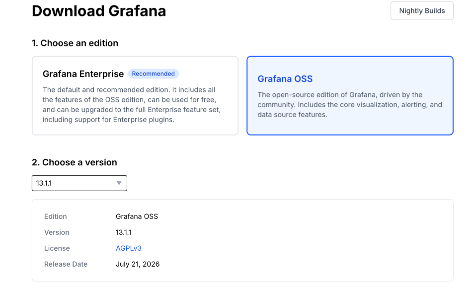
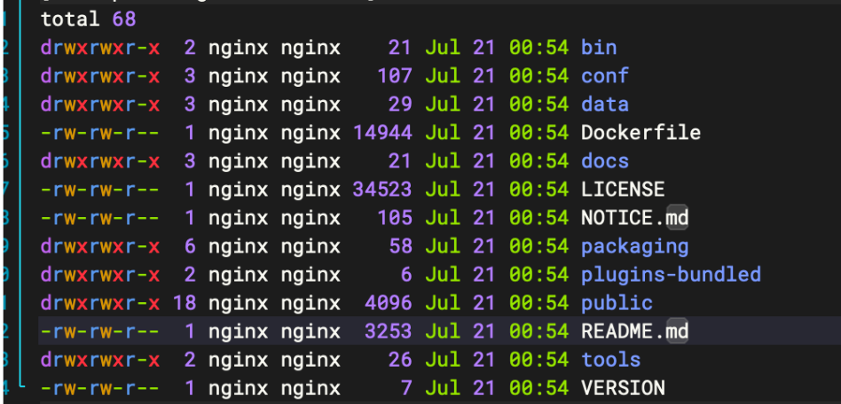

# Grafana


**Grafana 知识笔录**

Alertmanager+Prometheus 部署链接：[/tech/prometheus](https://wiki.uhowie.com/tech/prometheus)

## 1、服务部署

下载地址：https://grafana.com/grafana/download

配置文档：https://grafana.com/docs/grafana/latest/setup-grafana/configure-grafana/



我们此处选用开源oss版本即可，选择版本为 13.1.1，选用二进制部署法

```go
//下载和解压
cd /data
wget https://dl.grafana.com/grafana/release/13.1.1/grafana_13.1.1_29761037902_linux_amd64.tar.gz
tar -xvf grafana_13.1.1_29761037902_linux_amd64.tar.gz
cd grafana-13.1.1/
```



```go
//配置文件参考
cd /data/grafana-13.1.1/conf
vim custom.ini
//具体配置如下，可根据实际需求修改
# ===================== 路径配置 =====================
[paths]
# 存放Grafana数据库、面板配置、账号信息等持久化数据
data = ./data
# 日志存放目录
logs = ./logs
# 第三方插件存放目录
plugins = ./plugins

# ===================== 服务访问基础配置 =====================
[server]
# 监听端口，默认3000，可自行修改
http_port = 23000
# 【必须修改】填写服务器公网IP或者备案域名
domain = xxx.xxx.xxx.xxx
# 访问根路径，固定格式无需改动
root_url = %(protocol)s://%(domain)s:%(http_port)s/

# 禁止面板被嵌套在其他网站iframe中，公网开启防点击劫持
allow_embedding = false
# 登录会话有效期：43200秒=12小时，长时间无操作自动退出登录，公网缩短更安全
cookie_max_age = 43200
# 强制使用HTTPS传输Cookie，后续配置SSL证书后生效
strict_transport_security = true
max_connections = 40

# ===================== 安全核心配置（公网重中之重） =====================
[security]
# 开启：跳过首次登录强制修改初始密码，直接使用下面预设账号密码登录
disable_initial_admin_password = true
# 管理员用户名
admin_user = admin
# 【必须修改】设置高强度密码：大小写字母+数字+特殊符号，杜绝弱密码
admin_password = xxxxxx

# 关闭头像外部加载，减少外网请求、规避隐私风险
disable_gravatar = true
# 开启Cookie加密，公网环境保护登录凭证不被窃取
login_cookie_secure = true
# 开启暴力破解防护：多次输错密码会临时封禁IP，抵御端口扫描、密码爆破
brute_force_protection = true
# 开启内容安全策略，拦截恶意脚本注入攻击
content_security_policy = true
# 禁止加载未签名的不安全第三方插件，防止恶意插件入侵
allow_loading_unsigned_plugins = false

# ===================== 用户账号权限控制 =====================
[users]
# 禁止任何人自行注册账号，外网访客无法新建账户（核心需求）
allow_sign_up = false
# 关闭匿名访问：不登录账号完全看不到任何监控面板内容（核心需求）
allow_anonymous_login = false
# 匿名用户权限（匿名已关闭，此行仅保留占位）
anonymous_org_role = Viewer
# 普通用户看不到用户管理页面，精简界面、降低安全暴露面
hide_users_page = true

# ===================== 匿名访问总开关 =====================
[auth.anonymous]
# 彻底关闭匿名访客通道，双重兜底禁用免登录查看
enabled = false
hide_version = true

# ===================== 数据库优化（默认SQLite文件数据库，低配VPS适配） =====================
[database]
# 最大打开连接数，小内存服务器调低，减少内存占用
max_open_conn = 8
# 空闲连接数
max_idle_conn = 4
# 连接生命周期，超时自动释放连接
conn_max_lifetime = 10m

# ===================== 仪表盘面板通用设置 =====================
[dashboards]
# 面板默认自动刷新时间
default_refresh_interval = 30s
# 页面可选择的所有刷新间隔
refresh_intervals = 5s,10s,30s,1m,5m,15m,30m,1h
# 面板历史修改版本保存数量，过多会占用磁盘空间
versions_to_keep = 15

# ===================== 告警全局开关 =====================
[alerting]
# 开启整体告警功能，服务器负载异常可触发通知
#enabled = true
# 告警规则执行超时时间
#execution_timeout = 30s
# 关闭老旧告警引擎，使用新版告警框架
#alertmanager_enabled = false

# ===================== 邮箱告警推送（不需要收邮件告警可整段删除） =====================
[smtp]
#enabled = true
# QQ邮箱SMTP服务器地址端口
#host = smtp.qq.com:465
# 【修改为自己邮箱】发件邮箱
#user = xxx@qq.com
# 【修改】QQ邮箱POP3授权码（邮箱后台自行生成，不是QQ登录密码）
#password = xxxxxxxxxxxxx
#from_address = xxx@qq.com
# 邮件发送者名称
#from_name = 服务器监控告警
# 跳过证书校验
#skip_verify = true

# ===================== 暴露Grafana自身运行指标（可供Prometheus监控Grafana状态） =====================
[metrics]
enabled = false
prometheus_export_port = 29095
internal_storage_enabled = false

[metrics.graphite]
enabled = false

[metrics.prometheus]
enabled = false

# ===================== 日志级别配置 =====================
[log]
# info级别：常规运行日志；调试排错可改为debug，日志会变多
level = warn
# 日志输出方式：写入文件
mode = file
# 日志文本格式
format = text

[explore]
enabled = false

[dashboards]
snapshot_enabled = false

[memory]
# Go运行时堆内存硬性上限，推荐 384MB，整机服务多不能给太高
go_max_heap_size = 384mb

[unified_alerting]
enabled = false

[live]
# 最多20个网页同时在线查看监控，自用足够，节约WebSocket连接内存
max_connections = 20

[rendering]
server_url =
callback_url =

[tracing]
enabled = false

[analytics]
enabled = false
check_for_updates = false
reporting_enabled = false
```

启动脚本参考：

```go
#!/bin/bash
pkill grafan
sleep 0.5s
GF_PATHS_CONFIG=conf/custom.ini nohup ./bin/grafana server > grafana.log 2>&1 &
sleep 1s
```

