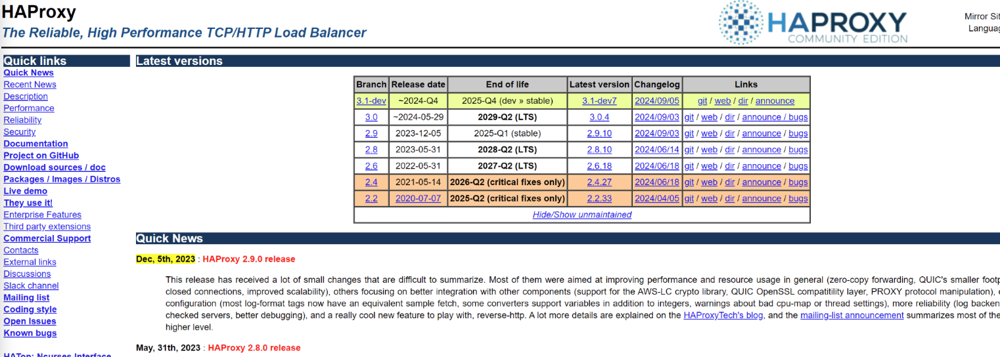

# Haproxy

Haproxy是一款优秀的高性能、可靠的TCP\HTTP负载代理软件；

一般来说，http代理选用Nginx，tcp选用HA用更好一点；

官网地址：https://www.haproxy.org/



## 1、基本用法

### TCP代理

```go
//需求：代理内网MongoDB端口3717
//配置文件如下vim /etc/haproxy/haproxy.cfg
global
    daemon
    user        haproxy
    group       haproxy
    node        haproxy
    pidfile     /var/run/haproxy.pid
    # chroot      /var/lib/haproxy          # if chrooted, change stats socket above
    stats socket /var/run/haproxy.socket user haproxy group haproxy mode 600 level admin

    # spread-checks 3                       # add randomness in check interval
    # quiet                                 # Do not display any message during startup
    maxconn     65535                       # maximum per-process number of concurrent connections

defaults
    log                global
    mode               tcp
    retries            2             # max retry connect to upstream
    timeout queue      60s           # maximum time to wait in the queue for a connection slot to be free
    timeout connect    60s           # maximum time to wait for a connection attempt to a server to succeed
    timeout client     60s           # client connection timeout
    timeout server     60s           # server connection timeout
    timeout check      60s           # health check timeout

frontend demo1
    bind *:13717
    mode tcp
    default_backend demo1
backend demo1
    mode tcp
    balance roundrobin
    server mongo1 192.168.0.3:3717 check

frontend demo2
    bind *:23717
    mode tcp
    default_backend demo2
backend demo2
    mode tcp
    balance roundrobin
    server mongo2 192.168.0.4:3717 check
```

### 应用监控

```go
global
    log            127.0.0.1    local0
    chroot         /usr/local/jiaxin/haproxy
    stats          socket /usr/local/jiaxin/haproxy/haproxy.sock mode 660 level admin
    stats          timeout 30s
    user           haproxy
    group          haproxy
    daemon

defaults
    log            global
    mode           http
    option         httplog
    option         dontlognull
    timeout        connect 5000
    timeout        client  50000
    timeout        server  50000

listen stats
    bind           0.0.0.0:18899
    stats          refresh 20s
    stats          uri /
    stats          realm Kuaipi Haproxy Manager
    stats          auth admin:KPad@123
    stats          hide-version

backend m1
    balance        roundrobin
    server         kp_nginx___________________443        m1:443 check maxconn 2000
    server         kp-server-ms-zuul________19000        m1:19000 check maxconn 2000
    server         kp-server-basic__________26101        m1:26101 check maxconn 2000

backend m2
    balance        roundrobin
    server         kp_nginx___________________443        m2:443 check maxconn 2000
    server         kp-server-ms-zuul________19000        m2:19000 check maxconn 2000
```

