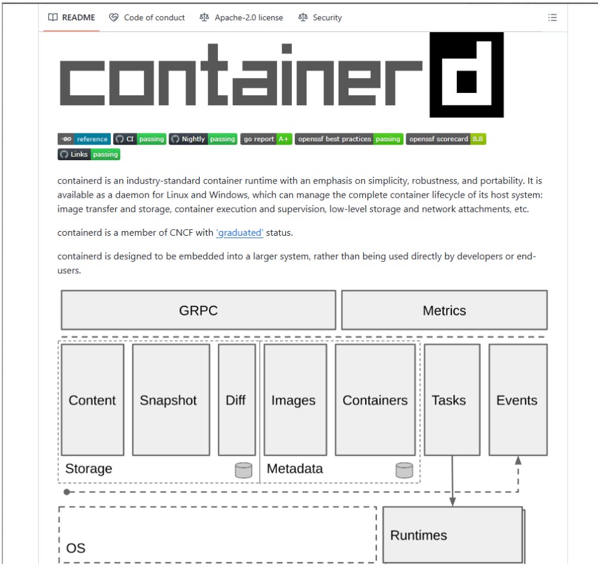
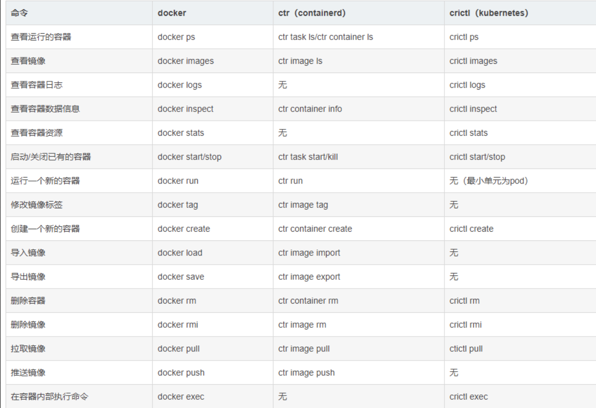
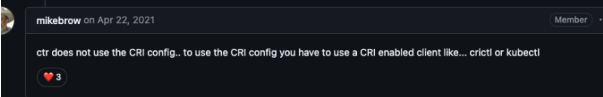

# ctr命令

k8s 在 v1.24 后放弃 docker，并把containerd作为运行时组件，因为 containerd 调用链更短，组件更少，更稳定，占用节点资源更少；



Github地址：https://github.com/containerd/containerd?tab=readme-ov-file

ctr是containerd的一个客户端工具；

crictl是CRI 兼容的容器运行时命令行接口，可以使用它来检查和调试Kubernetes节点上的容器运行时和应用程序；

==注意的是：==

```go
crictl image list
等效于
ctr -n=k8s.io image list
```

Docker、containerd、K8s的三者容器运行时组件的部分命令对比如下图：



示例如下：

```go
命名空间查看
ctr namespaces list  或 ctr ns list
镜像标记
ctr -n k8s.io images tag registry.cn-hangzhou.aliyuncs.com/google_containers/pause:3.2 k8s.gcr.io/pause:3.2
删除镜像
ctr -n k8s.io images rm k8s.gcr.io/pause:3.2
拉取镜像
ctr images pull docker.io/library/redis:latest
ctr -n k8s.io images pull -k k8s.gcr.io/pause:3.2   //指定命名空间并且检查镜像是否有效
导出镜像
ctr -n k8s.io images export pause.tar k8s.gcr.io/pause:3.2
导入镜像
ctr -n k8s.io i import pause.tar
任务查看
ctr -n k8s.io tasks list
停止容器
kill -a -s 9 {id}
删除容器
ctr -n k8s.io images rm k8s.gcr.io/pause:3.2
```

----

补充知识：



当有第三方自建的 Harbor 仓库，且配置自制的证书，k8s 的 pod 需要拉取镜像时需要加跳过 TLS 验证，如下所示：

```go
// vim /etc/containerd/config.toml
---
[plugins."io.containerd.grpc.v1.cri".registry]
      config_path = ""

      [plugins."io.containerd.grpc.v1.cri".registry.auths]

      [plugins."io.containerd.grpc.v1.cri".registry.configs]
        # hub.phharbor.com 的配置
        [plugins."io.containerd.grpc.v1.cri".registry.configs."hub.phharbor.com"]
          # 认证信息
          [plugins."io.containerd.grpc.v1.cri".registry.configs."hub.phharbor.com".auth]
            username = "admin"
            password = "123456"

          # TLS 设置
          [plugins."io.containerd.grpc.v1.cri".registry.configs."hub.phharbor.com".tls]
            ca_file = ""     # 如果需要信任自签名证书，请指定 CA 文件路径
            cert_file = ""   # 客户端证书文件路径（如果需要）
            key_file = ""    # 客户端密钥文件路径（如果需要）
            insecure_skip_verify = true  # 跳过 TLS 验证

      [plugins."io.containerd.grpc.v1.cri".registry.headers]

      [plugins."io.containerd.grpc.v1.cri".registry.mirrors]
        [plugins."io.containerd.grpc.v1.cri".registry.mirrors."docker.io"]
          endpoint = ["https://registry-1.docker.io"]
---
// 重启 contaiunerd 后，用命令 crictl pull hub.phharbor.com/xxx/xxxx:v1.0 就能正常拉了，不知道为啥 ctr 的命令不能拉，还在研究中哈哈。
```


