# k8s安装

介绍多种方式k8s的安装

[TOC]

## 1、Kubekey

基于kubekey安装

### 旧版本

[/k8s/基于kubekey安装并制作k8s离线安装包.pdf](https://wiki.uhowie.com/k8s/基于kubekey安装并制作k8s离线安装包.pdf)
编写：2024-03-31  Howie

### 新版本

背景：选用 kk 版本为 v3.1.8，搭建k8s版本为 v1.31.7，集群节点数为 3，os皆为 Rockey9.4（保持系统纯净），先采用 kk 的在线安装，再制作离线安装包，最后再用离线安装k8s集群。

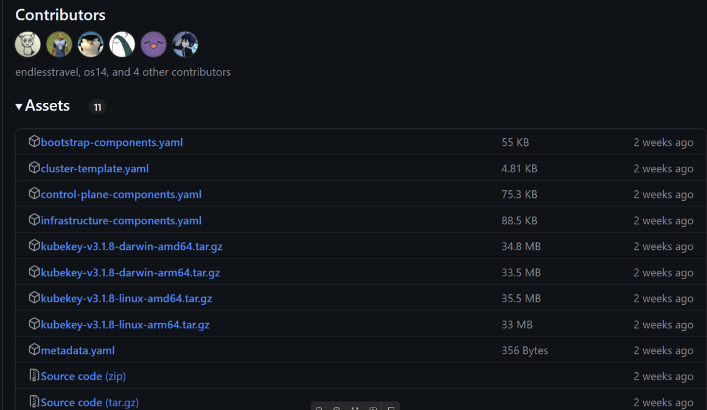

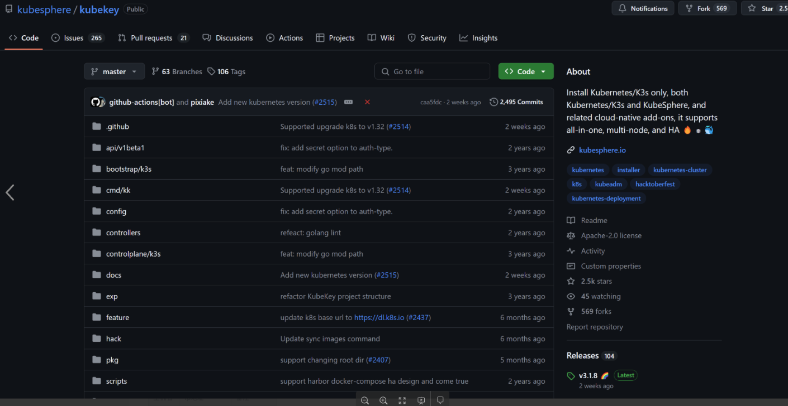

#### 1、在线安装

ip 地址规划如下：（提前做好防火墙关闭、hosts解析、节点ssh免密登录等）

| kk01 | 172.30.139.70 | 4c8G 40GB |
| ---- | ------------- | --------- |
| kk02 | 172.30.139.71 | 4c8G 40GB |
| kk03 | 172.30.139.72 | 4c8G 40GB |

```go
// 获取 kk 的二进制包
kk version --show-supported-k8s | grep 1.31.7               // 查询是否支持版本
kk create config --with-kubernetes 1.31.7 -f kk3.yaml       // 获取默认集群配置文件
```

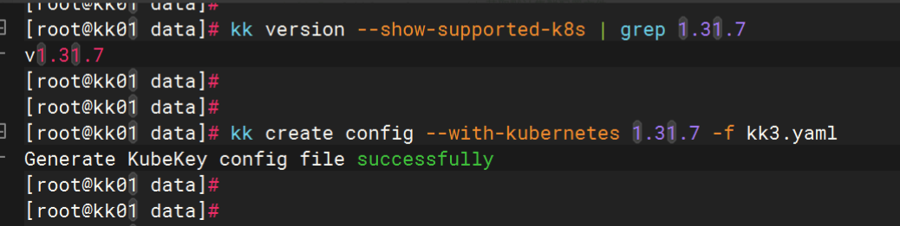

```go
mkdir /data/etcd /data/containerd /data/docker /data/registry /data/local-path-provisioner
// cat kk3.yml
################
apiVersion: kubekey.kubesphere.io/v1alpha2
kind: Cluster
metadata:
  name: sample
spec:
  hosts:
  - {name: kk01, address: 172.30.139.70, internalAddress: 172.30.139.70, user: root, password: ""}
  - {name: kk02, address: 172.30.139.71, internalAddress: 172.30.139.71, user: root, password: ""}
  - {name: kk03, address: 172.30.139.72, internalAddress: 172.30.139.72, user: root, password: ""}
  roleGroups:
    etcd:
    - kk01
    - kk02
    - kk03
    control-plane:
    - kk01
    - kk02
    - kk03
    worker:
    - kk01
    - kk02
    - kk03
  controlPlaneEndpoint:
    ## Internal loadbalancer for apiservers
    # internalLoadbalancer: haproxy

    domain: lb.kubesphere.local
    address: ""
    port: 6443
  kubernetes:
    version: 1.31.7
    clusterName: cluster.local
    autoRenewCerts: true
    containerManager: containerd
    maxPods: 110
    proxyMode: ipvs
  etcd:
    type: kubekey
    dataDir: "/data/etcd"
  network:
    plugin: calico
    calico:
      ipipMode: Always
      vxlanMode: Never
      vethMTU: 0
    kubePodsCIDR: 10.233.64.0/18
    kubeServiceCIDR: 10.233.0.0/18
    ## multus support. https://github.com/k8snetworkplumbingwg/multus-cni
    multusCNI:
      enabled: false
  registry:
    privateRegistry: ""
    namespaceOverride: ""
    registryMirrors: []
    insecureRegistries: []
    containerdDataDir: /data/containerd
    dockerDataDir: /data/docker
    registryDataDir: /data/registry
  addons: []
##################
```

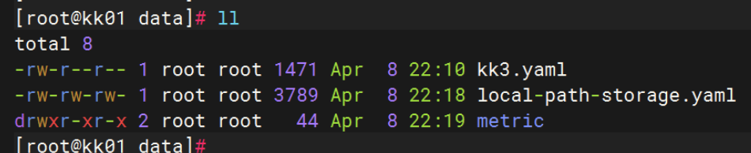

```go
// 在线安装
// 记得 sshd 服务配置中开启 setenv 功能，不然执行安装命令会报错：
AcceptEnv LANG LC_*
PermitUserEnvironment yes
// 开始安装
export KKZONE=cn
kk create cluster -f kk3.yml
```

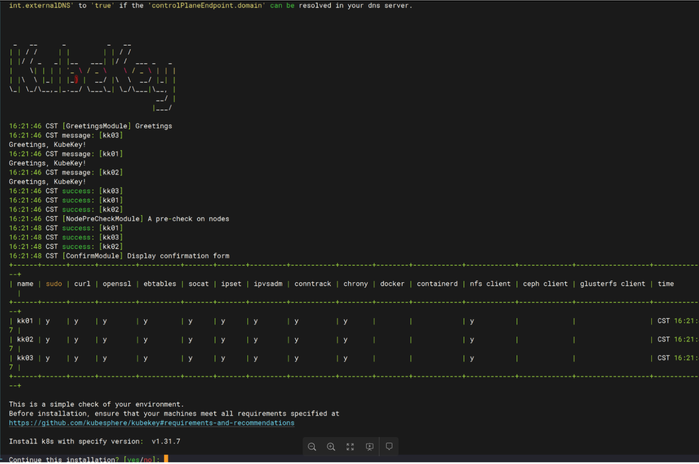

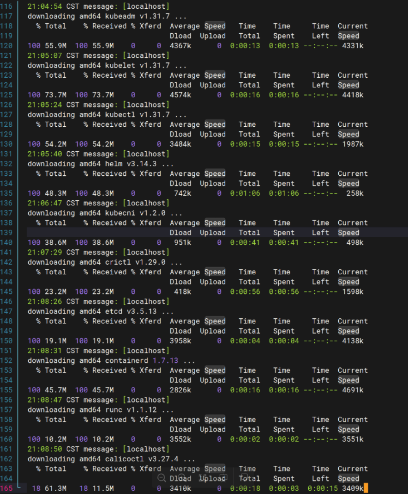

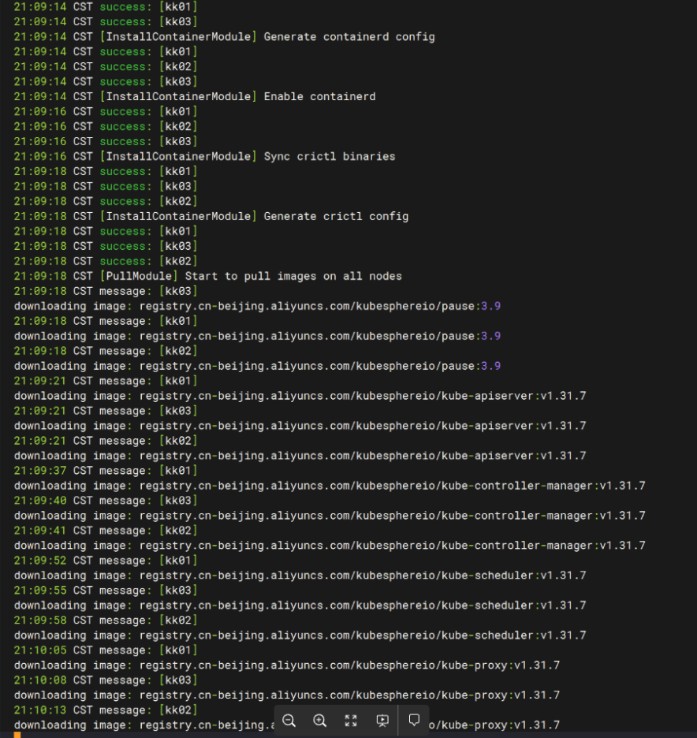

可能会因为网络原因卡在这一步：(需要执行命令 **export KKZONE=cn** 以拉起国内镜像)

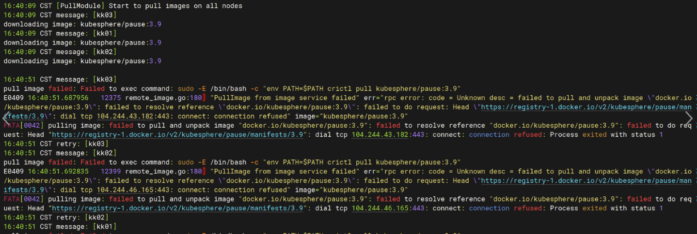

最后成功执行完的截图如下：

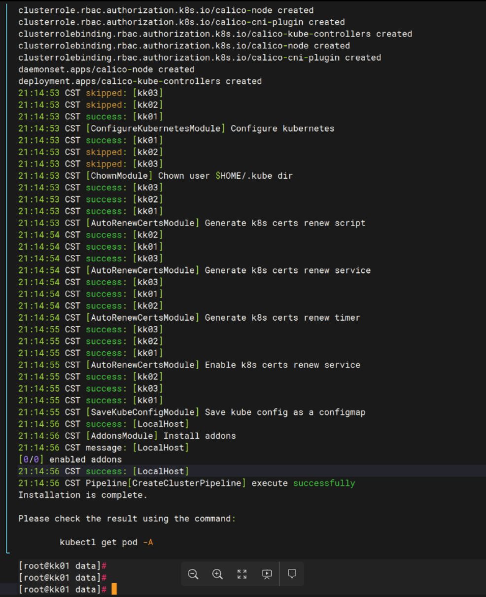

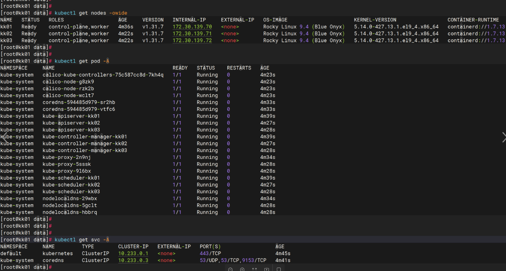

#### 2、制作离线安装包

```go
// 开始制作离线包
kk create manifest -f manifest.yaml
###########
apiVersion: kubekey.kubesphere.io/v1alpha2
kind: Manifest
metadata:
  name: sample
spec:
  arches:
  - amd64
  operatingSystems:
  - arch: amd64
    type: linux
    id: rocky
    version: "Can't get the os version. Please edit it manually."
    osImage: Rocky Linux 9.4 (Blue Onyx)
    repository:
      iso:
        localPath:
        url:
  kubernetesDistributions:
  - type: kubernetes
    version: v1.31.7
  components:
    helm:
      version: v3.14.3
    cni:
      version: v1.2.0
    etcd:
      version: v3.5.13
    containerRuntimes:
    - type: containerd
      version: 1.7.13
    calicoctl:
      version: v3.27.4
    crictl:
      version: v1.29.0
   docker-registry:
      version: 24.0.9
    harbor:
      version: v2.10.1
    docker-compose:
      version: v2.26.1

  images:
  #- docker.io/kubesphere/metrics-server:v0.7.2                   // 临时取消，手动导入
  #- docker.io/rancher/local-path-provisioner:v0.0.31             // 临时取消，手动导入
  - registry.cn-beijing.aliyuncs.com/kubesphereio/cni:v3.27.4
  - registry.cn-beijing.aliyuncs.com/kubesphereio/coredns:1.9.3
  - registry.cn-beijing.aliyuncs.com/kubesphereio/k8s-dns-node-cache:1.22.20
  - registry.cn-beijing.aliyuncs.com/kubesphereio/kube-apiserver:v1.31.7
  - registry.cn-beijing.aliyuncs.com/kubesphereio/kube-controller-manager:v1.31.7
  - registry.cn-beijing.aliyuncs.com/kubesphereio/kube-controllers:v3.27.4
  - registry.cn-beijing.aliyuncs.com/kubesphereio/kube-proxy:v1.31.7
  - registry.cn-beijing.aliyuncs.com/kubesphereio/kube-scheduler:v1.31.7
  - registry.cn-beijing.aliyuncs.com/kubesphereio/node:v3.27.4
  - registry.cn-beijing.aliyuncs.com/kubesphereio/pause:3.10
  - registry.cn-beijing.aliyuncs.com/kubesphereio/pause:3.9
  - registry.cn-beijing.aliyuncs.com/kubesphereio/pod2daemon-flexvol:v3.27.4
  registry:
    auths: {}
###########
```

```go
export KKZONE=cn
kk artifact export -m manifest.yaml -o kk-1.31.7-images.tar.gz
```

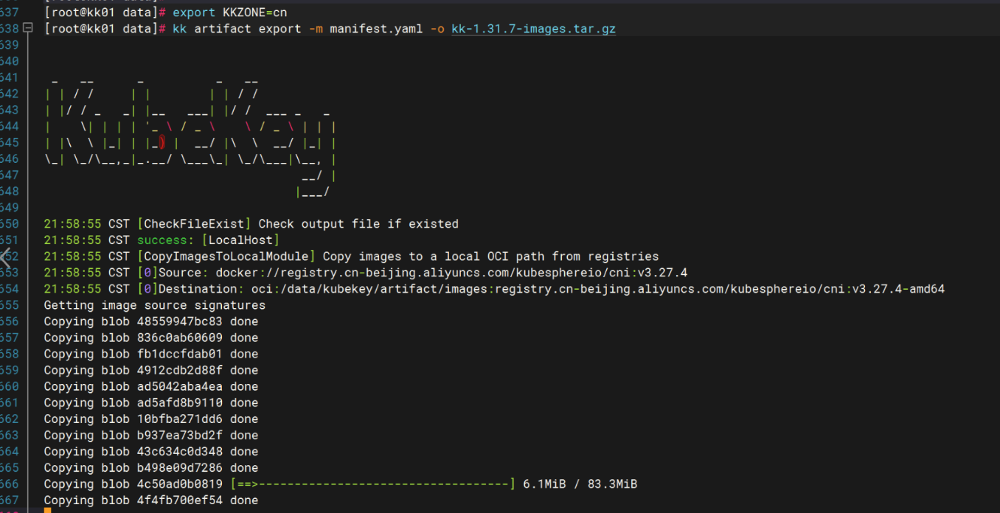

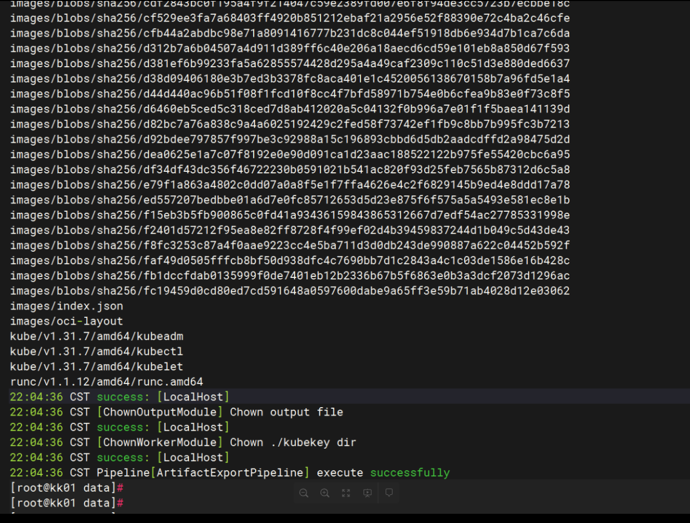

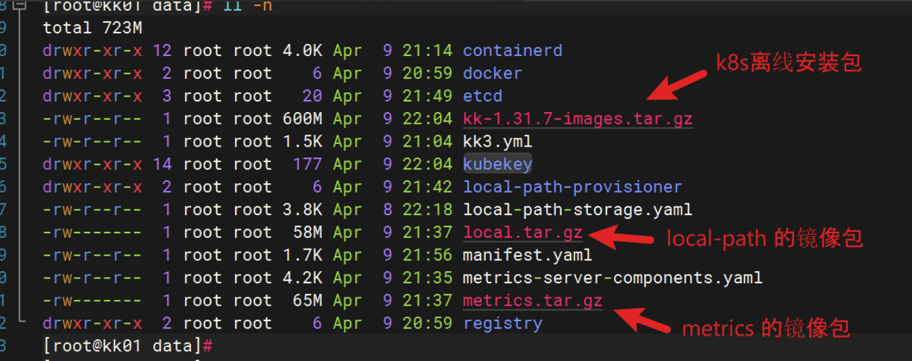

可将其他文件和资源一起打包成 **offline-images-k8s-1.31.7.tar.gz** ，如下图所示：

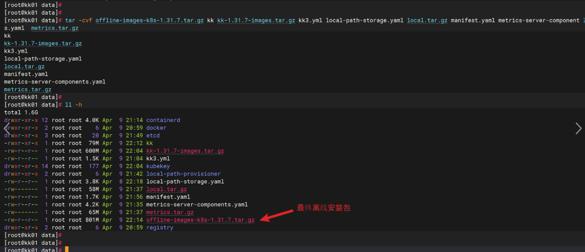

#### 3、离线安装

```go
// 重新选择干净的系统（为了方便此处用回退快照的方式，已回退到最初干净环境，ip地址不变，去掉正确的 dns 地址模拟离线），将离线安装包上传到服务器上
cat kk3-offinle.yml
######
apiVersion: kubekey.kubesphere.io/v1alpha2
kind: Cluster
metadata:
  name: sample
spec:
  hosts:
  - {name: kk01, address: 172.30.139.70, internalAddress: 172.30.139.70, user: root, password: ""}
  - {name: kk02, address: 172.30.139.71, internalAddress: 172.30.139.71, user: root, password: ""}
  - {name: kk03, address: 172.30.139.72, internalAddress: 172.30.139.72, user: root, password: ""}
  roleGroups:
    etcd:
    - kk01
    - kk02
    - kk03
    control-plane:
    - kk01
    - kk02
    - kk03
    worker:
    - kk01
    - kk02
    - kk03
    registry:     # 新添
    - kk01      # 新添
  controlPlaneEndpoint:
    ## Internal loadbalancer for apiservers
    # internalLoadbalancer: haproxy

    domain: lb.kubesphere.local
    address: ""
    port: 6443
  kubernetes:
    version: 1.31.7
    clusterName: cluster.local
    autoRenewCerts: true
    containerManager: containerd
    maxPods: 110
    proxyMode: ipvs
  etcd:
    type: kubekey
    dataDir: "/data/etcd"
  network:
    plugin: calico
    calico:
      ipipMode: Always
      vxlanMode: Never
      vethMTU: 0
    kubePodsCIDR: 10.233.64.0/18
    kubeServiceCIDR: 10.233.0.0/18
    ## multus support. https://github.com/k8snetworkplumbingwg/multus-cni
    multusCNI:
      enabled: false
  registry:
    type: harbor      # 新添
    auths:
      "kk.harbor.com":   # 私人仓库域名
        username: admin  # 新添
        password: Harbor000000   # 新添
        skipTLSVerify: true   # 新添
        #certsPath: "/etc/ssl/registry/ssl/ca.crt"
    privateRegistry: "kk.harbor.com"    # 新添
    namespaceOverride: "kubesphereio"     # 新添
    registryMirrors: []
    insecureRegistries: []
    containerdDataDir: /data/containerd
    dockerDataDir: /data/docker
    registryDataDir: /data/registry
  addons: []
######
```

```go
mkdir /data/etcd /data/containerd /data/docker /data/registry /data/local-path-provisioner
export KKZONE=cn
kk init registry -f kk3-offline.yml -a kk-1.31.7-images.tar.gz
```

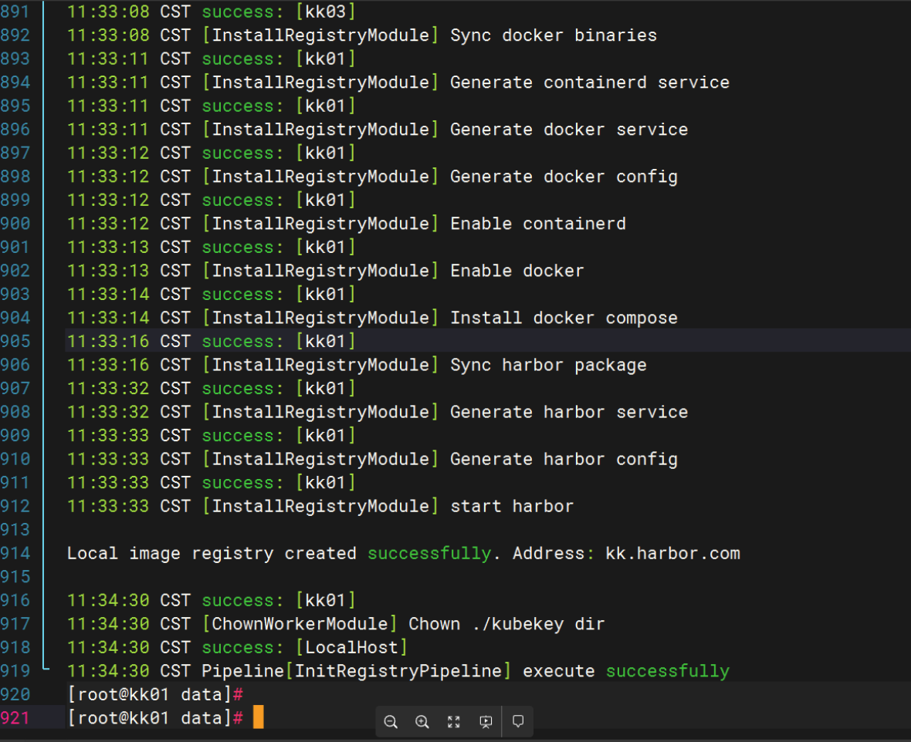

```go
// cat create_project_harbor.sh
####################################
#!/usr/bin/env bash

# Copyright 2018 The KubeSphere Authors.
#
# Licensed under the Apache License, Version 2.0 (the "License");
# you may not use this file except in compliance with the License.
# You may obtain a copy of the License at
#
#     http://www.apache.org/licenses/LICENSE-2.0
#
# Unless required by applicable law or agreed to in writing, software
# distributed under the License is distributed on an "AS IS" BASIS,
# WITHOUT WARRANTIES OR CONDITIONS OF ANY KIND, either express or implied.
# See the License for the specific language governing permissions and
# limitations under the License.

url="https://kk.harbor.com"
user="admin"
passwd="Harbor000000"

harbor_projects=(
    library
    kubesphereio
    kubesphere
    calico
    coredns
    openebs
    csiplugin
    minio
    mirrorgooglecontainers
    osixia
    prom
    thanosio
    jimmidyson
    grafana
    elastic
    istio
    jaegertracing
    jenkins
    weaveworks
    openpitrix
    joosthofman
    nginxdemos
    fluent
    kubeedge
    rdapp
    baseapp
    eqalpha
    apache
    bitnami
    apacherocketmq
    nginxinc
    nacos
    acid
    zalando
    portainer
    keycloak
    goharbor
    rancher
    oliver006
    stakater
)

for project in "${harbor_projects[@]}"; do
    echo "creating $project"
    curl -u "${user}:${passwd}" -X POST -H "Content-Type: application/json" "${url}/api/v2.0/projects" -d "{ \"project_name\": \"${project}\", \"public\": true}" -k #curl命令末尾加上 -k
done
###################
./create_project_harbor.sh
```

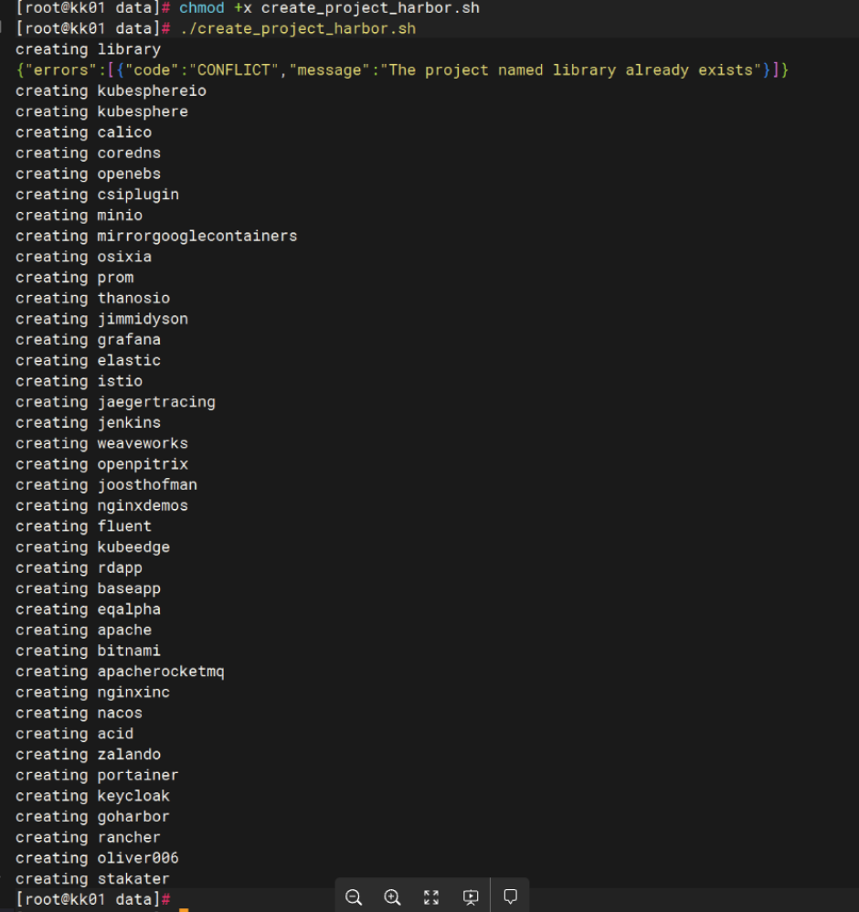

```go
kk artifact image push -f kk3-offline.yml -a kk-1.31.7-images.tar.gz
```

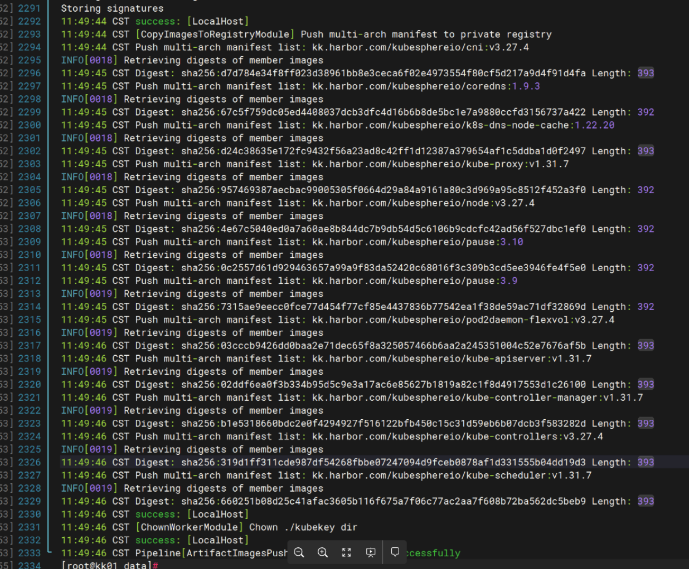

```go
// 设置 containerd 信任证书,每个节点都操作
mkdir -p /etc/containerd/kk.harbor.com
cp /etc/docker/certs.d/kk.harbor.com/ca.crt /etc/containerd/kk.harbor.com/
cp /etc/docker/certs.d/kk.harbor.com/ca.crt /etc/pki/ca-trust/source/anchors/
update-ca-trust  &&  systemctl restart containerd

// 开始正式安装
export KKZONE=cn && kk create cluster -f kk3-offline.yml -a kk-1.31.7-images.tar.gz
// 可能会卡在 "init kubadm" 这一步，可查看其他文章解决(可联系作者或者下面评论)
```

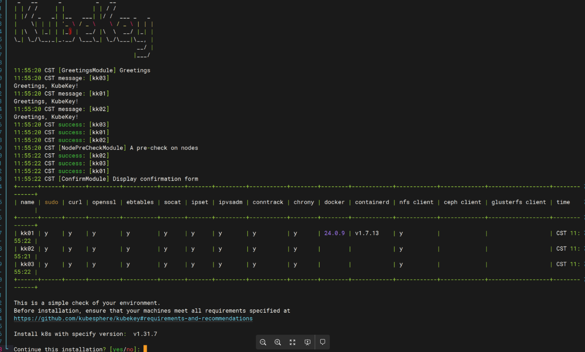

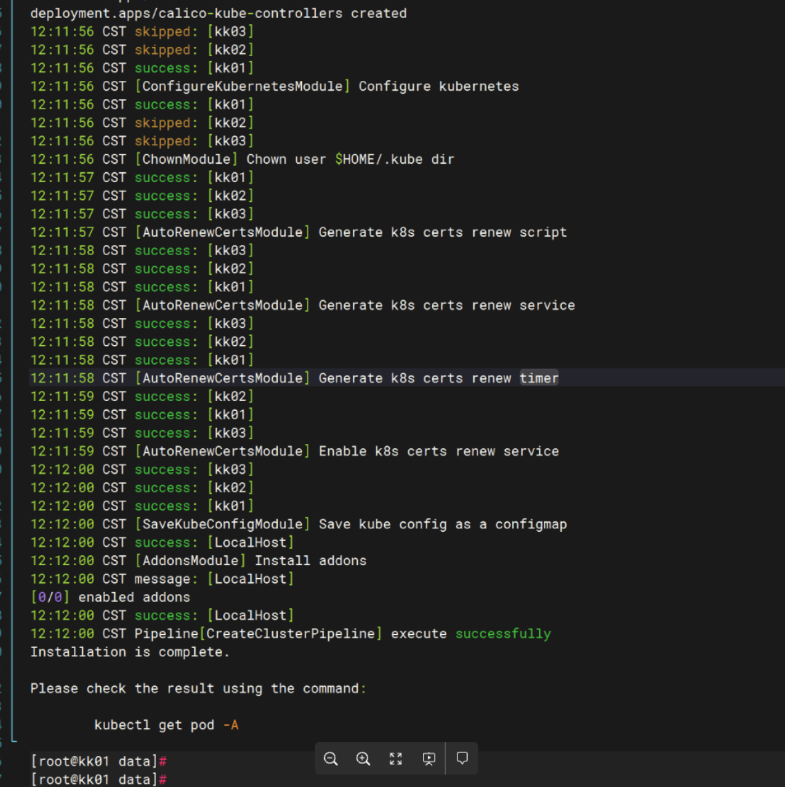

查看状态，离线安装完成，其他插件可自行安装即可：

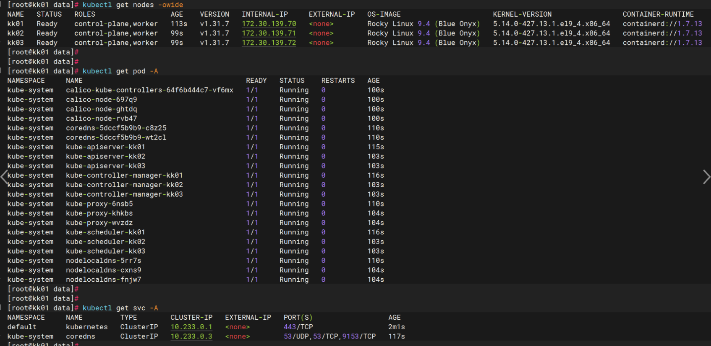

## 2、sealos

类似于 kubekey 工具可支持在线和离线快速部署生产级别的 k8s 集群。

社区地址：https://github.com/labring/sealos

## 3、二进制安装

### 1、基于Docker安装

[/k8s/k8s2/基于docker实现k8s_1.29二进制高可用集群.md](https://wiki.uhowie.com/k8s/k8s2/基于docker实现k8s_1.29二进制高可用集群.md)

### 2、基于Containerd安装

[/k8s/k8s2/基于containerd实现k8s_1.29二进制高可用集群.pdf](https://wiki.uhowie.com/k8s/k8s2/基于containerd实现k8s_1.29二进制高可用集群.pdf)

### 3、疑难问题解决

#### 1、查集集群的 CA 证书有效期

```go
openssl x509 -in ca.pem -text -noout
```

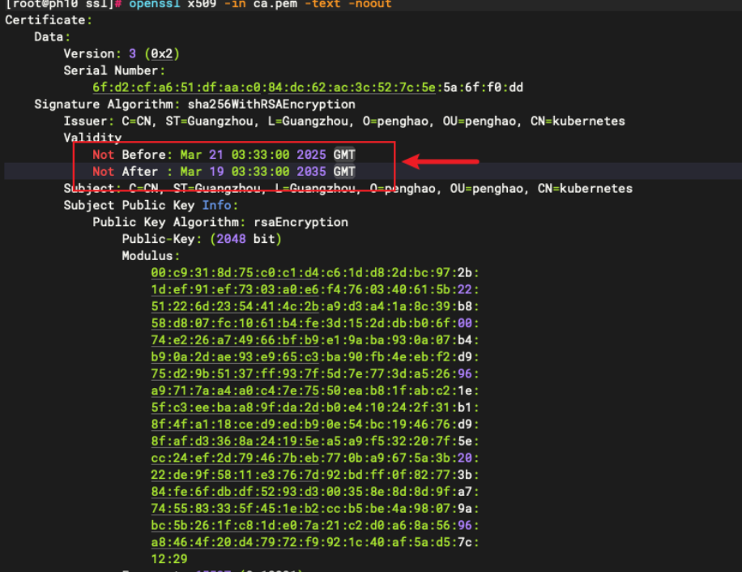

#### 2、安装 metrics

二进制安装完的集群服务运行如下，但是 metrics 服务一直启动失败，用 top 命令会报错，且 pod 的报错日志如下：

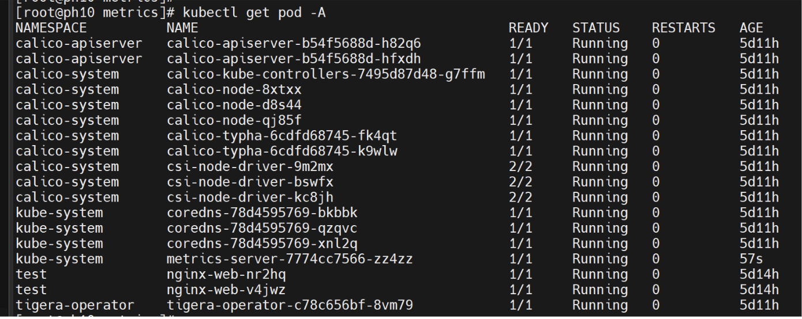

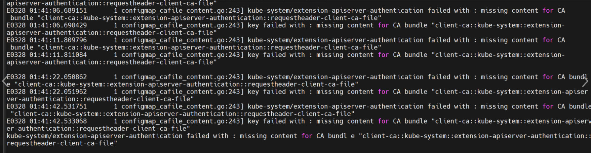

解决方法为：

（1）修改 metrics 的 yaml 文件如下，添加 --kubelet-insecure-tls 参数，再 apply 起来：

```go
--kubelet-insecure-tls
```

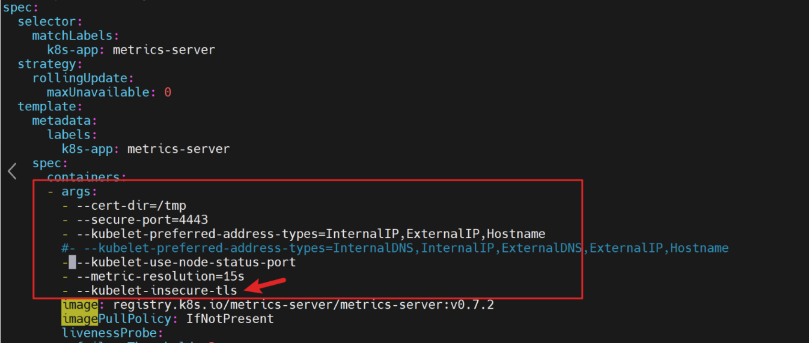

（2）修改 kube-apiserver 的配置文件，添加内容如下：

```go
// 修改 api-servers 的配置文件：
 ...
  --requestheader-allowed-names=aggregator \
  --requestheader-group-headers=X-Remote-Group \
  --requestheader-username-headers=X-Remote-User \
  --requestheader-extra-headers-prefix=X-Remote-Extra- \
  --requestheader-client-ca-file=/etc/kubernetes/ssl/ca.pem \
  --proxy-client-cert-file=/etc/kubernetes/ssl/kubernetes.pem \
  --proxy-client-key-file=/etc/kubernetes/ssl/kubernetes-key.pem  \
  --enable-aggregator-routing=true \
  ...

// 然后生成对应的 proxy-client 证书，放到 /etc/kubernetes/ssl/ 目录下：
// cat proxy-client-csr.json
{
    "CN": "kubernetes",
    "hosts": [
      "172.30.139.60"      // master节点ip地址
    ],
    "key": {
        "algo": "rsa",
        "size": 2048
    },
    "names": [
        {
            "C": "CN",
            "ST": "Guangzhou",
            "L": "Guangzhou",
            "O": "penghao",
            "OU": "penghao"
        }
    ]
}

//执行以下命令
cfssl gencert \
-ca=ca.pem \
-ca-key=ca-key.pem  \
-profile=kubernetes proxy-client-csr.json | cfssljson -bare kubernetes

// 重启 kube-spiserver 服务即可
```

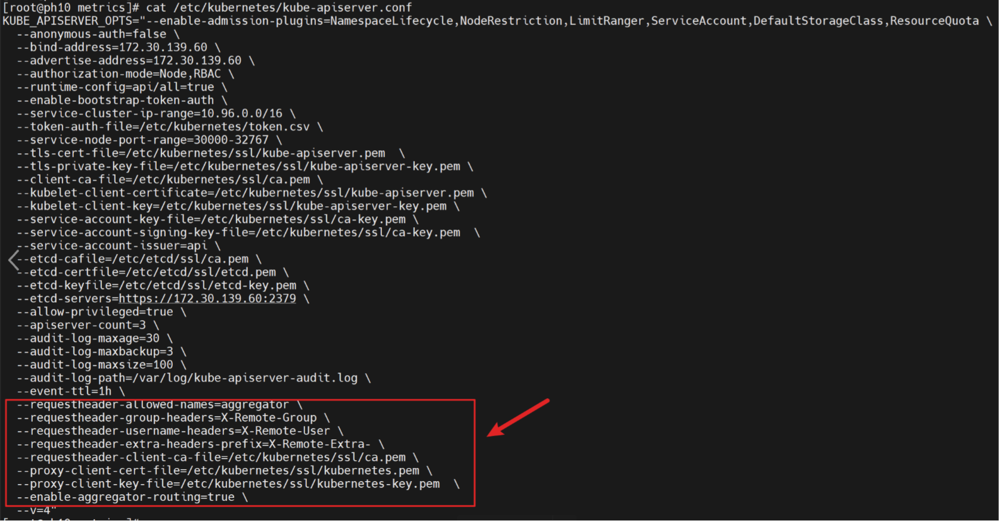

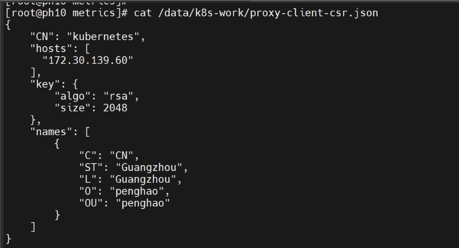

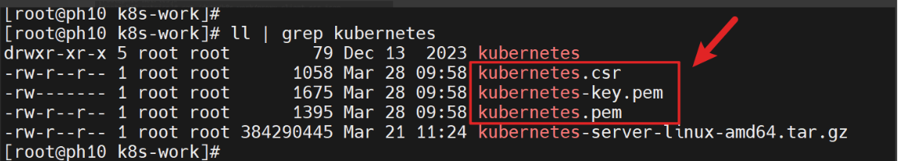

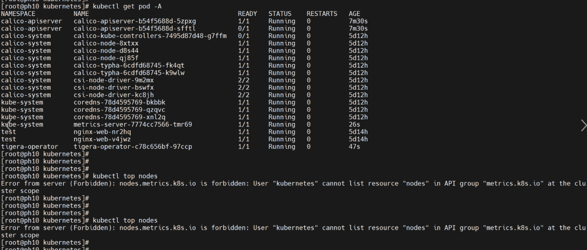

（3）添加 clusterroles 和 clusterrolesbinding ：

```go
// cat clusterrole.yaml
apiVersion: rbac.authorization.k8s.io/v1
kind: ClusterRole
metadata:
  name: metrics-reader-all
rules:
- apiGroups: ["metrics.k8s.io"]
  resources: ["pods", "nodes"]
  verbs: ["get", "list", "watch"]
---
apiVersion: rbac.authorization.k8s.io/v1
kind: ClusterRoleBinding
metadata:
  name: metrics-reader-all-binding
subjects:
- kind: User
  name: kubernetes
  apiGroup: rbac.authorization.k8s.io
roleRef:
  kind: ClusterRole
  name: metrics-reader-all
  apiGroup: rbac.authorization.k8s.io

// 最后 apply 一下即可，最后可用top以下nodes和pods资源，打印正常即为部署成功了，如最后图所示
```

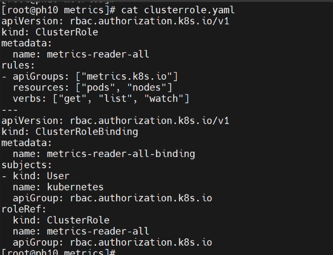

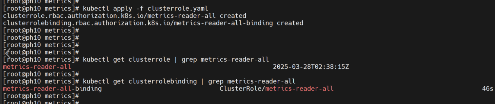

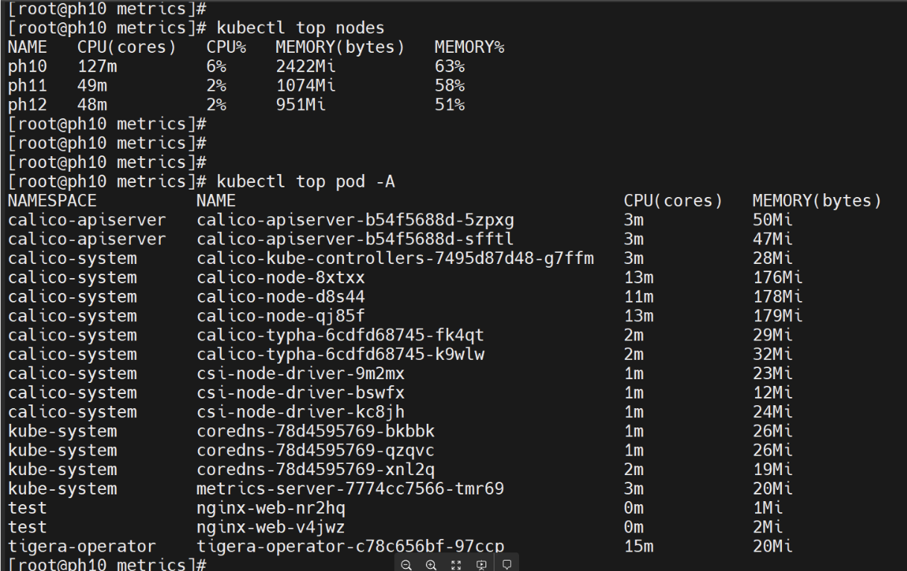

#### 3、更换证书为100年

==待更新…==

#### 4、kubectl 添加新的 context

当前k8s的上下文环境为 use-context [kubernetes-admin@cluster.local](mailto:kubernetes-admin@cluster.local)，新添一个 new-k8s 的上下文指向新安装的二进制 k8s 环境，步骤如下：

当前context：

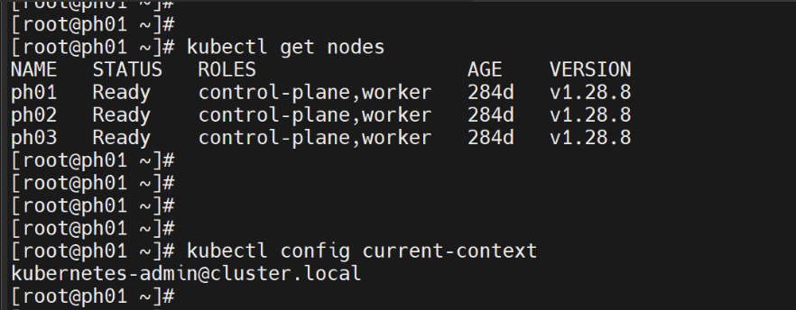

添加新context，名字为 new-k8s：

```go
// 其中 ca.pem 为新集群的ca证书
kubectl config set-cluster k8s2 --server=https://172.30.139.60:6443 --certificate-authority=/etc/kubernetes/k8s2/ca.pem --embed-certs=true
//  其中 admin-key.pem、admin.pem 为新集群 kubectl 所用的证书文件
kubectl config set-credentials k8s2-new --client-certificate=/etc/kubernetes/k8s2/admin.pem --client-key=/etc/kubernetes/k8s2/admin-key.pem --embed-certs=true
// 创建一个上下文（context），它将用户与特定集群关联起来
kubectl config set-context new-k8s --cluster=k8s2 --user=k8s2-new
// 查询当前已有的上下文
kubectl config view
kubectl config get-contexts
// 切换上下文，切到新集群，如下图所示效果,成功完成上下文添加
kubectl config use-context new-k8s
kubectl get nodes
```

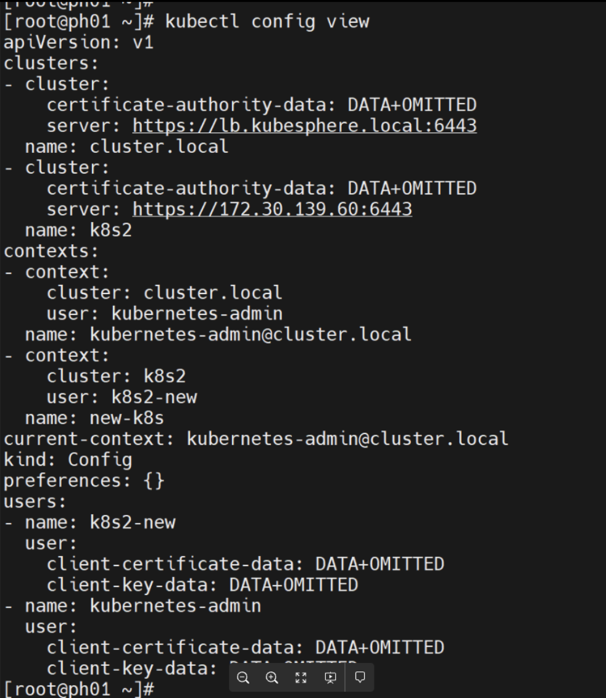

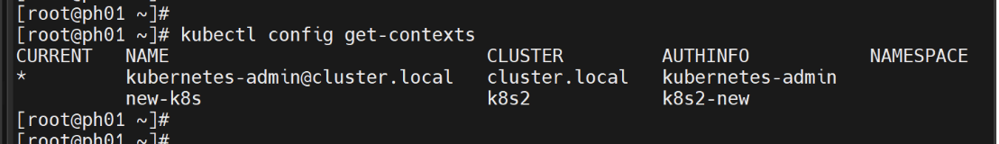

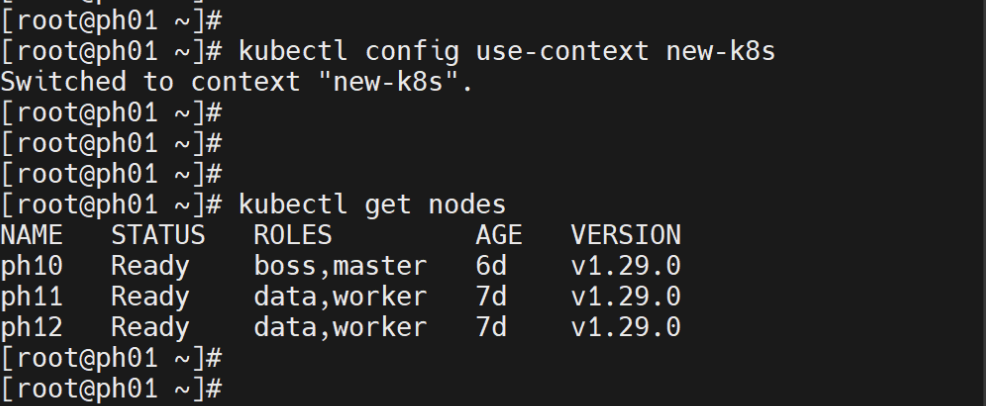

#### 5、小版本升级 k8s 集群

当前版本为 v1.29.0，计划升级至29的最新文档版本 v1.29.11，先下载二进制安装包到本地，目前集群版本和节点情况如下所示：

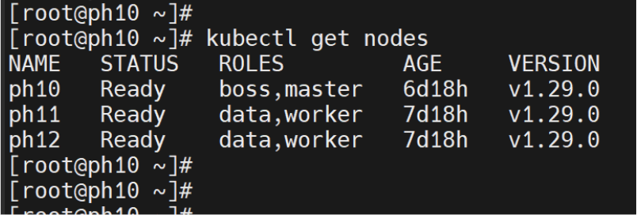

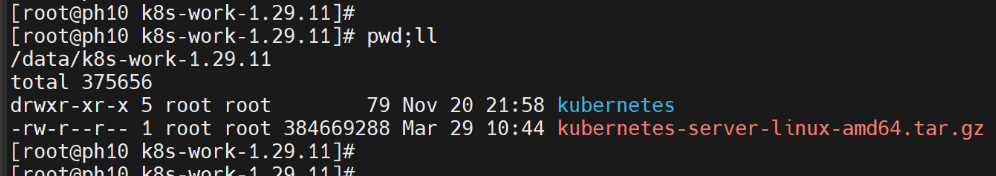

```go
// 升级的部署大概是这样的，直接覆盖原来的二进制程序即可：
// 先备份数据 etcd
// 再升级 master 的 api、controll、sched、kubectl、kubelet、kube-proxy 等组件
// 再升级 works 的 kubelet、kube-proxy等组件
// 最后检查一下 kubectl get nodes 是否符合预期效果
```

```go
// 备份 etcd 数据
export ETCDCTL_API=3
etcdctl --endpoints=https://172.30.139.60:2379 --cacert="/etc/kubernetes/ssl/ca.pem" --cert="/etc/etcd/ssl/etcd.pem" --key="/etc/etcd/ssl/etcd-key.pem"
snapshot save /data/backup/etcd-snapshot20250329.db
// 查看备份状态
etcdctl snapshot status /data/backup/etcd-snapshot20250329.db -wtable
```

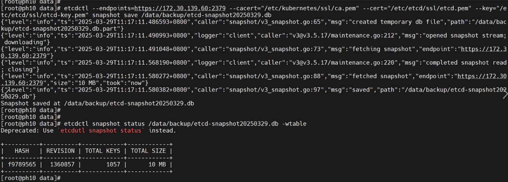

备份现有版本的二进制程序，master和works节点都需要，如下所示：

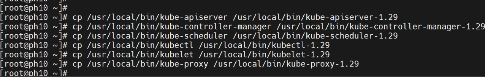

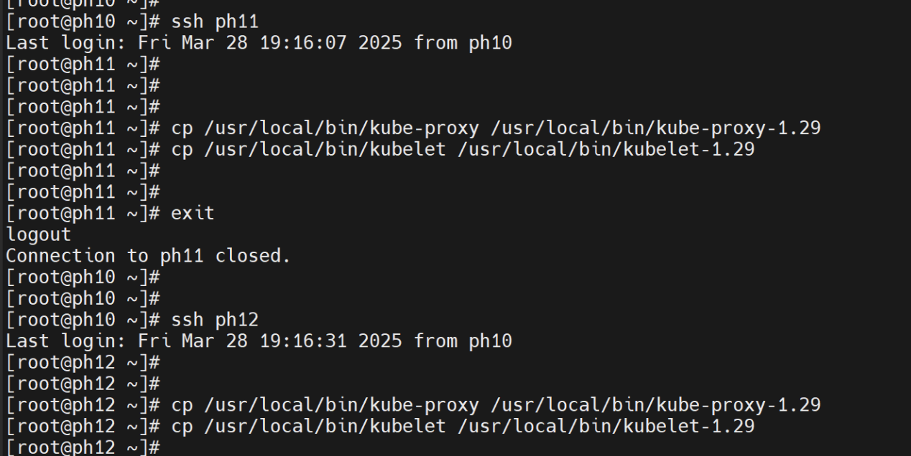

```go
// 先升级master节点，node节点也是一样的步骤
kubectl cordon ph10   // 设为不可调度
kubectl drain ph10 --ignore-daemonsets  --delete-emptydir-data  // 驱除上面的pod
// 先 stop 掉各个需要替换的组件，再将v1.29.11版本的二进制程序覆盖原有路径即可，操作完进行下一步
kubectl uncordon ph10            // 取消不可调度
```

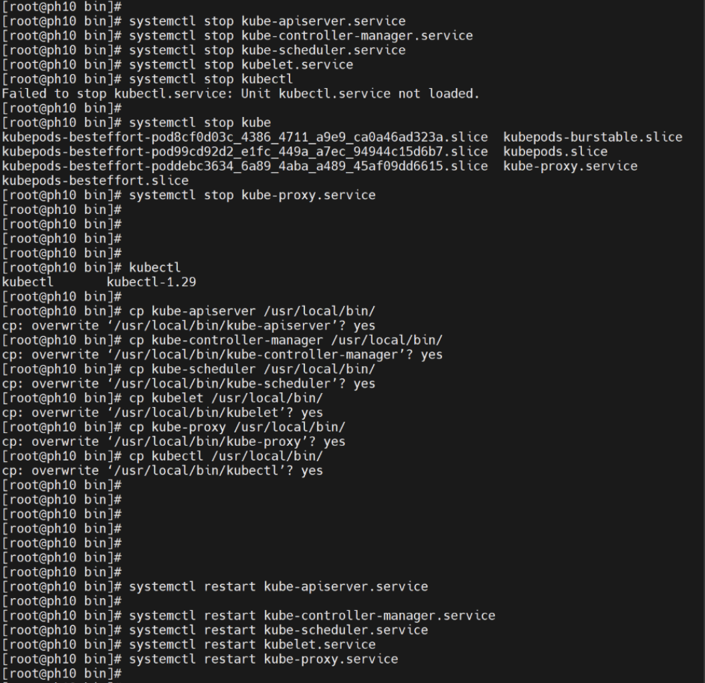

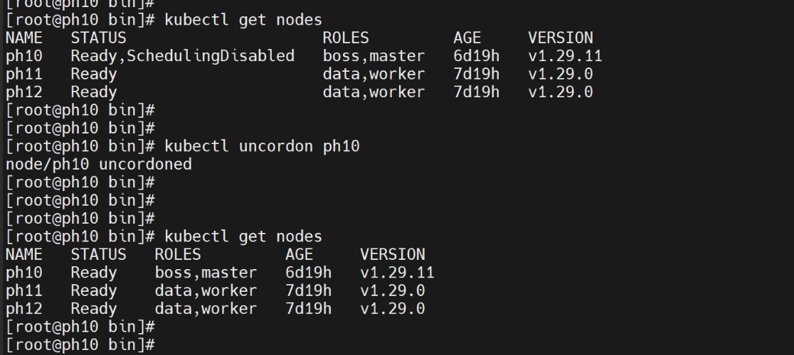

```go
// 从节点是一样的操作，具体可参考上面 master 的内容，操作完之后最后可检查下，如下所示成功完成了小版本集群升级操作：
```

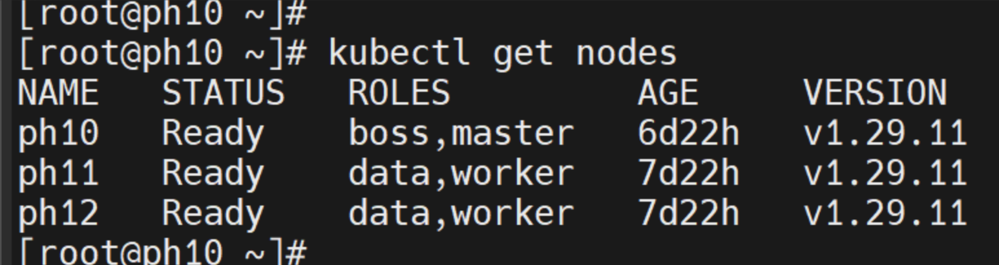

