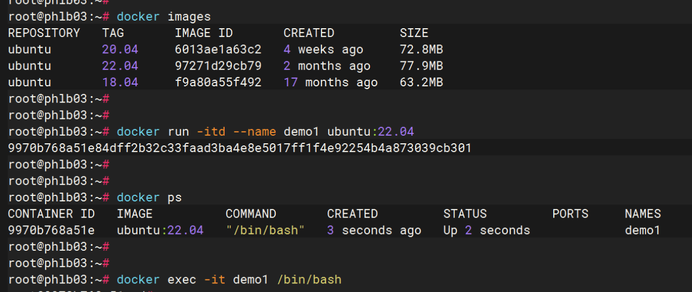
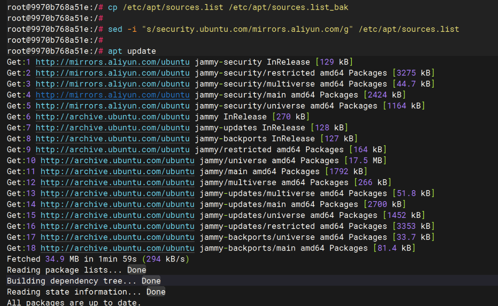
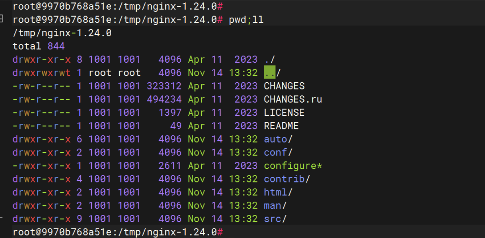
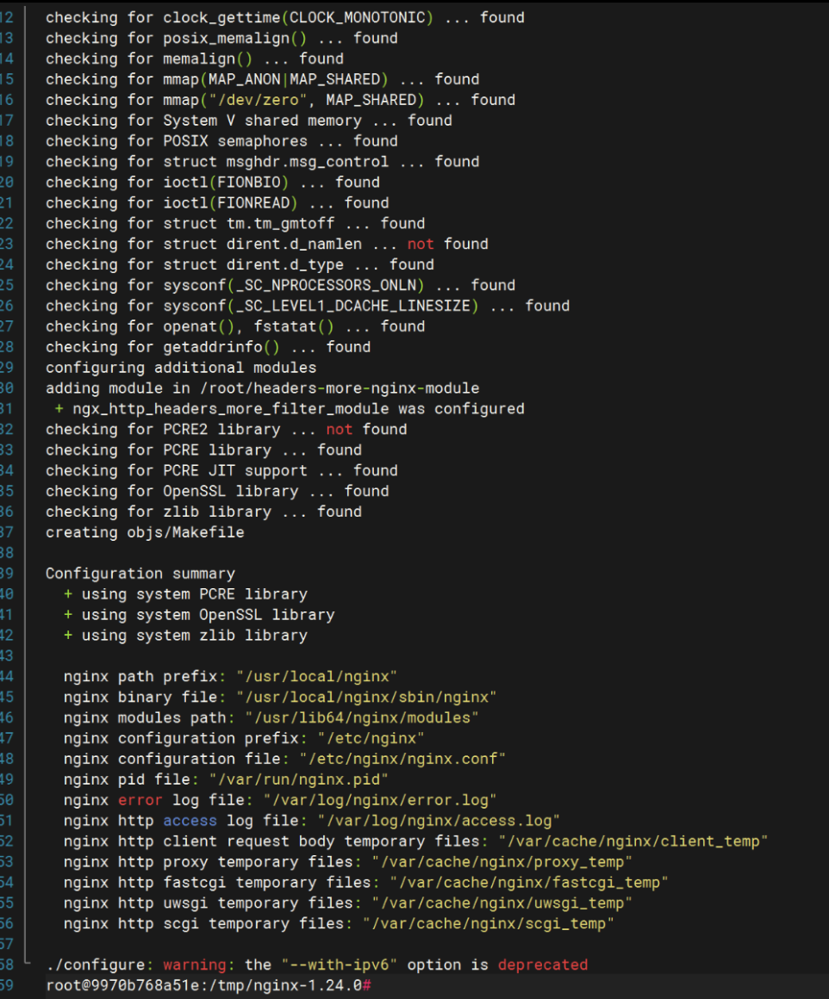
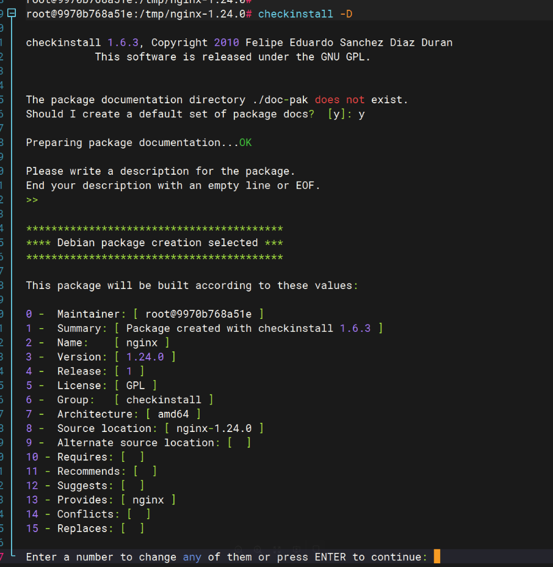
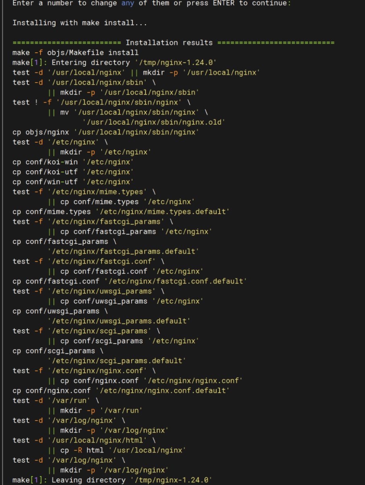
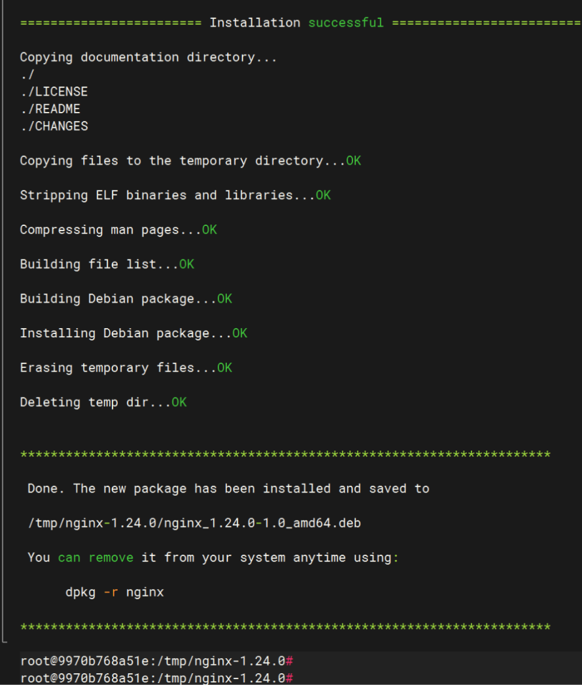
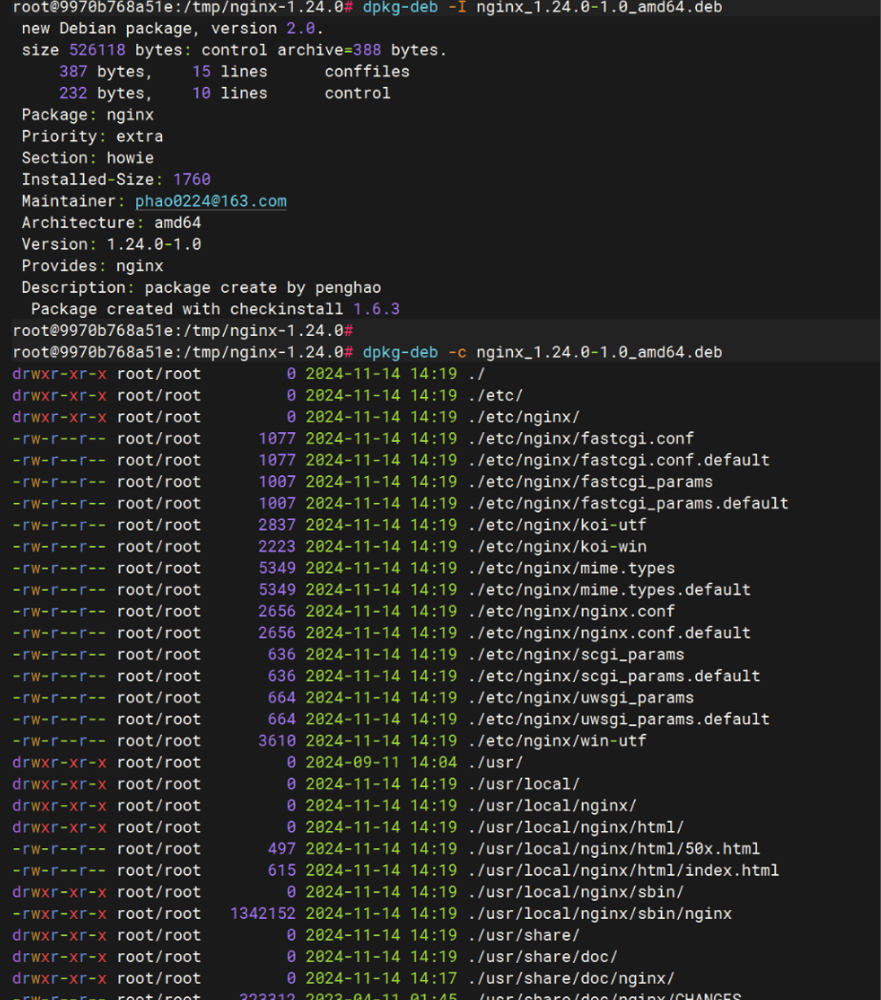

# DEB 包制作

记录制作各种deb格式的安装包

## 1、Nginx

制作一个nginx的deb包，可快速移植于其他类debian系统安装；

笔者环境基于ubuntu22.04的docker images，nginx版本以1.24.0为例；

```go
//dpkg的基础知识
dpkg -l | grep xxx  //列出xxx包
dpkg -i xxx.deb     //安装包
dpkg -e xxx         //卸载包
dpkg --purge xxx    //完全清除xxx的配置文件
dpkg-deb -c xxx.deb   //列出包中的文件，类似与rpm -qpl的功能
dpkg-deb -I xxx.deb   //查看deb包的详细信息，类似与rpm -qpi的功能
```

### 1、环境准备

笔者是以docker容器工作的，首先起来一个纯净的ubuntu镜像，如下所示：



换成国内阿里的apt源：

```go
cp /etc/apt/sources.list /etc/apt/sources.list_bak
sed -i "s/security.ubuntu.com/mirrors.aliyun.com/g" /etc/apt/sources.list
apt update
apt install checkinstall  wget   //checkinstall是一款便捷的安装包制作工具，非常好用且方便,官方地址：https://checkinstall.izto.org/index.php
apt install libssl-dev       //安装openssl的依赖包，相当与“yum install openssl-devel”
apt install libpcre3 libpcre3-dev zlib1g-dev
```



```go
//可选，如果要控制HTTP 响应头的话
cd /root ; git clone https://github.com/openresty/headers-more-nginx-module.git
//下载nginx源码包
cd /tmp ; wget http://nginx.org/download/nginx-1.24.0.tar.gz
tar -xvf nginx-1.24.0.tar.gz ; cd nginx-1.24.0
```

### 2、开始编译



```go
//开始编译
./configure \
        --prefix=/usr/local/nginx \
        --user=nginx \
        --group=nginx \
        --conf-path=/etc/nginx/nginx.conf \
        --error-log-path=/var/log/nginx/error.log \
        --http-log-path=/var/log/nginx/access.log \
        --pid-path=/var/run/nginx.pid \
        --lock-path=/var/run/nginx.lock \
        --modules-path=/usr/lib64/nginx/modules \
        --sbin-path=/usr/local/nginx/sbin/nginx \
        --http-client-body-temp-path=/var/cache/nginx/client_temp \
        --http-proxy-temp-path=/var/cache/nginx/proxy_temp \
        --http-fastcgi-temp-path=/var/cache/nginx/fastcgi_temp \
        --http-uwsgi-temp-path=/var/cache/nginx/uwsgi_temp \
        --http-scgi-temp-path=/var/cache/nginx/scgi_temp \
        --with-http_ssl_module \
        --with-http_v2_module \
        --with-http_realip_module \
        --with-http_addition_module \
        --with-http_sub_module \
        --with-http_dav_module \
        --with-http_flv_module \
        --with-http_mp4_module \
        --with-http_gunzip_module \
        --with-http_gzip_static_module \
        --with-http_random_index_module \
        --with-http_secure_link_module \
        --with-http_stub_status_module \
        --with-http_auth_request_module \
        --with-mail \
        --with-mail_ssl_module \
        --with-file-aio \
        --with-ipv6 \
        --with-stream \
        --add-module=/root/headers-more-nginx-module
//make操作
make
```



### 3、打包deb

```go
//用checkinstall工具打包，根据提示操作即可自动完成打包操作；
checkinstall -D
```







### 4、验证

```go
//查看当前目录下就会生产nginx的deb安装包，如下所示
ll | grep nginx_1.24.0-1.0_amd64.deb
dpkg-deb -I nginx_1.24.0-1.0_amd64.deb
//把nginx_1.24.0-1.0_amd64.deb 放到其他类debian主机上就能轻松安装上nginx服务了
```




