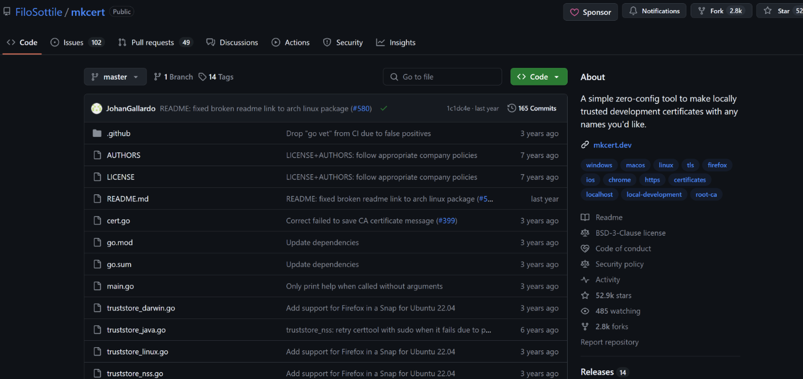

# 其他杂项

## 1、在线脚本升级pip

```go
//在线脚本升级pip
wget https://bootstrap.pypa.io/pip/2.7/get-pip.py
python get-pip.py
pip --version
```

## 2、自信任证书生成

```go
// 方法一
openssl genrsa -out ca.key 4096
openssl req -x509 -new -nodes -sha512 -days 36500 \
 -subj "/C=CN/ST=Guangzhou/L=Guangzhou/O=example/OU=Personal/CN=MyPersonal Root CA" \
 -key ca.key \
 -out ca.crt

// 或者
openssl genpkey -algorithm RSA -out server.key
openssl req -new -key server.key -out server.csr
openssl x509 -req -days 3650 -in server.csr -signkey server.key -out server.crt
----------------------------

// 方法二
// 或者生成 SAN 的
openssl genpkey -algorithm RSA -out server.key
// cat openssl-san.cnf
[ req ]
default_bits       = 2048
distinguished_name = req_distinguished_name
req_extensions     = req_ext
prompt             = no

[ req_distinguished_name ]
C  = CN
ST = Zhejiang
L  = Hangzhou
O  = Example Corp
OU = IT Department
CN = hub.phharbor.com

[ req_ext ]
subjectAltName = @alt_names

[ alt_names ]
DNS.1 = hub.phharbor.com

openssl req -x509 -new -nodes -key server.key -sha256 -days 365 -out server.crt -subj "/C=CN/ST=Zhejiang/L=Hangzhou/O=Example Corp/OU=IT Department/CN=hub.phharbor.com" -extensions req_ext -config openssl-san.cnf
-----------------------------

// 方法三：以上两种都没有生成根证书，正常浏览器会提示风险，可用开源工具 mkcert 解决（亲测不错）
地址：https://github.com/FiloSottile/mkcert
基本用法如下：
./mkcert -install   // 安装根证书
./mkcert -key-file xxxx.key -cert-file xxxx.pem www.xxxx.com  *.xxxx.com // 签发自域名
```

```go
//【 最新完整openssl生成自信任证书（自定义域名为 wiki.uhowie.com ）】
一、创建证书存放目录并进入
mkdir -p ~/ssl_wiki
# mkdir 创建文件夹，-p 上级目录不存在也自动创建，避免报错
cd ~/ssl_wiki
# 切换到证书工作目录，后续所有文件都生成在这里

二、生成根 CA 私钥（Root CA 密钥，整个证书体系的最高机密）
openssl genrsa -out root-ca.key 4096
# openssl genrsa：生成RSA非对称私钥
# -out root-ca.key：输出文件名为root-ca.key
# 4096：密钥长度4096位，安全性更高
# 这是根证书的私钥，务必妥善保管，泄露可伪造你所有内网证书

三、生成自签名根证书（信任根，有效期 20 年）
openssl req -x509 -new -nodes -key root-ca.key -sha256 -days 7300 -out root-ca.crt \
-subj "/C=CN/ST=HK/L=HK/O=cheezyrabbit/OU=cheezyrabbit/CN=cheezyrabbit"
# req -x509：直接生成自签名证书（根证书专用）
# -new：新建证书请求
# -nodes：私钥不设置密码，后续签发证书不用手动输密码
# -key root-ca.key：使用上面生成的根CA私钥
# -sha256：使用SHA256哈希算法，禁用老旧不安全的SHA1
# -days 7300：证书有效天数，3650天≈20年
# -out root-ca.crt：输出根证书文件
# -subj：直接填入证书信息，无需交互式手动输入
# /C=CN 国家；/ST=HK 省份；/L=HK 城市；/O 组织；/OU 部门；/CN 证书名称

四、生成网站域名 wiki.uhowie.com 的私钥
openssl genrsa -out wiki.uhowie.com.key 2048
# 生成网站服务端RSA私钥，Nginx HTTPS 解密用
# 2048位足够内网使用，文件 wiki.uhowie.com.key 禁止对外泄露

五、生成证书签名请求文件 CSR（向根 CA 申请发证的申请表）
openssl req -new -key wiki.uhowie.com.key -out wiki.uhowie.com.csr \
-subj "/C=CN/ST=HK/L=HK/O=cheezyrabbit/OU=cheezyrabbit/CN=wiki.uhowie.com"
# -new：发起证书申请
# -key：绑定当前网站私钥
# -out：输出csr申请文件
# CN=wiki.uhowie.com 必须和访问域名完全一致，否则浏览器域名校验失败
# csr只是中间文件，签发完证书后可以删除

六、创建证书扩展配置文件（关键！解决浏览器域名不匹配报错）
cat > v3.ext <<EOF
authorityKeyIdentifier=keyid,issuer
basicConstraints=CA:FALSE
keyUsage = digitalSignature, nonRepudiation, keyEncipherment, dataEncipherment
extendedKeyUsage = serverAuth
subjectAltName = DNS:wiki.uhowie.com
EOF
# cat > v3.ext 新建并写入v3.ext配置
# authorityKeyIdentifier：绑定签发者根证书标识
# basicConstraints=CA:FALSE：该证书不能再用来签发下级证书，仅用作网站HTTPS
# keyUsage：限定证书合法用途
# extendedKeyUsage = serverAuth：标记为服务器身份证书，浏览器认可
# subjectAltName 域名SAN扩展，现代浏览器强制校验该项，不加必报证书错误

七、根 CA 签发正式网站 SSL 证书（有效期 10 年）
openssl x509 -req -in wiki.uhowie.com.csr \
-CA root-ca.crt -CAkey root-ca.key -CAcreateserial \
-out wiki.uhowie.com.crt -days 3650 -sha256 -extfile v3.ext
# x509：证书签发处理命令
# -req -in xxx.csr：读取刚才的域名申请文件
# -CA root-ca.crt 指定签发机构根证书
# -CAkey root-ca.key 使用根CA私钥签名
# -CAcreateserial 自动生成序列号文件root-ca.srl，用于证书编号
# -out wiki.uhowie.com.crt 输出最终nginx可用公钥证书
# -days 3650 网站证书有效期10年
# -sha256 哈希算法
# -extfile v3.ext 加载上面的扩展配置，写入SAN域名信息

八、可选：最终产出可用文件（Nginx配置需要）
wiki.uhowie.com.crt 证书公钥
wiki.uhowie.com.key 网站私钥
```

mkcert项目截图：



## 3、shc 加密 shell 脚本

```go
shc -f demo.sh
```

