# RPM 包制作

制作各种软件的 rpm 包

[TOC]

## 1、haproxy

基于centos7.9，内核5.15，环境为docker容器环境，openssl版本为1.0.2k

先按照此章节把lua进行升级：[haproxy编译](https://home.gztzs.com/pages/viewpage.action?pageId=1015873)

```go
//安装依赖
yum install gcc openssl openssl-devel pcre-devel systemd-devel readline-devel rpm-build
//目录结构为下图
```

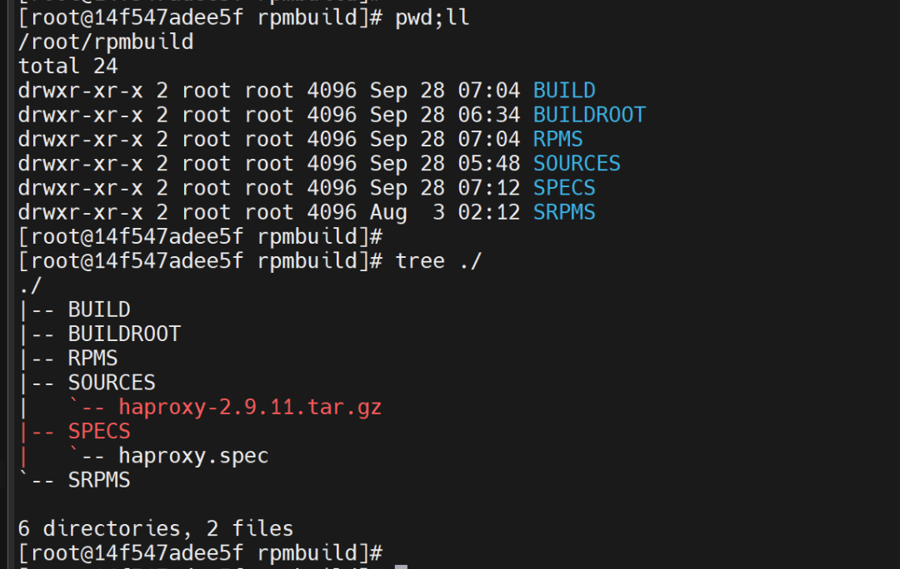

```go
//其中haproxy.spec文件内容为
Summary: HA server
Name: haproxy
Version: 2.9.11
Release: el7
License: GPL
Group: Applications/Server
Source: haproxy-2.9.11.tar.gz
URL: https://haproxy.org
Distribution: Linux
Packager: penghao phao0224@163.com
BuildRequires: gcc openssl-devel pcre-devel systemd-devel readline-devel
%description
This a haproxy software which product for penghao

%post
id haproxy &> /dev/null
if [ $? -ne 0 ];
then
  useradd haproxy
fi

getent group haproxy &> /dev/null
if [ $? -ne 0 ];
then
  groupadd haproxy
  useradd -g haproxy haproxy
fi
%preun
userdel -r haproxy

%prep
%setup -q
%build
make ARCH=x86_64 TARGET=linux-glibc USE_PCRE=1 USE_OPENSSL=1 USE_ZLIB=1 USE_SYSTEMD=1 USE_LUA=1 LUA_INC=/usr/local/src/lua-5.3.5/src/ LUA_LIB=/usr/local/src/lua-5.3.5/src/   //编译命令，具体参数根据实际情况调整
%install
make install DESTDIR=%{buildroot} PREFIX=/opt/haproxy
%files
/opt/haproxy
```

```go
rpmbuild -bb haproxy.spec    //执行打包
```

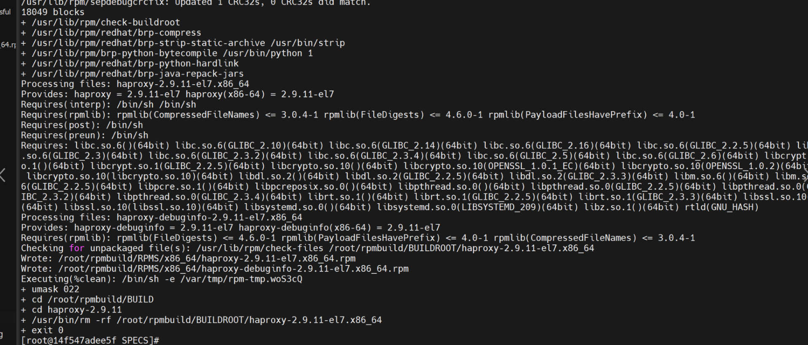

```go
rpm -qpi haproxy-2.9.11-el7.x86_64.rpm   //不安装检验包
```

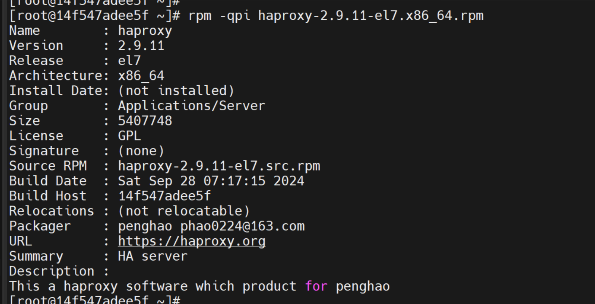

## 2、nginx

制作nginx的rpm包，基于最新的LTS版本v1.26.1，操作系统为centos-7.9，内核为6.1.80；

**目录：**

- 1、下载源码包
- 2、准备环境
- 3、上传源码包到指定文件夹下
- 4、编写spec文件（非常重要）
- 5、开始编译
- 6、检查rpm是否生成
- 7、安装
- 8、检查工作
- 9、补充：用checkinstall制作
- 10、补充2：官方下载
- 11、补充3：基于openresty高性能分支的nginx

### 1、下载源码包

nginx地址：https://nginx.org/en/download.html

headers-more-nginx-module模块：git clone https://github.com/openresty/headers-more-nginx-module.git  （可选，如果要控制HTTP 响应头的话）

### 2、准备环境

```go
//下载必要的依赖
yum install -y make gcc gcc-c++ openssl openssl-devel pcre-devel zlib-devel

//创建编译文件夹，nginx.spec不存在也可，只是为了拿到文件夹,或者用命令"rpmdev-setuptree"
rpmbuild -bb nginx.spec
ll rpmbuild/
```

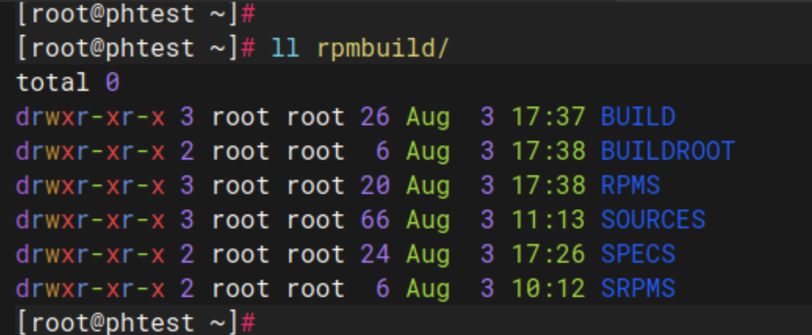

### 3、上传源码包

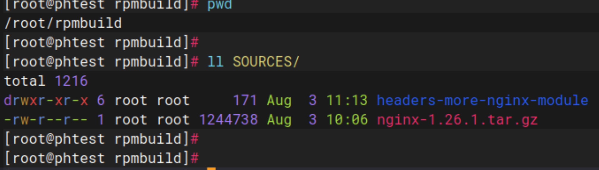

### 4、编写spec文件==（非常重要）==

```go
cd SPECS
//完整配置如下
cat nginx.spec

// 附加
zlib下载地址：https://zlib.net/current/zlib.tar.gz
openssl下载地址：https://openssl-library.org/source/
pcre下载地址：https://sourceforge.net/projects/pcre/files/pcre/8.45/pcre-8.45.tar.gz

//   温馨提示
在centos7.9上面选用的版本号通过：
openssl-1.1.1w
zlib-1.3.2
pcre-8.45
```

```go
Summary: High Performance Web Server
Name: nginx
Version: 1.26.1
Release: el7
License: GPL
Group: Applications/Server
Source: nginx-1.26.1.tar.gz
URL: http://nginx.org/
Distribution: Linux
Packager: penghao phao0224@163.com
BuildRequires: gcc,gcc-c++,pcre-devel,zlib-devel
%description
this a nginx which product for penghao

%post
id nginx &>/dev/null
 if [ $? -ne 0 ];
 then
   useradd nginx
 fi
echo "export PATH=/usr/local/nginx/sbin:$PATH" >> /etc/profile
source /etc/profile
declare -a filePaths
filePaths=(/var/log/nginx  /var/run  /var/cache/nginx)
for i in ${filePaths[*]}
do
        if [ ! -d ${i} ];
        then
                mkdir  ${i}
        fi
done

%preun
userdel -r nginx
%prep
%setup -q
%build
./configure \
        --prefix=/etc/nginx \
        --user=nginx \
        --group=nginx \
        --conf-path=/etc/nginx/nginx.conf \
        --error-log-path=/var/log/nginx/error.log \
        --http-log-path=/var/log/nginx/access.log \
        --pid-path=/var/run/nginx.pid \
        --lock-path=/var/run/nginx.lock \
        --modules-path=/usr/lib64/nginx/modules \
        --sbin-path=/usr/sbin/nginx \
        --http-client-body-temp-path=/var/cache/nginx/client_temp \
        --http-proxy-temp-path=/var/cache/nginx/proxy_temp \
        --http-fastcgi-temp-path=/var/cache/nginx/fastcgi_temp \
        --http-uwsgi-temp-path=/var/cache/nginx/uwsgi_temp \
        --http-scgi-temp-path=/var/cache/nginx/scgi_temp \
        --with-openssl=/root/rpmbuild/SOURCES/openssl  \
        --with-compat \
        --with-threads \
        --with-http_ssl_module \
        --with-http_v2_module \
        --with-http_realip_module \
        --with-http_addition_module \
        --with-http_sub_module \
        --with-http_dav_module \
        --with-http_flv_module \
        --with-http_mp4_module \
        --with-http_gunzip_module \
        --with-http_gzip_static_module \
        --with-http_random_index_module \
        --with-http_secure_link_module \
        --with-http_stub_status_module \
        --with-http_auth_request_module \
        --with-mail \
        --with-mail_ssl_module \
        --with-file-aio \
        --with-http_v3_module \
        --with-stream \
        --with-stream_realip_module \
        --with-stream_ssl_module \
        --with-stream_ssl_preread_module \
        --with-zlib=/root/rpmbuild/SOURCES/zlib \
        --with-pcre-jit \
        --with-http_slice_module \
        --with-pcre=/root/rpmbuild/SOURCES/pcre \
        --add-module=/root/rpmbuild/SOURCES/headers-more-nginx-module \
        --with-cc-opt='-O2 -g -pipe -Wall -Wp,-D_FORTIFY_SOURCE=2 -fexceptions -fstack-protector-strong --param=ssp-buffer-size=4 -grecord-gcc-switches -m64 -mtune=generic -fPIC' \
        --with-ld-opt='-Wl,-z,relro -Wl,-z,now -pie'
make %{?_smp_mflags}
%install
make install DESTDIR=%{buildroot}
%files
/usr/local/nginx
/etc/nginx
```

```go
//接下来对个参数进行解释
Summary: High Performance Web Server            //摘要信息
Name: nginx                                     //包名
Version: 1.26.1                                 //包的版本
Release: el7                                    //编译版本
License: GPL                                   //开源协议
Group: Applications/Server                      //软件分组
Source: nginx-1.23.1.tar.gz                      //源码文件，这里的文件名一定要和SOURCES下的文件一致
URL: http://nginx.org/                          //软件官网
Distribution: Linux                             //发版标识
Packager: pengaho                              //制作者的信息
BuildRoot: root/nginx-1.26.1-el7                //编译时的目录，可以自定义
BuildRequires: gcc,gcc-c++,pcre-devel,zlib-devel      //编译软件需要的依赖
%description                                          //%description一下的内容可以是软件信息的详细描述
nginx [engine x] is a HTTP and reverse proxy server, as well as a mail proxy server


%post                                           //安装时执行的操作
id nginx &>/dev/null                            //这里判断nginx用户是否存在，不存在则创建
 if [ $? -ne 0 ];
 then
   useradd nginx
 fi
echo "export PATH=/usr/local/nginx/sbin:$PATH" >> /etc/profile            //将nginx可执行文件添加到环境变量
source /etc/profile                                                       //刷新环境变量
declare -a filePaths
filePaths=(/var/log/nginx  /var/run  /var/cache/nginx)
for i in ${filePaths[*]}                                            //这里是判断nginx运行时需要的目录是否存在，不存在则创建
do
        if [ ! -d ${i} ];
        then
                mkdir  ${i}
        fi
done
%preun
userdel -r nginx                                                    //卸载时，删除nginx用户
%prep
%setup -q                                                           //构建BUILD环境,将解压源码压缩包到BUILD目录
%build
./configure \                                                       //对编译打包时的参数设置和环境检查
--prefix=/usr/local/nginx \
--user=nginx \
--group=nginx \
--conf-path=/etc/nginx/nginx.conf \
--error-log-path=/var/log/nginx/error.log \
--http-log-path=/var/log/nginx/access.log \
--pid-path=/var/run/nginx.pid \
--lock-path=/var/run/nginx.lock \
--modules-path=/usr/lib64/nginx/modules \
--sbin-path=/usr/local/nginx/sbin/nginx \
--http-client-body-temp-path=/var/cache/nginx/client_temp \
--http-proxy-temp-path=/var/cache/nginx/proxy_temp \
--http-fastcgi-temp-path=/var/cache/nginx/fastcgi_temp \
--http-uwsgi-temp-path=/var/cache/nginx/uwsgi_temp \
--http-scgi-temp-path=/var/cache/nginx/scgi_temp \
--with-openssl=/root/rpmbuild/SOURCES/openssl \  //添加指定版本的openssl源码编译
--with-http_ssl_module \
--with-http_v2_module \                  //添加http2.0编译
--with-http_realip_module \
--with-http_addition_module \
--with-http_sub_module \
--with-http_dav_module \
--with-http_flv_module \
--with-http_mp4_module \
--with-http_gunzip_module \
--with-http_gzip_static_module \
--with-http_random_index_module \
--with-http_secure_link_module \
--with-http_stub_status_module \
--with-http_auth_request_module \
--with-mail \
--with-mail_ssl_module \
--with-file-aio \
--with-ipv6 \
--with-stream
make %{?_smp_mflags}                        //编译
%install
make install DESTDIR=%{buildroot}             //编译安装
%files
/usr/local/nginx
/etc/nginx
```

### 5、开始编译

```go
rpmbuild -bb nginx.spec               //编译最后出现exit0为成功
```

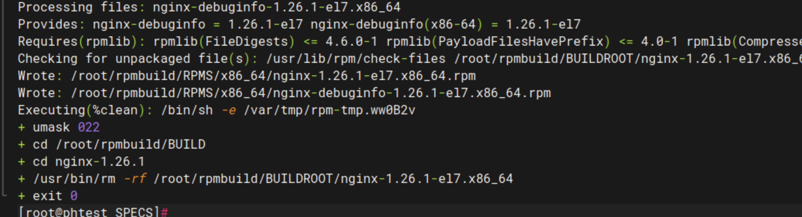

### 6、检查rpm

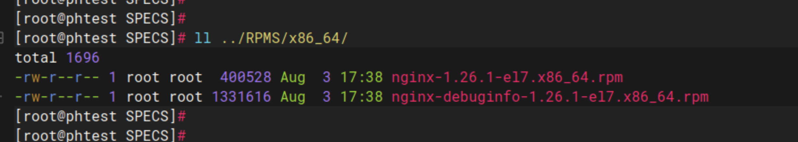

### 7、安装

```go
rpm -ivh ../RPMS/x86_64/nginx-1.26.1-el7.x86_64.rpm
//成功安装后在这几个地方生成文件配置文件在/etc/nginx目录下
//静态资源在/usr/local/nginx/html目录下
//可执行文件在/usr/local/nginx/sbin目录下
```

### 8、检查工作

```go
ll /usr/local/nginx/
ll /etc/nginx/
```

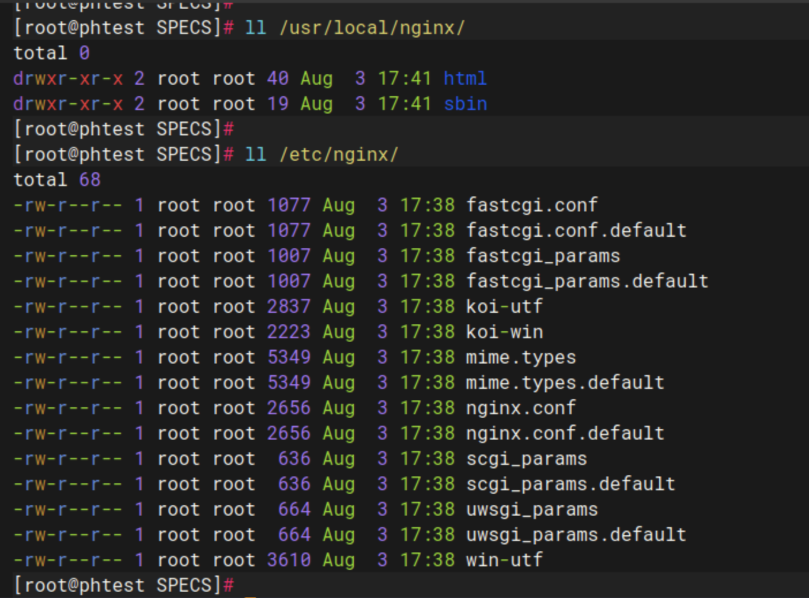

```go
cd /root/rpmbuild/RPMS/x86_64
rpm -qpi nginx-1.26.1-el7.x86_64.rpm   //不安装检测rpm信息

/*
Name        : nginx
Version     : 1.26.1
Release     : el7
Architecture: x86_64
Install Date: (not installed)
Group       : Applications/Server
Size        : 1147448
License     : GPL
Signature   : (none)
Source RPM  : nginx-1.26.1-el7.src.rpm
Build Date  : Sat 03 Aug 2024 05:38:20 PM CST
Build Host  : phtest
Relocations : (not relocatable)
Packager    : penghao phao0224@163.com
URL         : http://nginx.org/
Summary     : High Performance Web Server
Description :
this a nginx which product for penghao
*/
```

参考资料：https://blog.csdn.net/weixin_45913746/article/details/126285688

### 9、补充：用checkinstall制作

```go
// checkinstall是一款非常方便的制作rpm或者deb包的小工具，极大的方便了安装包的制作与安装，下面将介绍其在centos7.9系统下制作nginx的rpm包的过程；
```

```go
//安装checkinstallh程序包，参考链接：
```

[checkinstall](https://home.gztzs.com/display/zsxx/checkinstall)

```go
//下载nginx的源码包，解压后进行make编译
rpmdev-setuptree    //自动生成rpmbuild文件目录
wget http://nginx.org/download/nginx-1.24.0.tar.gz ; tar -xvf nginx-1.24.0.tar.gz
cd nginx-1.24.0
//为例避免报错，还需要优化一些东西，以下操作：
echo "/usr/local/lib64" >/etc/ld.so.conf.d/installwatch.conf && ln -s /usr/local/lib/installwatch.so /usr/local/lib64/installwatch.so && ldconfig
```

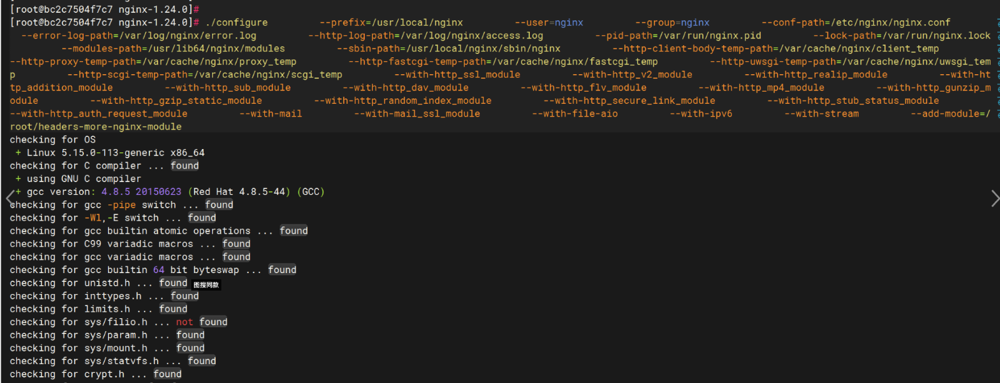

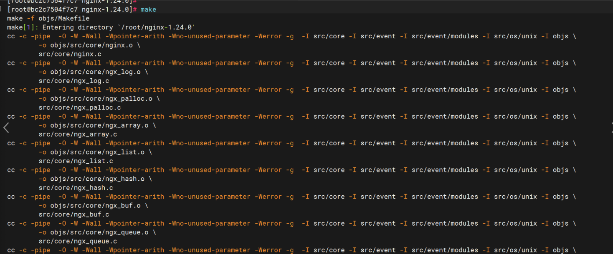

```go
//执行完make之后
checkinstall -R
```


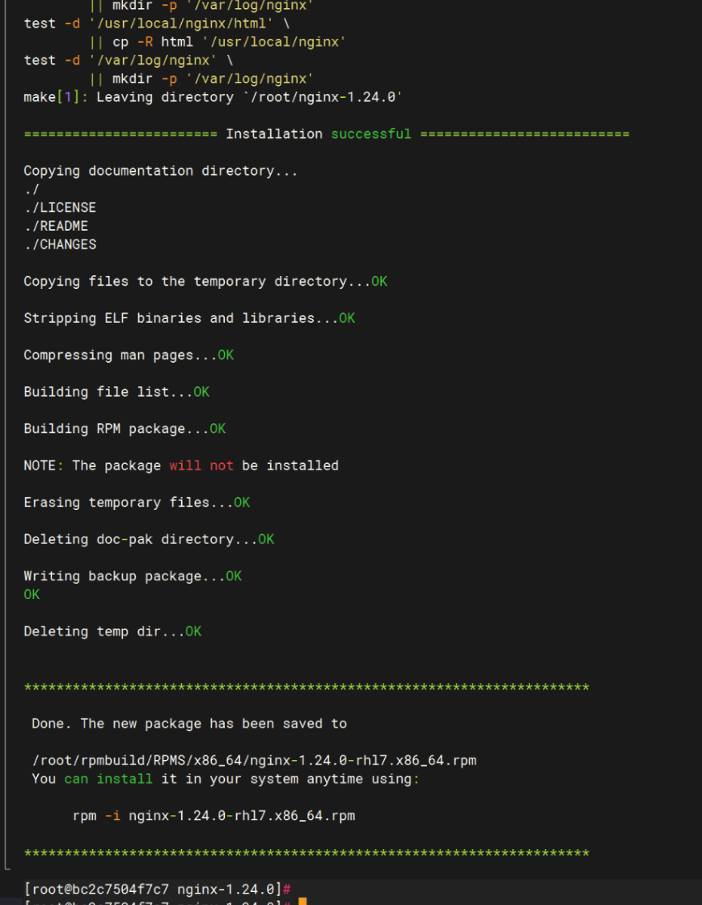

```go
//可以看到在 /root/rpmbuild/RPMS/x86_64 目录下面生成了nginx的rpm包了
rpm -qpi nginx-1.24.0-rhl7.x86_64.rpm
rpm -qpl nginx-1.24.0-rhl7.x86_64.rpm
```

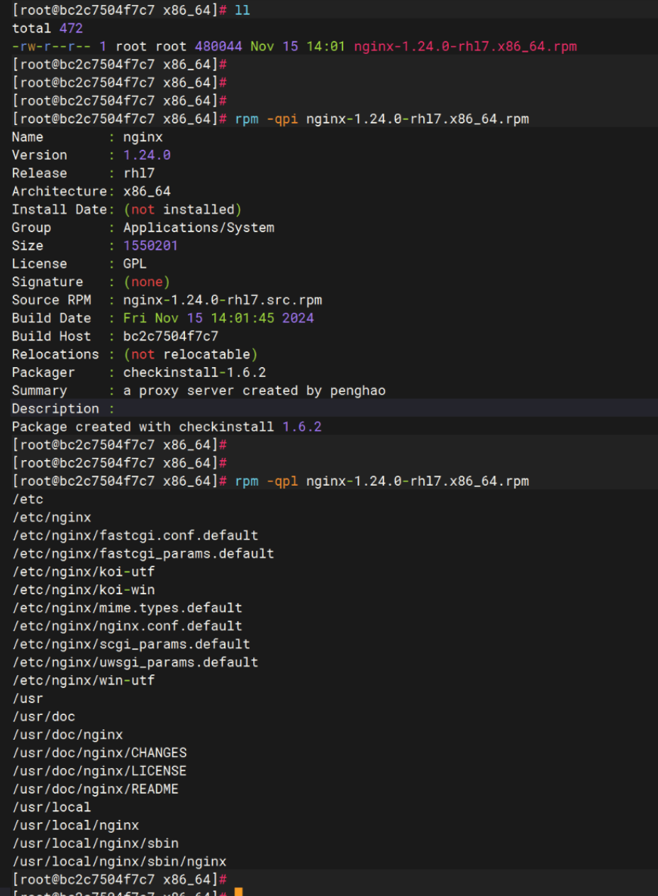

### 10、补充2：官方下载

官方下载链接：http://nginx.org/packages

### 11、补充3：基于openresty高性能分支的nginx

文章链接：[基于openresty高性能分支的nginx](https://wiki.uhowie.com/tech/linux/rpm/openresty)

### 12、附编译参数（os为Rocky9.3，生产可用）

```go
--prefix=/etc/nginx --user=nginx --group=nginx --conf-path=/etc/nginx/nginx.conf --error-log-path=/var/log/nginx/error.log --http-log-path=/var/log/nginx/access.log --pid-path=/var/run/nginx.pid --lock-path=/var/run/nginx.lock --modules-path=/usr/lib64/nginx/modules --sbin-path=/usr/sbin/nginx --http-client-body-temp-path=/var/cache/nginx/client_temp --http-proxy-temp-path=/var/cache/nginx/proxy_temp --http-fastcgi-temp-path=/var/cache/nginx/fastcgi_temp --http-uwsgi-temp-path=/var/cache/nginx/uwsgi_temp --http-scgi-temp-path=/var/cache/nginx/scgi_temp --with-compat --with-threads --with-http_ssl_module --with-http_v2_module --with-http_realip_module --with-http_addition_module --with-http_sub_module --with-http_dav_module --with-http_flv_module --with-http_mp4_module --with-http_gunzip_module --with-http_gzip_static_module --with-http_random_index_module --with-http_secure_link_module --with-http_stub_status_module --with-http_auth_request_module --with-mail --with-mail_ssl_module --with-file-aio --with-http_v3_module --with-stream --with-stream_realip_module --with-stream_ssl_module --with-stream_ssl_preread_module --with-http_slice_module --with-cc-opt='-O2 -g -pipe -Wall -Wp,-D_FORTIFY_SOURCE=2 -fexceptions -fstack-protector-strong --param=ssp-buffer-size=4 -grecord-gcc-switches -m64 -mtune=generic -fPIC' --with-ld-opt='-Wl,-z,relro -Wl,-z,now -pie'
```

