# 源码编译

记录源码编译常用软件代码

[TOC]

## 1、checkinstall

在debain系统上是可以用apt直接在线安装checkinstall的，但是centos7上面是没有在线源了，百度说可以用centos6的rpm包安装，但是6的是旧版本的，所以如果要安装新版本的话还得编译安装为好；

以下将编译安装checkinstall，笔者环境为centos7.9（docker环境）

```go
yum install gettext make
yum install gcc rpm-build pcre-devel rpmdevtools
wget https://checkinstall.izto.org/files/source/checkinstall-1.6.2.tar.gz
tar -xvf checkinstall-1.6.2.tar.gz
cp checkinstall-1.6.2
make   //直接make是会报错的，如下所示
```


```go
//需要做一下处理先,参考链接：https://www.patrickmin.com/linux/tip.php?name=checkinstall_fedora_13
To fix these, load the file installwatch/installwatch.c into an editor, and modify these lines:
at line 101, change:
 static int (*true_scandir)(    const char *,struct dirent ***,
                int (*)(const struct dirent *),
                int (*)(const void *,const void *));

to:
 static int (*true_scandir)(    const char *,struct dirent ***,
                int (*)(const struct dirent *),
                int (*)(const struct dirent **,const struct dirent **));

(i.e. just change the types in the last line from const void * to const struct dirent **)
at line 121, change:
 static int (*true_scandir64)(  const char *,struct dirent64 ***,
                int (*)(const struct dirent64 *),
                int (*)(const void *,const void *));

to:
 static int (*true_scandir64)(  const char *,struct dirent64 ***,
                int (*)(const struct dirent64 *),
                int (*)(const struct dirent64 **,const struct dirent64 **));

(i.e. same change with 64 added)
at line 2941, change:
#if (GLIBC_MINOR <= 4)
to:
#if (0)
at line 3080, change:
 int scandir(   const char *dir,struct dirent ***namelist,
        int (*select)(const struct dirent *),
        int (*compar)(const void *,const void *)    ) {

to:
 int scandir(   const char *dir,struct dirent ***namelist,
        int (*select)(const struct dirent *),
        int (*compar)(const struct dirent **,const struct dirent **)    ) {

at line 3692, change:
 int scandir64( const char *dir,struct dirent64 ***namelist,
        int (*select)(const struct dirent64 *),
        int (*compar)(const void *,const void *)    ) {

to:
 int scandir64( const char *dir,struct dirent64 ***namelist,
        int (*select)(const struct dirent64 *),
        int (*compar)(const struct dirent64 **,const struct dirent64 **)    ) {
```

```go
//修改完上面的内容之后，再次执行make皆可
make
//在执行make install 还要执行一个步骤，修改一个变量，如下所示：
edit the file checkinstall itself:
at line 495, change: CHECKINSTALLRC=${CHECKINSTALLRC:-${INSTALLDIR}/checkinstallrc}
to:
CHECKINSTALLRC=${CHECKINSTALLRC:-${INSTALLDIR}/lib/checkinstall/checkinstallrc}
at line 2466, change: $RPMBUILD -bb ${RPM_TARGET_FLAG}${ARCHITECTURE} "$SPEC_PATH" &> ${TMP_DIR}/rpmbuild.log
to:
$RPMBUILD -bb ${RPM_TARGET_FLAG}${ARCHITECTURE} --buildroot $BROOTPATH "$SPEC_PATH" &> ${TMP_DIR}/rpmbuild.log
//最后执行install
make install
//检查版本
cd ~ && checkinstall --version
```

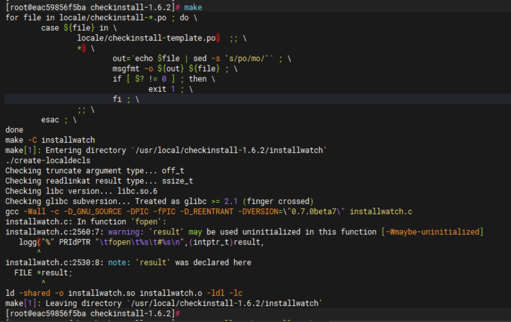


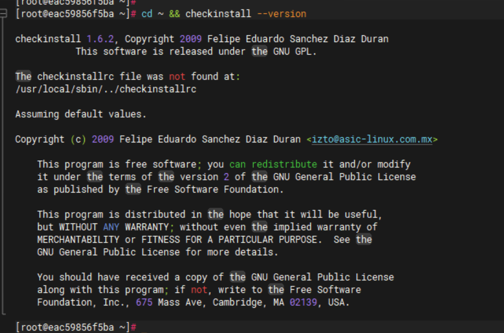

## 2、curl

源码编译安装curl服务，版本号为8.7.1，os为centos7.9，内核版本为6.1.80；

官方源码下载地址：https://curl.se/download/


开始安装：

```go
//如果需要增加http2编译，则需要先安装依赖包
yum install libnghttp2-devel
tar -xvf curl-8.7.1.tar.bz2
cd curl-8.7.1
./configure --prefix=/usr/local/ --with-openssl=/usr/local/openssl --with-nghttp2 --enable-http2 //配置安装目录，且编译http2
```

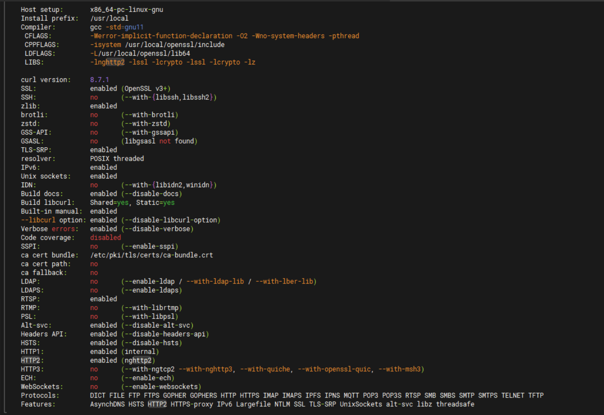

```go
make -j 4
make install
curl -V    //可能版本还是原来的，没有改变，需要继续进行一一步
find / -name curl
mv /usr/bin/curl /usr/bin/curl_bak
cp /usr/local/bin/curl /usr/bin/
curl -V        //再次查看就可以看到版本成功更新了
```

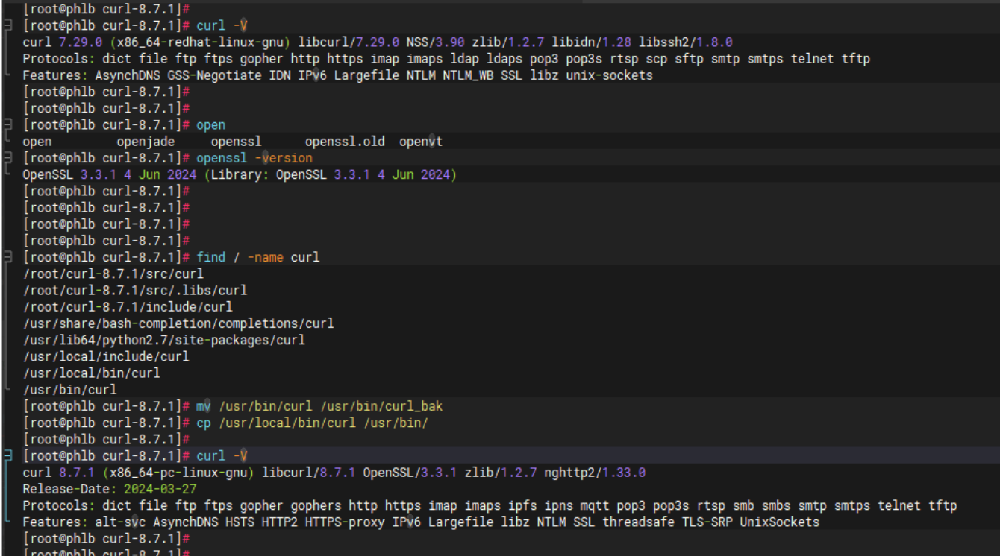

```go
//当安装了http2的编译版本后，利用curl命令请求一些http2的站点就能正确返回http2的协议了，如下图所示：
```

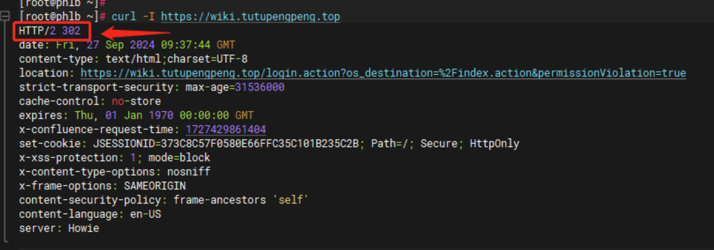

## 3、haproxy

os基于centos7.9，内核6.1.80，haproxy版本为2.9.11，openssl版本为3.3.1

源码地址：https://www.haproxy.org/

将源码包上传到/usr/local/目录下，然后解压：

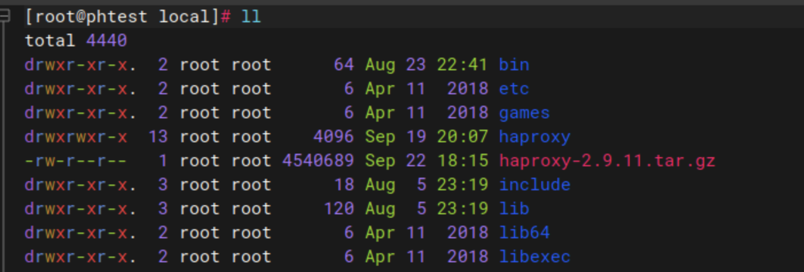

首先需要升级一下lua语言版本：

```go
// lua是一种小巧的脚本语言，于1993年由巴西里约热内卢天主教大学（Pontifical Catholic University of Rio de Janeiro ）里的一个研究小组开发，其设计目的是为了嵌入应用程序中，从而为应用程序提供灵活的扩展和定制功能
// 查看当前操作系统的lua版本
[root@phtest local]# lua -v
Lua 5.1.4  Copyright (C) 1994-2008 Lua.org, PUC-Rio
```

```go
//升级lua
yum install wget gcc readline-devel
wget http://www.lua.org/ftp/lua-5.3.5.tar.gz
tar -xvf lua-5.3.5.tar.gz -C /usr/local/src/
cd /usr/local/src/lua-5.3.5
//开始编译
make linux test
//检查升级后的版本
src/lua -v
```

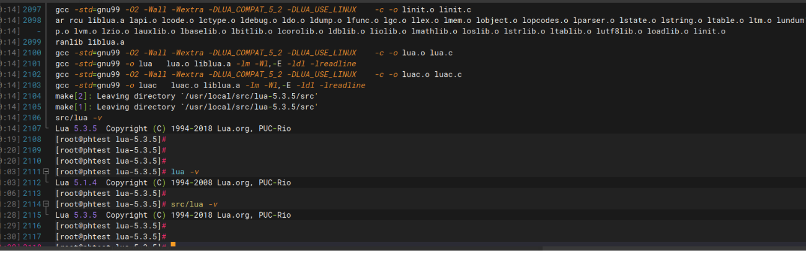

```go
//开始正式编译安装haproxy：
cd /usr/local/haproxy
yum install gcc openssl-devel pcre-devel systemd-devel
//可以查看Makefile INSTALL README 等文件进行安装参考
//本机是x86_64位的，且之前对openssl进行了升级，所以需要指定openssl的编译路径，编译如下
make ARCH=x86_64 TARGET=linux-glibc USE_PCRE=1 USE_OPENSSL=1 SSL_LIB=/usr/local/openssl/lib64/ SSL_INC=/usr/local/openssl/include/  USE_ZLIB=1 USE_SYSTEMD=1 USE_LUA=1 LUA_INC=/usr/local/src/lua-5.3.5/src/ LUA_LIB=/usr/local/src/lua-5.3.5/src/
//安装，路径选择为/opt/haproxy
make install PREFIX=/opt/haproxy
ln -s /opt/haproxy/sbin/haproxy /usr/sbin/
```

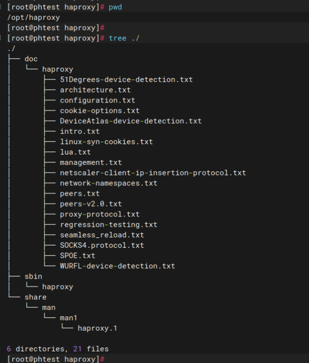

验证haproxy版本：

```go
which haproxy
haproxy -v
haproxy -vv
```


编写haproxy启动脚本：

```go
vim /usr/lib/systemd/system/haproxy.service
////////////////////////////////////////////////
[Unit]
Description=HAProxy Load Balancer
After=syslog.target network.target
[Service]
ExecStartPre=/sbin/haproxy -f /etc/haproxy/haproxy.cfg -c -q
ExecStart=/sbin/haproxy -Ws -f /etc/haproxy/haproxy.cfg -p /var/lib/haproxy/haproxy.pid
ExecReload=/bin/kill -USR2 $MAINPID
[Install]
WantedBy=multi-user.target
```

编写简单测试配置文件：

```go
mkdir -p /etc/haproxy
vim /etc/haproxy/haproxy.cfg
//可用命令 haproxy -f /etc/haproxy/haproxy.cfg  检查配置文件的语法
-------------------------
global
        maxconn 100000
        chroot /opt/haproxy
        stats socket /var/lib/haproxy/haproxy.sock mode 600 level admin
        #uid 99
        #gid 99
        user haproxy
        group haproxy
        daemon
        #nbproc 4
        #cpu-map 1 0
        #cpu-map 2 1
        #cpu-map 3 2
        #cpu-map 4 3
        pidfile /var/lib/haproxy/haproxy.pid
        log 127.0.0.1 local2 info

defaults
        option http-keep-alive
        option forwardfor
        maxconn 100000
        mode http
        timeout connect 300000ms
        timeout client 300000ms
        timeout server 300000ms
        listen stats
        mode http
        bind 0.0.0.0:9999
        stats enable
        log global
        stats uri /haproxy
        stats auth admin:123456

listen web_port
        bind 172.30.139.102:80
        mode http
        log global
        server web1 127.0.0.1:8080 check inter 3000 fall 2 rise 5
```

启动haproxy：

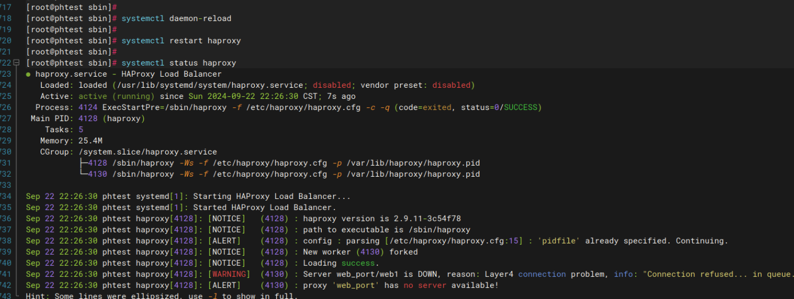

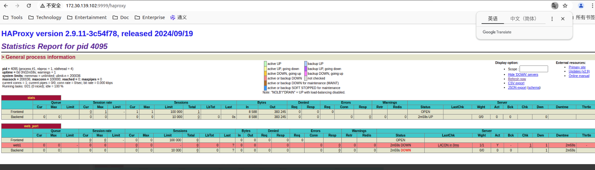

## 4、openssh

基于源码编译安装openssh，版本为最新的稳定版9.8p1，os为centos7.9，内核版本为6.1.80，openssl版本为3.3.1；

源码下载地址：https://cdn.openbsd.org/pub/OpenBSD/OpenSSH/portable/

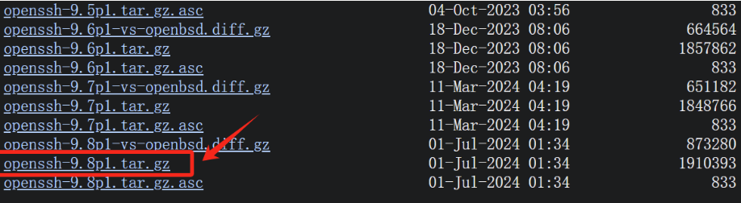

上传到服务器的/opt目录下，并解压：

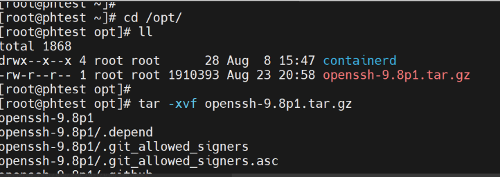

备份原来的配置文件：

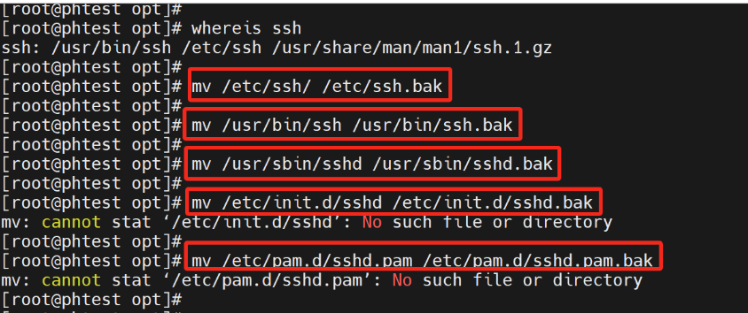

卸载原来的openssh包：

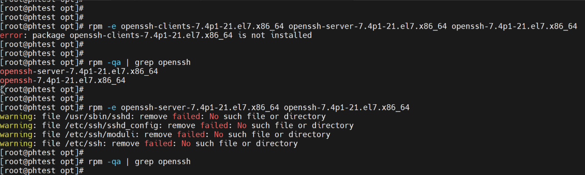

新建 **vim /etc/pam.d/sshd 文件：**

```go
#%PAM-1.0
auth       required     pam_sepermit.so
auth       substack     password-auth
auth       include      postlogin
# Used with polkit to reauthorize users in remote sessions
-auth      optional     pam_reauthorize.so prepare
account    required     pam_nologin.so
account    include      password-auth
password   include      password-auth
# pam_selinux.so close should be the first session rule
session    required     pam_selinux.so close
session    required     pam_loginuid.so
# pam_selinux.so open should only be followed by sessions to be executed in the user context
session    required     pam_selinux.so open env_params
session    required     pam_namespace.so
session    optional     pam_keyinit.so force revoke
session    include      password-auth
session    include      postlogin
# Used with polkit to reauthorize users in remote sessions
-session   optional     pam_reauthorize.so prepare
```

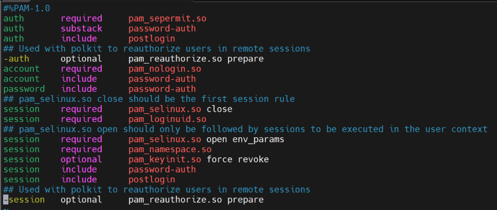

开始编译安装：

```go
//指定openssl位置
yum install pam-devel     //可能需要安装一些依赖
./configure --prefix=/usr --sysconfdir=/etc/ssh --with-md5-passwords --with-pam --with-tcp-wrappers --with-ssl-dir=/usr/local/openssl --with-privsep-path=/var/lib/sshd --without-hardening
```

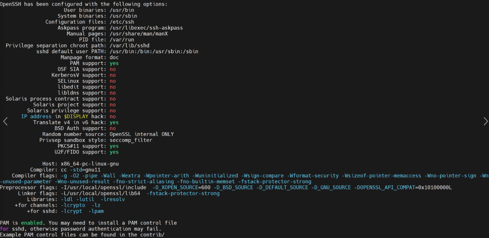

```go
make && make install
```

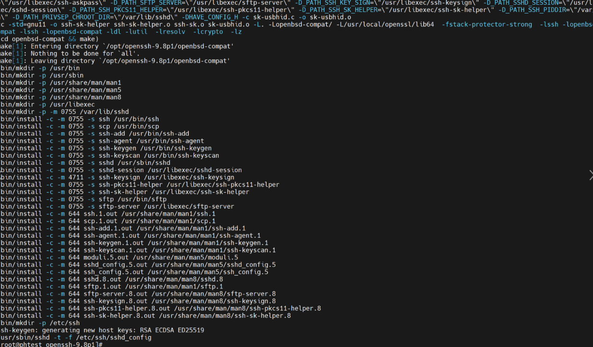

修改相关文件权限：

```go
cd /etc/ssh/
chmod 600 /etc/ssh/ssh_host_rsa_key
chmod 600 /etc/ssh/ssh_host_ecdsa_key
chmod 600 /etc/ssh/ssh_host_ed25519_key
```

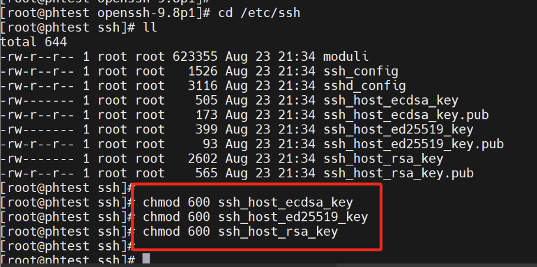

允许远程登陆：

```go
// 修改配置文件，允许root直接登录
echo "PasswordAuthentication yes" >> /etc/ssh/sshd_config
echo "PermitRootLogin yes" >> /etc/ssh/sshd_config
echo "UsePAM yes" >> /etc/ssh/sshd_config
```

设置自启：

```go
//ssh服务必须开机自启动，因此要进行一些设置
cp -p /opt/openssh-9.8p1/contrib/redhat/sshd.init /etc/init.d/sshd
chmod +x /etc/init.d/sshd
chkconfig --add sshd
chkconfig sshd on
systemctl restart sshd
systemctl status sshd
//查看版本
ssh -V
```

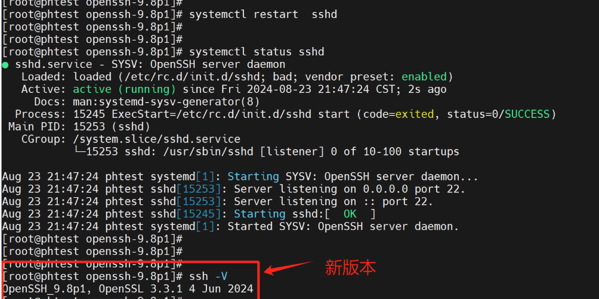

最后可以试一下服务器重启，看一下能否正常远程登陆。

## 5、openssl

源码编译安装openssl，版本为3.3.1，os为centos7.9，linux内核号为6.1.80；

官方源码下载地址：https://openssl-library.org/source/

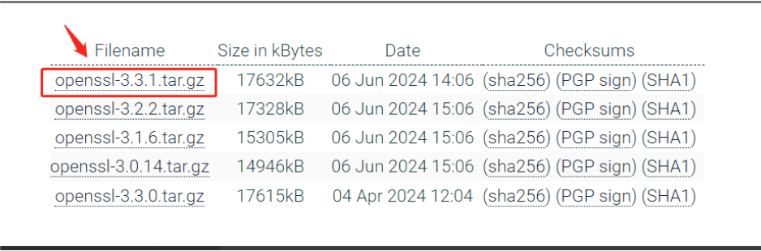

开始安装：

```go
tar -xvf openssl-3.3.1.tar.gz
cd openssl-3.3.1
mkdir /usr/local/openssl
yum install perl-ExtUtils-CBuilder perl-ExtUtils-MakeMaker         //可能需要安装一些依赖
./config --prefix=/usr/local/openssl/                              //开始编译
```

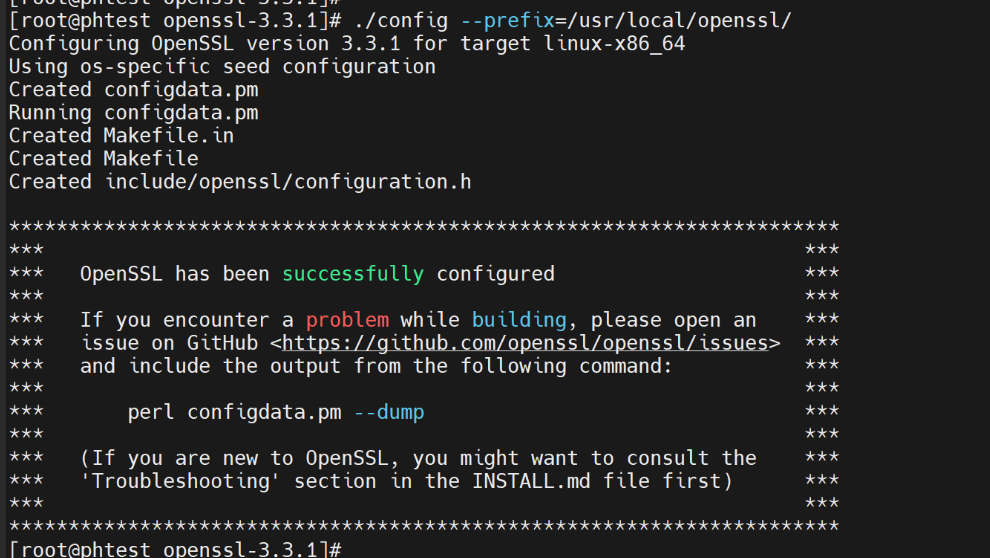

```go
make -j 4    //开始编译
make  install   //编译结束开始安装

//备份和配置软链接
which openssl
mv /usr/bin/openssl /usr/bin/openssl.old
mv /usr/include/openssl/ /usr/include/openssl.old
ln -s /usr/local/openssl/bin/openssl /usr/bin/openssl
ln -s /usr/local/openssl/include/openssl /usr/include/openssl

ldconfig
cat /etc/ld.so.conf           //可能需要手动将lib包路径加到动态链接中
ldconfig
openssl version          //查看版本号是否已经安装成功
openssl version -a       //查看完整配置信息
```

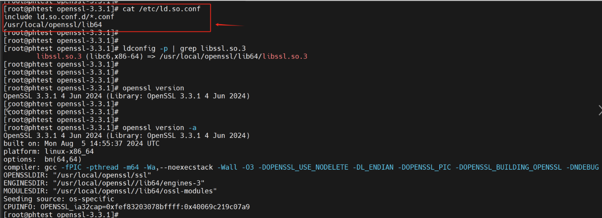

## 6、python

编译安装python3.8，os为centos7.9，此次我们安装的版本为v3.8.9；

源码下载地址：https://www.python.org/ftp/python/

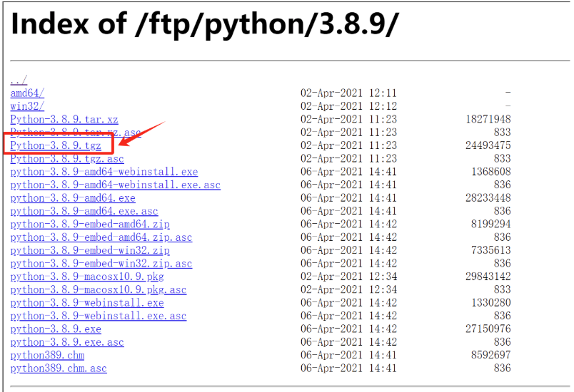

原来版本为：

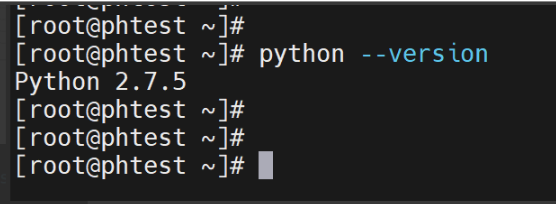

源码上传到服务器上并解压：

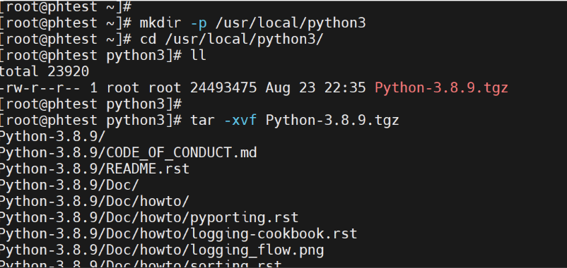

开始编译安装：

```go
cd Python-3.8.9
./configure --prefix=/usr/local/python3
make & make install
```

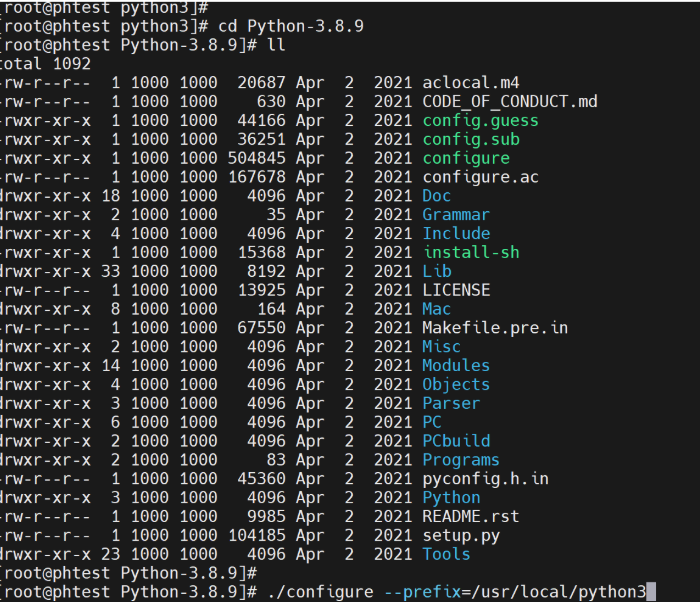

创建软连接：

```go
cd /usr/local/python3
ln -s /usr/local/python3/bin/python3 /usr/local/bin/python3
ln -s /usr/local/python3/bin/pip3 /usr/local/bin/pip3
```

验证：（注意PATH环境变量的导入）

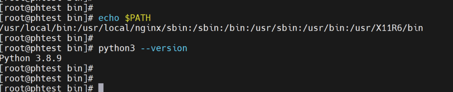

