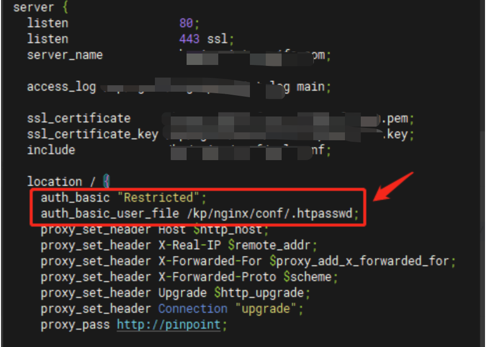

# Nginx


nginx学习章节

部署于安装参考链接：https://wiki.baidu.com/tech/linux/rpm

## 1、基本用法

### 1、重定向

- 案例1：

​      实现将请求从https://s.baidu.com/EvQzE3 重定向到 https://api.baidu.com/c2/salesbooster/url/EvQzE3，其中"[EvQzE3](https://api.baidu.com/c2/salesbooster/url/EvQzE3)"是可变的;

```go
server {
    listen 443 ssl;
    server_name s.baidu.com;

    # SSL 配置
    ssl_certificate /path/to/your/certificate.crt;
    ssl_certificate_key /path/to/your/private.key;

    # 其他 SSL 相关配置...

    location ~ ^/([a-zA-Z0-9]+)$ {
        return 301 https://api.baidu.com/c2/salesbooster/url/$1;
    }
}
```

- 案例2：

​      实现外网访问 https://api.baidu.com/kp-server-kpkd，打到内网 http://192.168.8.116:30801/kp-server-kpkd/：(有WAF的需要注意影响，是否已添加域名与证书)

```go
//外网nginx配置：
server {
  server_name           api.baidu.com
  access_log            /kp/nginx/logs-443.baidu.log main;

  ssl_certificate           /kp/nginx/certs/baidu.com.pem;
  ssl_certificate_key       /kp/nginx/certs/baidu.com.key;
  include                   /kp/nginx/ssl.conf;

  listen                    443 ssl;
  location / {
    proxy_set_header        Host $host;
    proxy_set_header        X-Real-IP $remote_addr;
    proxy_set_header        X-Forwarded-For $proxy_add_x_forwarded_for;
    proxy_set_header        X-Forwarded-Proto $scheme;
    proxy_pass              https://113.108.196.190:12443;      #打到内网

    proxy_http_version      1.1;
    proxy_set_header        Upgrade $http_upgrade;
    proxy_set_header        Connection "upgrade";

    proxy_redirect          off;
    proxy_next_upstream     error timeout invalid_header http_500;
    proxy_connect_timeout   5;
  }
}

//内网nginx配置：
server {
  listen                      80;
  listen                      443 ssl;
  server_name                 api.baidu.com;

  access_log                  /kp/nginx/logs/api.log main;

  ssl_certificate             /kp/nginx/certs/baidu.com.pem;
  ssl_certificate_key         /kp/nginx/certs/baidu.com.key;
  include                     /kp/nginx/ssl.conf;

  client_header_timeout       120;
  client_max_body_size        200m;
  client_body_buffer_size     256k;

  proxy_buffer_size           4k;
  proxy_buffers               8 32k;
  proxy_busy_buffers_size     64k;
  proxy_temp_file_write_size  64k;
  client_body_temp_path       /kp/nginx/tmppath;
  add_header  'Access-Control-Max-Age' 600;

  location /kp-server-kpkd/ {
    proxy_set_header Host $host;
    proxy_set_header X-Real-IP $remote_addr;
    proxy_set_header X-Forwarded-For $proxy_add_x_forwarded_for;
    proxy_set_header X-Forwarded-Proto $scheme;
    proxy_pass http://192.168.8.116:30801/kp-server-kpkd/;            ##映射内网ip:port

    proxy_redirect          off;
    proxy_next_upstream     error timeout invalid_header http_500;
    proxy_connect_timeout   5;
  }
```

### 2、隐藏版本号

```go
// 方法一
vim nginx.conf
-----------
http{
    server_tokens off;
}

// 方法二
http{
    //需要nginx有headers-more-nginx-module模块
    more_set_headers 'Server: SRE';
}

// 方法三，修改源码重新编译即可
① src/core/nginx.h 【最重要】
#define NGINX_VERSION      "1.26.2"   // 删掉版本数字，改为空/自定义字符串
#define NGINX_VER          "nginx/" NGINX_VERSION
// 修改成自定义内容，示例：
#define NGINX_VERSION      "1.0.0"
#define NGINX_VER          "Howie"
② src/http/ngx_http_header_filter_module.c
static u_char ngx_http_server_string[] = "Server: nginx" CRLF;
static u_char ngx_http_server_full_string[] = "Server: " NGINX_VER CRLF;
替换为
static u_char ngx_http_server_string[] = "Server: Howie" CRLF;
static u_char ngx_http_server_full_string[] = "Server: Howie" CRLF;
③ src/http/ngx_http_special_response.c（错误页面底部版权）
"<hr><center>" NGINX_VER "</center>" CRLF
替换为
"<hr><center>Howie</center>" CRLF
```

### 3、端口代理

```go
vim nginx.conf
--------------
//将127.0.0.1的端口8888转发到192.168.0.2:9999
stream {
    upstream wiki {
        server 192.168.0.2:9999;
    }

    server {
        listen 8888;
        proxy_pass wiki;
    }
}
```

### 4、身份验证

```go
//auth_basic是Nginx中的一个模块,用于实现基本的身份验证机制。当客户端尝试访问设置auth_basic的资源时，Nginx会要求用户提供用户名和密码。如果提供的凭据有效，客户端才能访问该资源；否则，客户端会收到HTTP-401 Unauthorized状态码，并被提示输入用户名和密码
//加如下字段；其中的密码信息是由htpasswd工具（需要安装httpd-tools）创建的，语法为：
htpasswd -cm /path/to/your/htpasswd_file username

auth_basic "Restricted";
auth_basic_user_file /kp/nginx/conf/.htpasswd;
```



### 5、限制指定url访问

```go
//比如限制 /actuator/* 的访问路径
location ~* ^/(actuator|c1/actuator|c2/actuator|g1/actuator)/.*$ {
            deny all;      #拒绝所有访问
            return 403;    #返回 403 错误码
        }
```

### 6、基本生产配置参考

```go
// nginx.conf
user  nginx;
worker_processes  2;
worker_rlimit_nofile 51200;
#error_log  logs/error.log;
#error_log  logs/error.log  notice;
#error_log  logs/error.log  info;
#pid        logs/nginx.pid;

events {
    worker_connections  51200;
}

http {

    include       mime.types;
    default_type  application/octet-stream;
    server_tokens off;
    #more_set_headers 'Server: CheezyRabbit';
    log_format  main  '$remote_addr - $remote_user [$time_local] "$request" '
                      '$status $body_bytes_sent "$http_referer" '
                      '"$http_user_agent" "$http_x_forwarded_for"';

    access_log  logs/access.log  main;

    sendfile       on;
    tcp_nopush     on;
    tcp_nodelay     on;

    keepalive_timeout  65;
    keepalive_requests 10000;
    include /etc/nginx/conf.d/*.conf;
    gzip  on;
    gzip_vary on;
    gzip_proxied any;
    gzip_comp_level 6;
    gzip_buffers 16 8k;
    gzip_http_version 1.1;
    gzip_types
      text/plain
      text/css
      application/json
      application/javascript
      text/xml
      application/xml
      application/xml+rss
      text/javascript;
}
```

```go
// 0_backend.conf
upstream wiki {
    # confluencei
    keepalive 32;
    server 127.0.0.1:3000 weight=1 max_fails=3 fail_timeout=30s;
}
```

```go
// wiki.conf
server {
    listen 80;
    server_name wiki.baidu.com;
    return 301 https://wiki.baidu.com$request_uri;
}

server {
    listen 443 ssl;
    server_name wiki.baidu.com;
    http2 on;

    add_header Strict-Transport-Security "max-age=31536000; includeSubDomains" always;
    add_header X-Content-Type-Options nosniff always;
    add_header X-Frame-Options SAMEORIGIN always;
    add_header X-XSS-Protection "1; mode=block" always;
    ssl_certificate /etc/nginx/certs/baidu.com.pem;
    ssl_certificate_key /etc/nginx/certs/baidu.com.key;

    ssl_protocols TLSv1.2 TLSv1.3;
    ssl_ciphers ECDHE-ECDSA-AES128-GCM-SHA256:ECDHE-RSA-AES128-GCM-SHA256:ECDHE-ECDSA-AES256-GCM-SHA384:ECDHE-RSA-AES256-GCM-SHA384:ECDHE-ECDSA-CHACHA20-POLY1305:ECDHE-RSA-CHACHA20-POLY1305:DHE-RSA-AES128-GCM-SHA256:DHE-RSA-AES256-GCM-SHA384;
    ssl_prefer_server_ciphers on;
    ssl_session_cache   shared:SSL:10m;
    ssl_session_timeout 10m;
    ssl_session_tickets off;

    client_max_body_size 50M;

    access_log /data/logs/wiki.log main;
    error_log /data/logs/wiki_error.log;

    location / {
        #auth_basic "Restricted";
        #auth_basic_user_file /etc/nginx/.htpasswd;

        # 测试，用完请注释
        #default_type application/octet-stream;
        #default_type text/html;
        #echo "No permission to view. Please contact admin Howie.";

        # 使用 upstream 名称
        proxy_pass http://wiki/;
        proxy_http_version 1.1;
        proxy_set_header Host $host;
        proxy_set_header X-Real-IP $remote_addr;
        proxy_set_header X-Forwarded-For $proxy_add_x_forwarded_for;
        proxy_set_header X-Forwarded-Proto $scheme;
        proxy_set_header Upgrade $http_upgrade;
        proxy_set_header Connection "upgrade";

        proxy_redirect off;
        proxy_connect_timeout 10;
        proxy_send_timeout 60;
        proxy_read_timeout 60;
    }

    # 强制 HTTPS（可选）
    if ($scheme != "https") {
        return 301 https://$host$request_uri;
    }
}
```

```go
// 补充上面
// 情况一：nginx前面无代理，想获取客户端真实ip地址（同上）
proxy_pass http://wiki/;
proxy_http_version 1.1;
proxy_set_header Host $host;
proxy_set_header X-Real-IP $remote_addr;
proxy_set_header X-Forwarded-For $proxy_add_x_forwarded_for;
proxy_set_header X-Forwarded-Proto $scheme;
proxy_set_header Upgrade $http_upgrade;
proxy_set_header Connection $connection_upgrade;

// 情况二：nginx前面有代理，如LB、CF等，想获取客户端真实ip地址（修改如下）
先在http{}内添加
map $http_upgrade $connection_upgrade {
    default upgrade;
    '' close;
}
map $http_x_forwarded_for $real_ip {
    "" $remote_addr;
    ~^(?P<src>[0-9.]+),?.*$ $src;
}

location 内部
proxy_pass http://wiki/;
proxy_http_version 1.1;
proxy_set_header Host $host;
proxy_set_header X-Real-IP $real_ip;
proxy_set_header X-Forwarded-For $proxy_add_x_forwarded_for;
proxy_set_header X-Forwarded-Proto $scheme;
proxy_set_header Upgrade $http_upgrade;
proxy_set_header Connection $connection_upgrade;
```

```go
// www.conf
# HTTP 强制跳转 HTTPS
server {
    listen 80;
    server_name baidu.com www.baidu.com;
    return 301 https://www.baidu.com$request_uri;
}

# 裸域名跳转 www
server {
    listen 8443 ssl;
    server_name baidu.com;
    ssl_certificate /etc/nginx/certs/baidu.com.pem;
    ssl_certificate_key /etc/nginx/certs/baidu.com.key;
    return 301 https://www.baidu.com$request_uri;
}

server {
    listen 8443 ssl;
    server_name www.baidu.com;
    http2 on;

    add_header Strict-Transport-Security "max-age=31536000; includeSubDomains" always;
    add_header X-Content-Type-Options nosniff always;
    add_header X-Frame-Options SAMEORIGIN always;
    add_header X-XSS-Protection "1; mode=block" always;
    ssl_certificate /etc/nginx/certs/baidu.com.pem;
    ssl_certificate_key /etc/nginx/certs/baidu.com.key;

    ssl_protocols       TLSv1.2 TLSv1.3;
    ssl_ciphers ECDHE-ECDSA-AES128-GCM-SHA256:ECDHE-RSA-AES128-GCM-SHA256:ECDHE-ECDSA-AES256-GCM-SHA384:ECDHE-RSA-AES256-GCM-SHA384:ECDHE-ECDSA-CHACHA20-POLY1305:ECDHE-RSA-CHACHA20-POLY1305:DHE-RSA-AES128-GCM-SHA256:DHE-RSA-AES256-GCM-SHA384;
    ssl_prefer_server_ciphers on;
    ssl_session_cache   shared:SSL:10m;
    ssl_session_timeout 10m;
    ssl_session_tickets off;

    client_max_body_size 50M;

    access_log /data/logs/www.log main;
    error_log /data/logs/www_error.log;
    #default_type application/octet-stream;
    root /data/www;
    index home.html;

    location / {
        try_files $uri $uri/ =404;
    }

    # 强制 HTTPS（可选）
    if ($scheme != "https") {
        return 301 https://$host$request_uri;
    }
}
```

## 2、参考资料

==更新中==

