# openwrt


官方网站：https://openwrt.org/zh/start

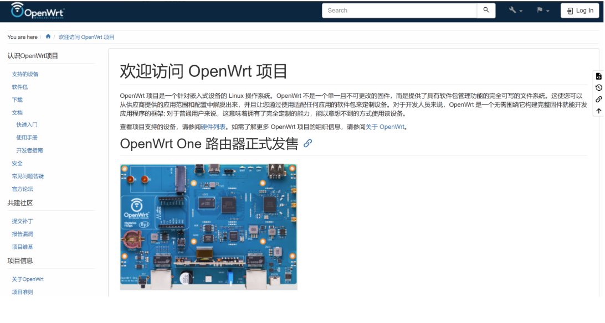

## 1、红米AC2100

官方红米ac2100刷机openwrt记录，默认管理后台地址为 **192.168.31.1**

此处选择的openwrt版本为 v23.05.5，固件下载地址为：https://downloads.openwrt.org/releases/23.05.5/targets/ramips/mt7621/

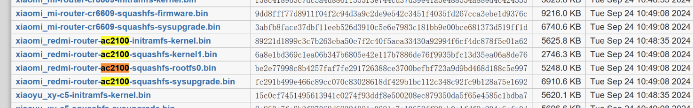

红米降级固件地址：http://cdn.cnbj1.fds.api.mi-img.com/xiaoqiang/rom/rm2100/miwifi_rm2100_firmware_d6234_2.0.7.bin

下载 breed软件（防止刷机失败已回退）：https://breed.hackpascal.net/

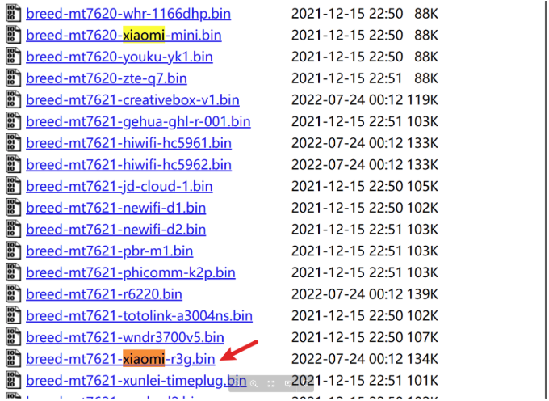

整理以上所需的资源如下：

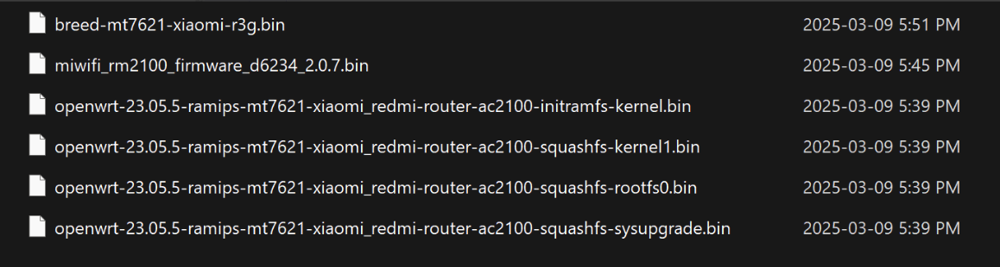

----

**开始安装**

1、降级ROM

登录路由器的管理页面
浏览器访问`192.168.31.1`

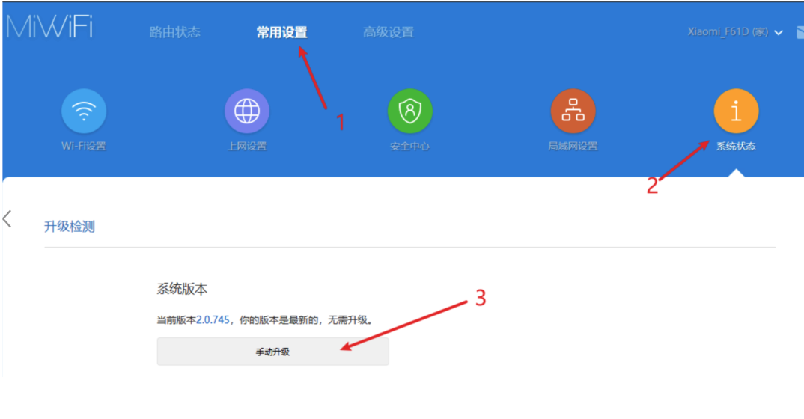

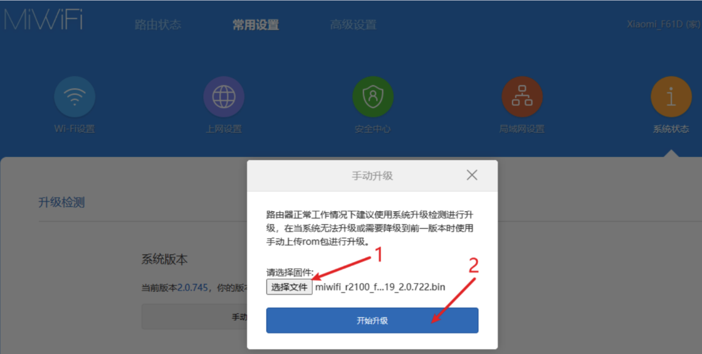

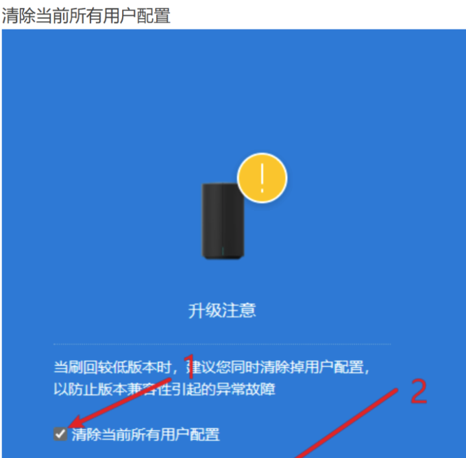

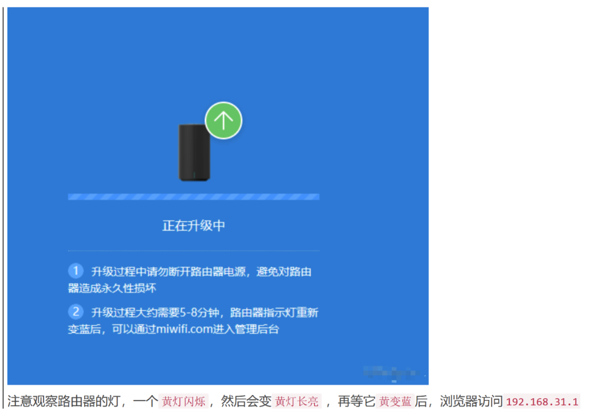

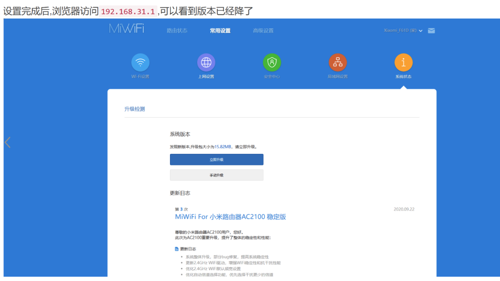

2、安装Breed

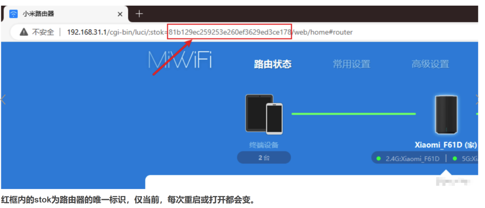

```go
// 浏览器打开，注意stok值的替换
http://192.168.31.1/cgi-bin/luci/;stok=81b129ec259253e260ef3629ed3ce178/api/misystem/set_config_iotdev?bssid=Xiaomi&user_id=longdike&ssid=%0Acd%20%2Ftmp%0Acurl%20-o%20B%20-O%20https%3A%2F%2Fbreed.hackpascal.net%2Fr1286%2520%255b2020-10-09%255d%2Fbreed-mt7621-xiaomi-r3g.bin%20-k%20-g%0A%5B%20-z%20%22%24(sha256sum%20B%20%7C%20grep%20242d42eb5f5aaa67ddc9c1baf1acdf58d289e3f792adfdd77b589b9dc71eff85)%22%20%5D%20%7C%7C%20mtd%20-r%20write%20B%20Bootloader%0A
```

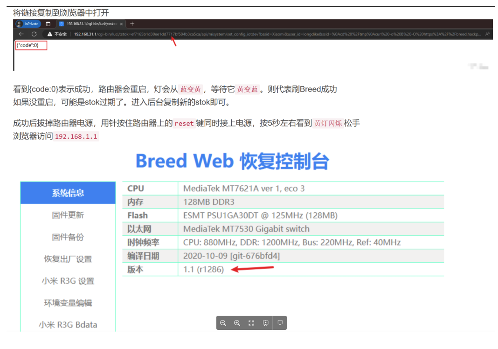

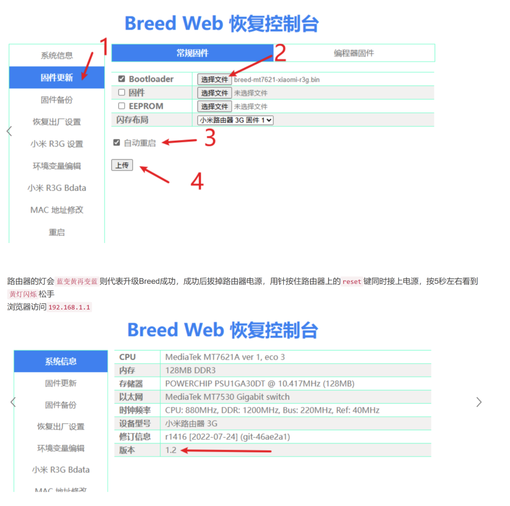

3、安装OpenWrt固件

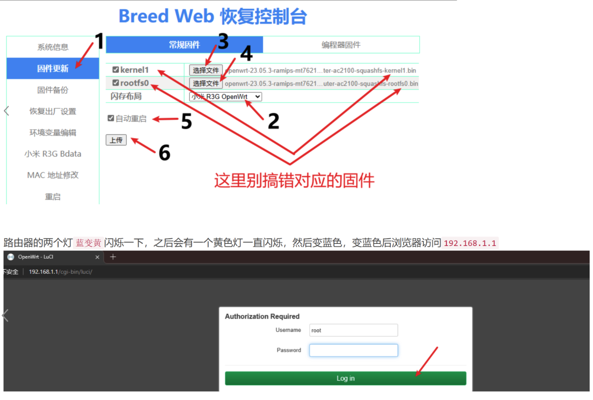

4、openwrt的一些设置

安装新的UI：luci-theme-material

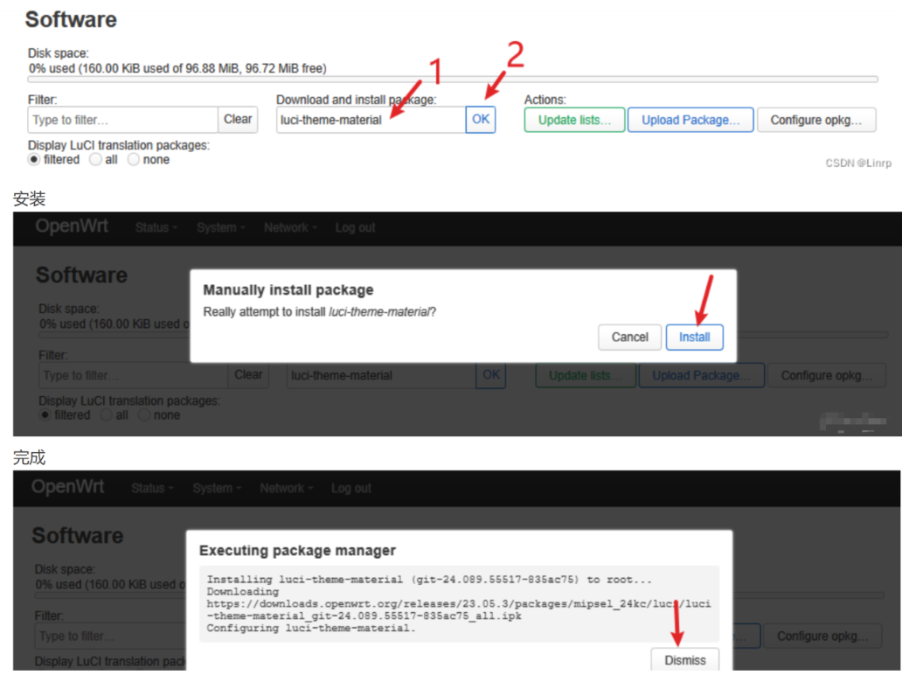

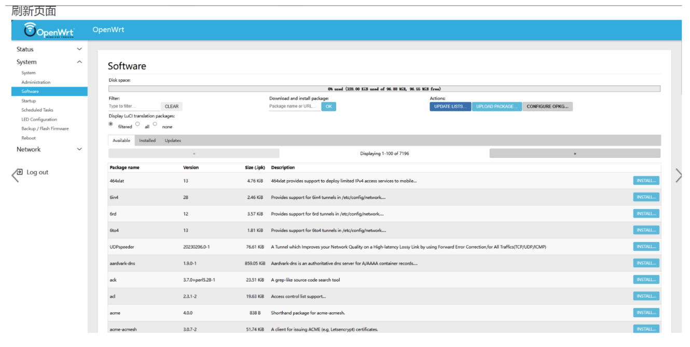

安装中文：`luci-i18n-base-zh-cn`

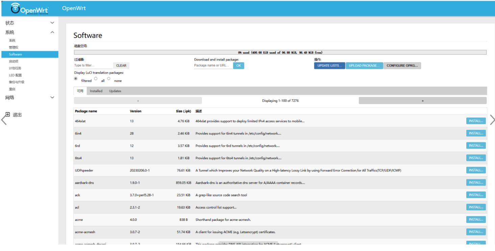

5、ssh登录

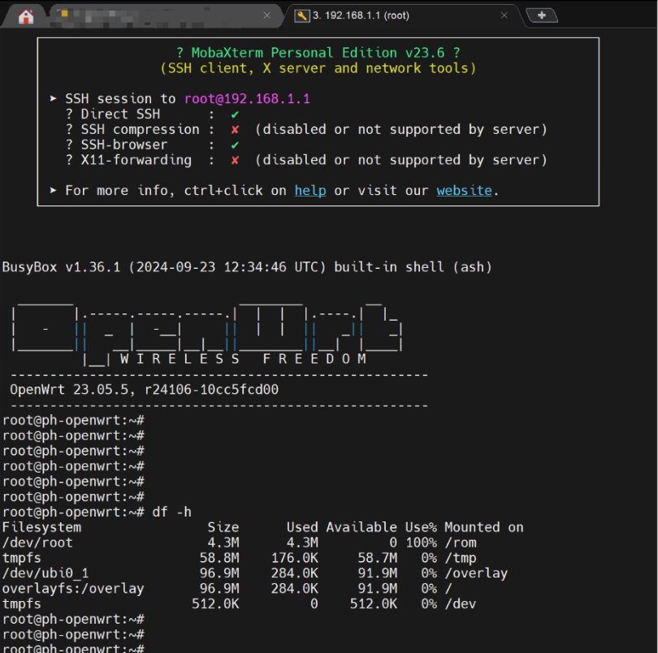


