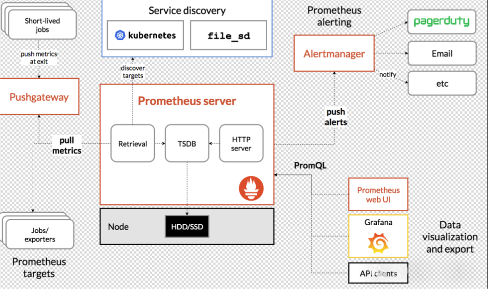
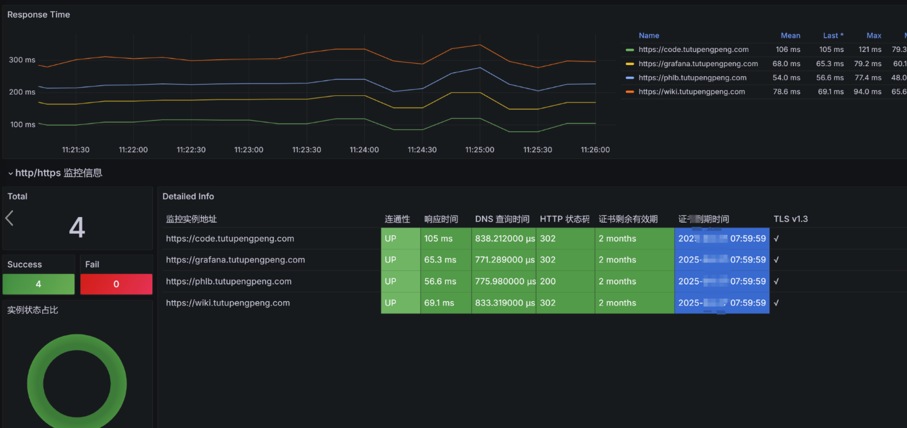
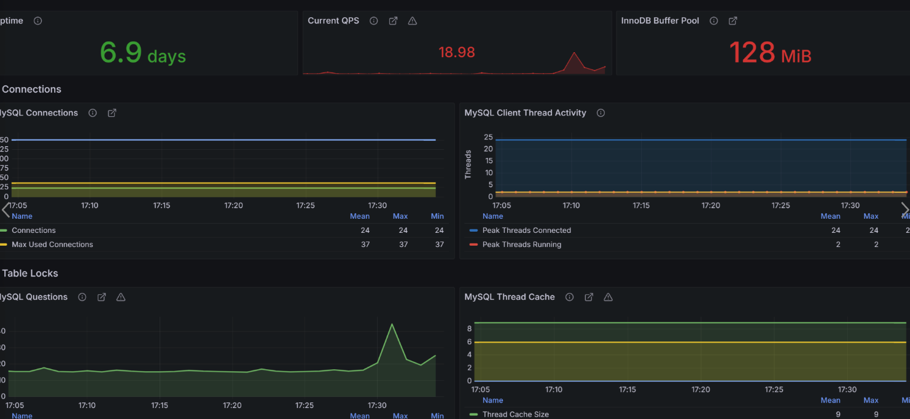
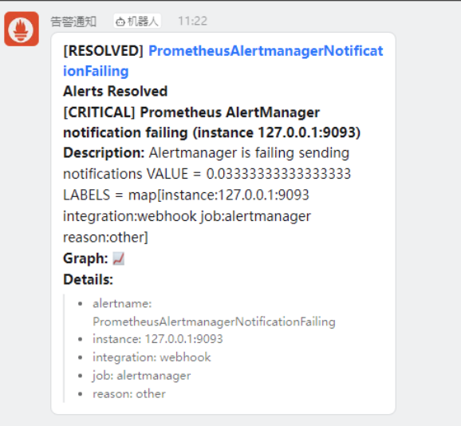
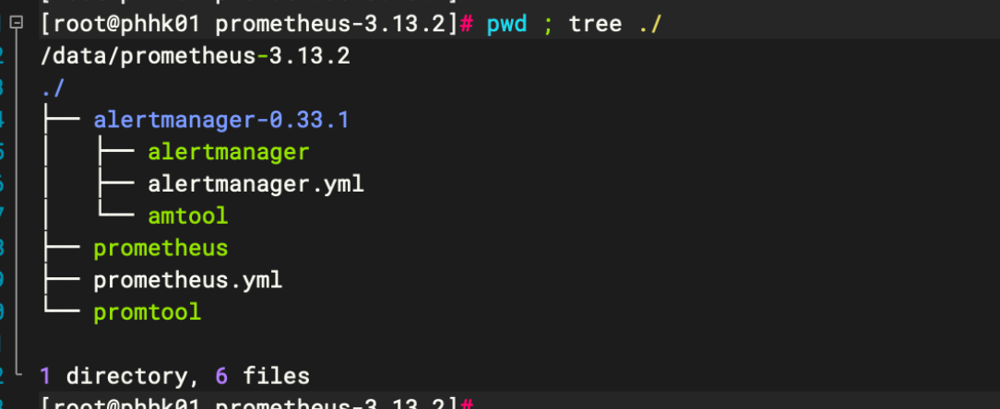
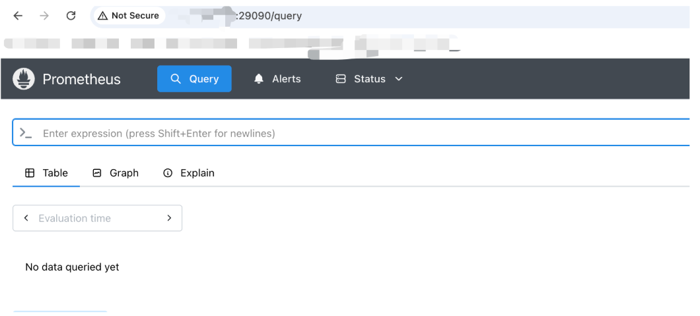

# Prometheus


Prometheus官方文档：https://prometheus.io/docs/introduction/overview/
Alertmanager社区地址：https://github.com/prometheus/alertmanager
Grafana部署链接：[/tech/grafana](https://wiki.uhowie.com/tech/grafana)
==持续更新配置和规则参考链接==：https://cnb.cool/uhowie/prometheus
Promethus 的架构图如下：



## 1、Exporter & Rules

汇总常用的 exporter&rules，用于promethus拉取数据用于grafana展示，并平台告警。

官方：https://github.com/prometheus/

第三方：https://samber.github.io/awesome-prometheus-alerts/

### Gost

官方文档：https://gost.run/tutorials/metrics/

```go
services:
- name: service-0
  addr: ":8080"
  handler:
    type: auto
  listener:
    type: tcp

metrics:
  addr: :9000
  # unix domain socket
  # addr: unix:///var/run/gost.sock
  path: /metrics
  auth:
    username: user
    password: pass
  auther: auther-0
```

```go
scrape_configs:
  - job_name: 'gost'
    scrape_interval: 5s
    static_configs:
      - targets: ['127.0.0.1:9000']
```

面板可以采用：https://grafana.com/grafana/dashboards/16037

### Nginx

openresty分支：[基于openresty高性能分支的nginx](https://wiki.uhowie.com/tech/linux/rpm/openresty)

nginx官方：https://github.com/nginx/nginx-prometheus-exporter

```go
# 仅本地回环网卡监听，外部网络完全无法访问
server {
    listen 127.0.0.1:8081;
    server_name localhost;

    # 监控状态核心页面
    location /nginx_status {
        stub_status;  # 开启状态统计模块
        access_log off; # 关闭访问日志，减少磁盘写入
        # 访问权限白名单：仅本机可访问
        allow 127.0.0.1;
        deny all;
    }
}
```

```go
#!/bin/bash
pkill nginx-prom
sleep 0.5s
nohup ./nginx-prometheus-exporter --web.listen-address=:29113 -nginx.scrape-uri=http://127.0.0.1:8081/nginx_status > nginx.log 2>&1 &
```

### Frp

[Frp内网穿透](https://wiki.uhowie.com/tech/servers_deploy/bypass/frp)

### SSL

```go
// SSL监控可以采用blackbox进行采集：
地址：https://github.com/prometheus/blackbox_exporter
// Prometheus配置：
- job_name: 'blackbox'
    metrics_path: /probe
    params:
      module: [http_2xx]  # 可以自由选择模块，此处选择http_2xx
    static_configs:
      - targets:
        - https://wiki.tutupengpeng.com
        - https://code.tutupengpeng.com
        - https://grafana.tutupengpeng.com
        - https://phlb.tutupengpeng.com
    relabel_configs:
      - source_labels: [__address__]
        target_label: __param_target
      - source_labels: [__param_target]
        target_label: instance
      - target_label: __address__
        replacement: 127.0.0.1:9115  # The blackbox exporter's real hostname:port.
  - job_name: 'blackbox_exporter'  # collect blackbox exporter's operational metrics.
    static_configs:
      - targets: ['127.0.0.1:9115']

// blackbox.yaml 配置如下：（请根据站点特点情况具体调整）
modules:
  http_2xx:
    prober: http
    timeout: 60s
    http:
      valid_http_versions: ["HTTP/1.1","HTTP/2"]
      valid_status_codes: [200,302]
      method: GET
      preferred_ip_protocol: "ip4"
      follow_redirects: false
      ip_protocol_fallback: false
      enable_http2: false
  http_post_2xx:
    prober: http
    timeout: 60s
    http:
      method: POST
      valid_http_versions: ["HTTP/1.1", "HTTP/2"]
      valid_status_codes: [200]
      preferred_ip_protocol: "ip4"
  tcp_connect:
    prober: tcp
  pop3s_banner:
    prober: tcp
    tcp:
      query_response:
      - expect: "^+OK"
      tls: true
      tls_config:
        insecure_skip_verify: false
  grpc:
    prober: grpc
    grpc:
      tls: true
      preferred_ip_protocol: "ip4"
  grpc_plain:
    prober: grpc
    grpc:
      tls: false
      service: "service1"
  ssh_banner:
    prober: tcp
    tcp:
      query_response:
      - expect: "^SSH-2.0-"
      - send: "SSH-2.0-blackbox-ssh-check"
  irc_banner:
    prober: tcp
    tcp:
      query_response:
      - send: "NICK prober"
      - send: "USER prober prober prober :prober"
      - expect: "PING :([^ ]+)"
        send: "PONG ${1}"
      - expect: "^:[^ ]+ 001"
  icmp:
    prober: icmp
  icmp_ttl5:
    prober: icmp
    timeout: 5s
    icmp:
      ttl: 5

// Grafana面版效果如下
```



### Node-exporter

```go
//下载
wget https://github.com/prometheus/node_exporter/releases/download/v1.12.1/node_exporter-1.12.1.linux-amd64.tar.gz

//启动脚本:
#!/bin/bash
pkill node_expor
sleep 0.5s
nohup ./node_exporter \
--web.listen-address=:9100 \
--no-collector.arp \
--no-collector.bonding \
--no-collector.infiniband \
--no-collector.mdadm \
--no-collector.nfs \
--no-collector.nvme \
--no-collector.wifi > node.log 2>&1 &
```

### Mysql-exporter

```go
//登录mysql
mysql -uroot -p
//创建只读监控用户
CREATE USER 'exporter'@'127.0.0.1' IDENTIFIED BY '你的自定义密码';
//授予全部只读权限
GRANT PROCESS, REPLICATION CLIENT, SELECT ON *.* TO 'exporter'@'127.0.0.1';
FLUSH PRIVILEGES;
exit;

cat > .my.cnf << EOF
[client]
user=exporter
password=你的自定义密码
host=127.0.0.1
port=3306
EOF

//修改权限（安全规范，防止密码泄露）
chmod 600 .my.cnf

//常用可选精简参数（关闭无用采集，省内存）
#!/bin/bash
pkill mysqld_exp
sleep 1s
nohup ./mysqld_exporter --web.listen-address=:9104 --config.my-cnf=./.my.cnf > mysql_exporter.log 2>&1 &
// 最后grafana添加面版，效果如下
```

\

### 钉钉机器人告警

下载[prometheus-webhook-dingtalk](https://github.com/timonwong/prometheus-webhook-dingtalk/releases/download/v2.1.0/prometheus-webhook-dingtalk-2.1.0.darwin-amd64.tar.gz)插件：https://github.com/timonwong/prometheus-webhook-dingtalk/releases

```go
// 启动webhook插件：
./prometheus-webhook-dingtalk --web.listen-address=":8060" --web.enable-ui --config.file=config.yml

// config.yml中核心内容见下：
targets:
  webhook1:
    url: 机器人url
    # secret for signature
    secret: 加密密码

// alertmanager核心内容见下：
receivers:
- name: 'default-receiver'
  webhook_configs:
  - url: 'http://localhost:8060/dingtalk/webhook1/send'
    send_resolved: true

// 重启alertmanager和prometheus即可，收到的告警信息样式见下，发送成功：
```



## 2、服务部署

Github下载地址：https://github.com/prometheus/prometheus/releases
官方下载地址：https://prometheus.io/download/
笔者环境os为Rocky9.7，配置为2C2G，我们此处
promrtheus选用的版本为: **v3.13.2 / 2026-07-29**
alertmanager的版本为: **v0.33.1 / 2026-07-04**

```go
// 下载解压
cd /data
wget https://github.com/prometheus/prometheus/releases/download/v3.13.2/prometheus-3.13.2.linux-amd64.tar.gz
tar -xvf ./prometheus-3.13.2.linux-amd64.tar.gz
mv prometheus-3.13.2.linux-amd64 prometheus-3.13.2 && cd prometheus-3.13.2
wget https://github.com/prometheus/alertmanager/releases/download/v0.33.1/alertmanager-0.33.1.linux-amd64.tar.gz
tar -xvf ./alertmanager-0.33.1.linux-amd64.tar.gz
mv alertmanager-0.33.1.linux-amd64 alertmanager-0.33.1
```



### 1、alertmanager

配置将告警信息发到企微（注意**关闭全员禁言功能**，不然收不到信息），定制化启动端口为 29093；

```go
# 配置文件参考
route:
  group_by: ['alertname']
  group_wait: 30s
  group_interval: 5m
  repeat_interval: 1h
  receiver: 'web.hook'

receivers:
- name: 'web.hook'
  webhook_configs:
    - url: '企业微信url地址'
      send_resolved: true
      #tls_config:
        #insecure_skip_verify: true

inhibit_rules:
  - source_match:
      severity: "critical"
    target_match:
      severity: "warning"
    equal: [alertname, env, instance]
```

启动脚本参考：

```go
#!/bin/bash
pkill alertmanag
sleep 0.5s
nohup ./alertmanager --config.file=alertmanager.yml  --storage.path=./data --web.listen-address=0.0.0.0:29093 --log.level=info > am.log 2>&1 &
```

测试发送是否成功参考：

```go
curl '企业微信url' -H 'Content-Type: application/json' -d '{
    "msgtype": "text",
    "text": {
        "content": "纯文本测试：企业微信机器人连通验证"
    }
}'
```


### 2、promethues

```go
//配置文件参考
global:
  scrape_interval: 60s # Set the scrape interval to every 15 seconds. Default is every 1 minute.
  evaluation_interval: 60s # Evaluate rules every 15 seconds. The default is every 1 minute.
  # scrape_timeout is set to the global default (10s).
  # 时序数据留存配,默认为15天
storage:
  tsdb:
    retention:
      time: 3d
      size: 5GB

# Alertmanager configuration
alerting:
  alertmanagers:
    - static_configs:
        - targets:
           - alertmanager:29093

# Load rules once and periodically evaluate them according to the global 'evaluation_interval'.
rule_files:
  # - "first_rules.yml"
  # - "second_rules.yml"

# A scrape configuration containing exactly one endpoint to scrape:
# Here it's Prometheus itself.
scrape_configs:
  # The job name is added as a label `job=<job_name>` to any timeseries scraped from this config.
  - job_name: "prometheus"

    # metrics_path defaults to '/metrics'
    # scheme defaults to 'http'.

    static_configs:
      - targets: ["0.0.0.0:29090"]
       # The label name is added as a label `label_name=<label_value>` to any timeseries scraped from this config.
        labels:
          app: "prometheus"
```

启动脚本参考：

```go
#!/bin/bash
pkill prometheus
sleep 0.5s
nohup ./prometheus --config.file=prometheus.yml --web.listen-address=:29090 --storage.tsdb.path=./data --web.enable-lifecycle > prom.log 2>&1 &
```



### 3、grafana

参考链接：[/tech/grafana](https://wiki.uhowie.com/tech/grafana)

