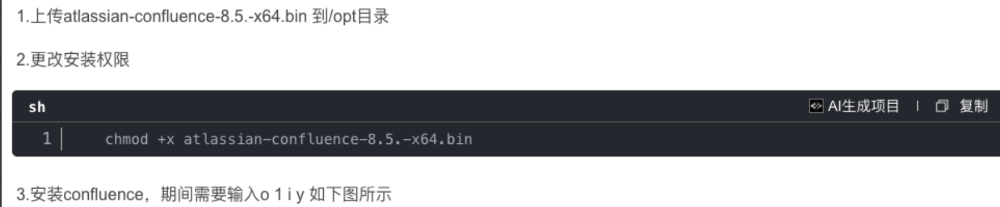
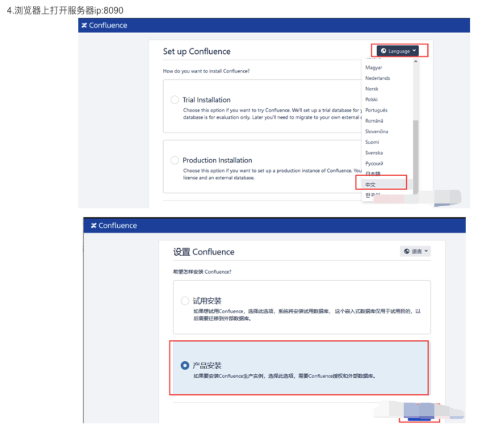
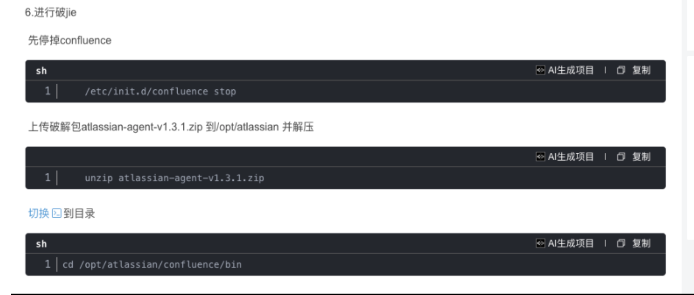
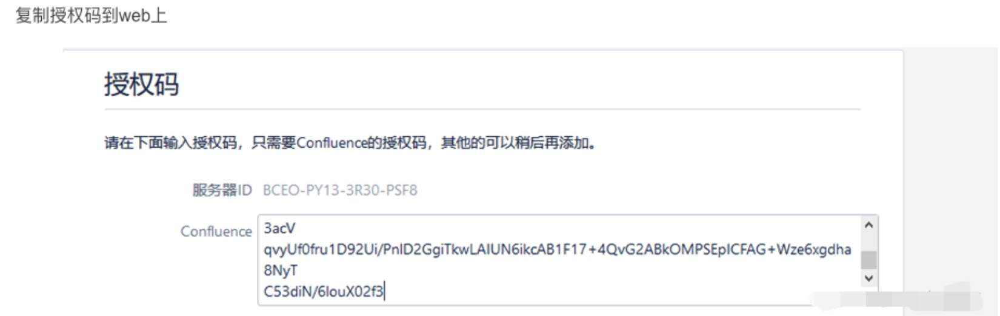
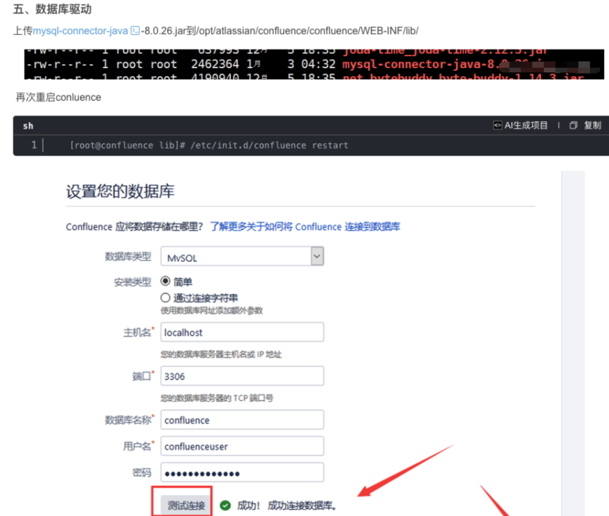
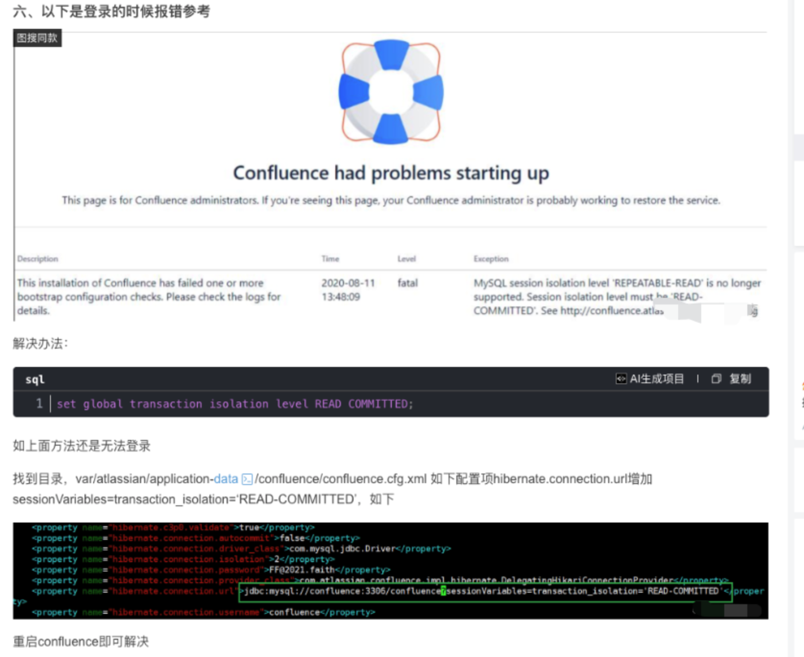
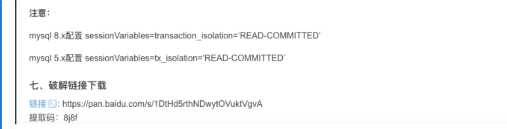
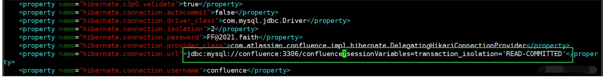
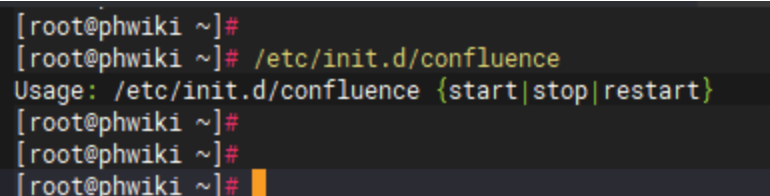

# Confluence

Confluence是一个专业的企业知识管理与协同软件，也可以用于构建企业wiki，且使用简单，它强大的编辑和站点管理特征能够帮助团队成员之间共享信息、文档协作、集体讨论，信息推送。

本次我们选择的安装版本为8.5.4

</br>官方下载地址：https://www.atlassian.com/software/confluence/download-archives

</br>参考地址：https://blog.csdn.net/weixin_44024436/article/details/135389431

</br>破解工具下载地址：链接：https://pan.baidu.com/s/1Rke9p2b0l1dTF9Phy2ZRuA
                 提取码：8j8f

------

安装confluence需要连接外部的数据库，默认我们已经安装好了Mysql数据库，其版本为v8.0.33。默认安装包上传到/data目录下。

而且需要在数据库中创建所需的库:

```go
create database confluence default character set utf8mb4 collate utf8mb4_bin;

create user 'confluence'@'%' identified by 'confluence';

grant all PRIVILEGES on *.* to confluence@'%';

flush privileges;

set global transaction isolation level READ COMMITTED;

flush privileges;
```

\----------------

重要步骤如下：



```go
[root@confluence opt]# ./atlassian-confluence-8.5.4-x64.bin
Regenerating the font cache
Fonts and fontconfig have been installed
Unpacking JRE ...
Starting Installer ...

This will install Confluence 8.5.4 on your computer.
OK [o, Enter], Cancel [c]
o
Click Next to continue, or Cancel to exit Setup.

Choose the appropriate installation or upgrade option.
Please choose one of the following:
Express Install (uses default settings) [1],
Custom Install (recommended for advanced users) [2, Enter],
Upgrade an existing Confluence installation [3]
1

See where Confluence will be installed and the settings that will be used.
Installation Directory: /opt/atlassian/confluence
Home Directory: /var/atlassian/application-data/confluence
HTTP Port: 8090
RMI Port: 8000
Install as service: Yes
Install [i, Enter], Exit [e]
i

Extracting files ...


Please wait a few moments while we configure Confluence.

Start Confluence now?
Yes [y, Enter], No [n]
y

Please wait a few moments while Confluence starts up.
Launching Confluence ...

Your installation of Confluence 8.5.4 is now ready and can be accessed via
your browser.
Confluence 8.5.4 can be accessed at http://localhost:8090
SLF4J: No SLF4J providers were found.
SLF4J: Defaulting to no-operation (NOP) logger implementation
SLF4J: See https://www.slf4j.org/codes.html#noProviders for further details.
Finishing installation ...
```






```go
[root@confluence bin]# vim setenv.sh
//在文件最末尾添加这段，根据包的存放实际路径
export JAVA_OPTS="-javaagent:/opt/atlassian/atlassian-agent-v1.3.1/atlassian-agent.jar ${JAVA_OPTS}"

//再次启动
[root@confluence bin]# /etc/init.d/confluence start
//执行破解jar包会得到一个授权码
[root@confluence bin]# java -jar /opt/atlassian/atlassian-agent-v1.3.1/atlassian-agent.jar -p conf -m 888888@qq.com -n confluence -o confluence -s 服务器ID
```









\----------------

且需修改/data/atlassian/application-data/confluence/confluence.cfg.xml

sessionVariables=transaction_isolation='READ-COMMITTED'



\---------------

服务启动/停止：**/etc/init.d/confluence {start|stop|restart}**



