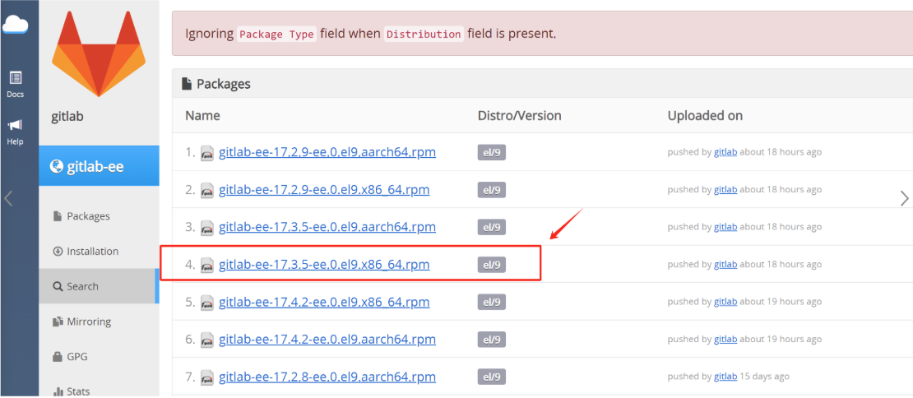
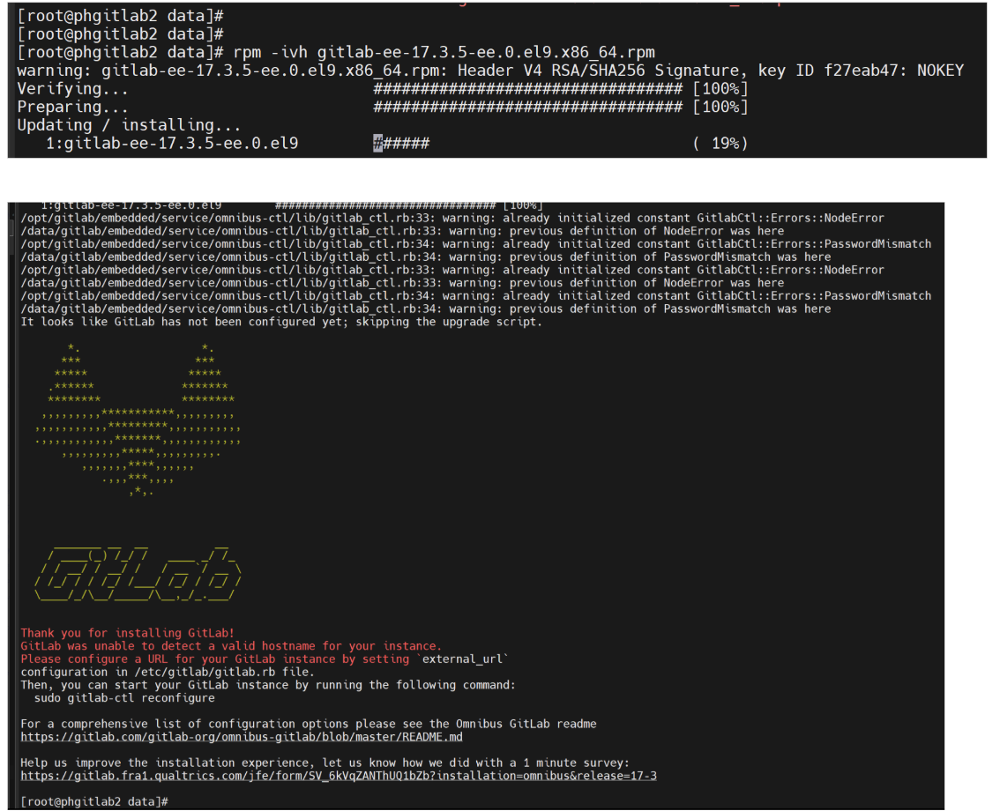
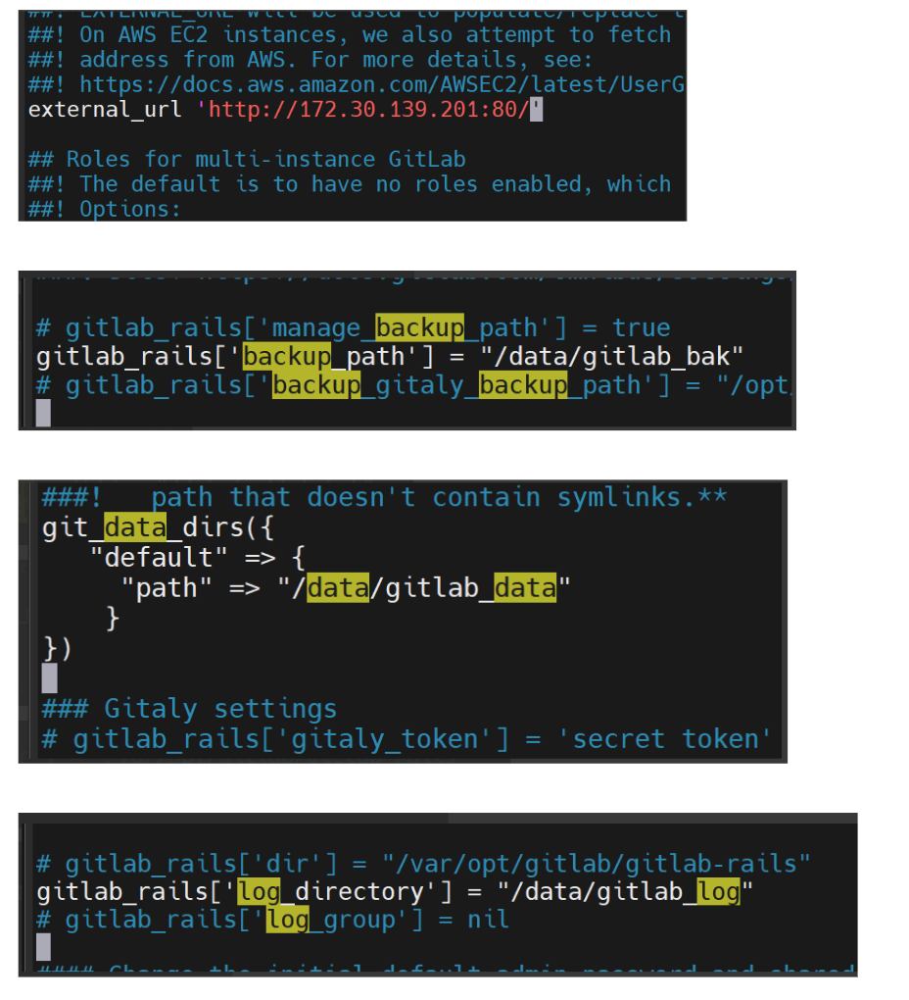
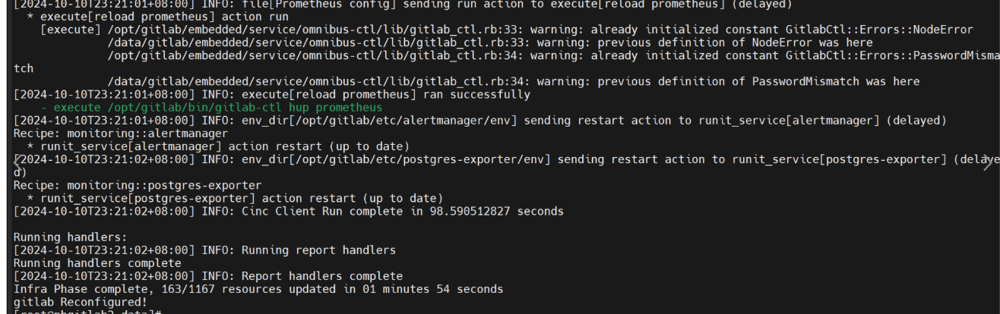
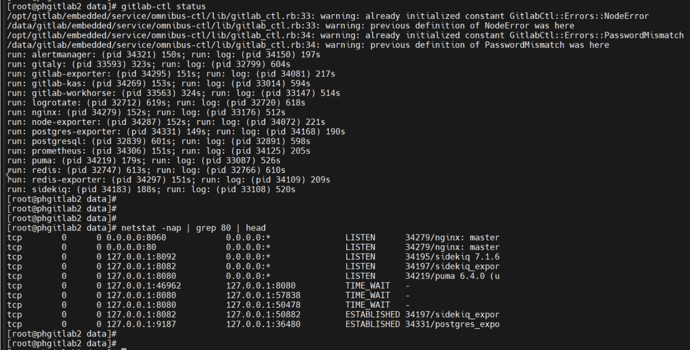
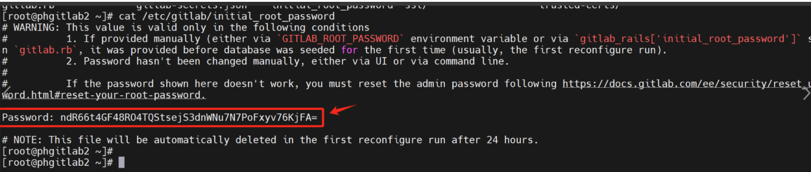

# Gitlab

Gitlab安装包分为CE（社区版）、EE（企业版）两种，此次我们选择安装企业版，版本号为17.3.5，社区版亦同。

安装环境为Rockey-9.4，内核为5.14.0，openssl版本为3.0.7；

EE版下载地址：https://packages.gitlab.com/gitlab/gitlab-ee

参考链接：https://www.yoyoask.com/?p=1653



默认我们需要把数据放到 /data 目录下，所以首先需要作软链接把gitlab的数据存储指向 /data

```go
mkdir -p /data/gitlab
ln -s /data/gitlab /opt/gitlab        //创建软链接
yum install perl                     //安装必要依赖
rpm -ivh gitlab-ee-17.3.5-ee.0.el9.x86_64.rpm
```



```go
//创建数据、日志、备份路径
mkdir gitlab_data
mkdir gitlab_log
mkdir gitlab_bak
//根据实际需要，修改配置文件
vim /etc/gitlab/gitlab.rb
```



```go
//修改完之后重启
 gitlab-ctl reconfigure    //时间较长耐心等待
```

`

```go
//查看状态
gitlab-ctl status
netstat -nap | grep 80 | head
```



```go
//获取初始密码
cat /etc/gitlab/initial_root_password
```



```go
//登陆界面
```


