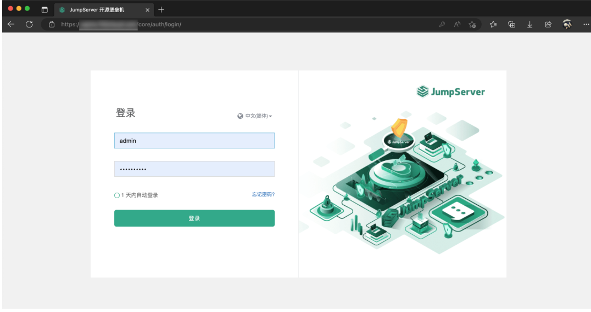

# JumpServer

JumpServer 是广受欢迎的开源堡垒机，是符合 4A 规范的专业运维安全审计系统。JumpServer 帮助企业以更安全的方式管控和登录所有类型的资产，实现事前授权、事中监察、事后审计，满足等保合规要求。

官方地址：https://www.jumpserver.org/

github地址：https://github.com/jumpserver/jumpserver/

在线文档地址：https://docs.jumpserver.org/zh/v4/#1-jumpserver

- 1、离线安装：

下载离线包并上传到部署服务器的/opt目录

cd /opt

tar -xf jumpserver-ce-v4.0.1-x86_64.tar.gz 

cd jumpserver-ce-v4.0.1-x86_64

\# 根据需要修改配置文件模板, 如果不清楚用途可以跳过修改

vim config-example.txt

\# 安装
./jmsctl.sh install

\# 启动
./jmsctl.sh start

安装完成后 JumpServer 配置文件路径为： /opt/jumpserver/config/config.txt

cd jumpserver-ce-v4.0.1-x86_64

\# 启动
./jmsctl.sh start

\# 停止
./jmsctl.sh down

\# 卸载
./jmsctl.sh uninstall

\# 帮助
./jmsctl.sh -h

- 2、安装成功后，通过浏览器访问登录 JumpServer

地址: http://<JumpServer服务器IP地址>:<服务运行端口>

用户名: admin

密码: ChangeMe

示例如下：

