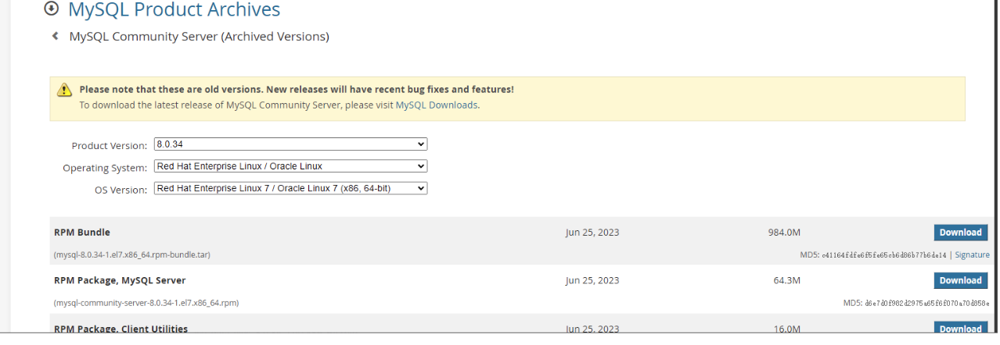
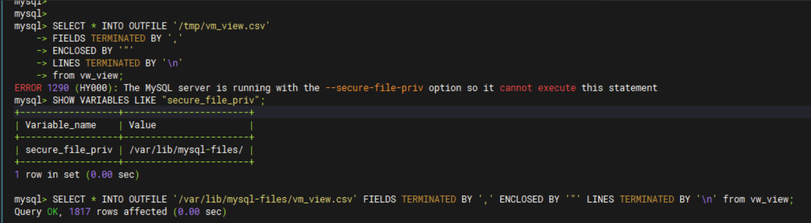

# MySql


介绍mysq的离线rpm包部署，主要版本基于8.0.23--→8.0.44都可适用

安装包下载地址：https://downloads.mysql.com/archives/community/



根据实际需求选择版本和操作系统，此处我们选择v8.0.34，以centos7.9为例；

- 1、检查：
  rpm -qa | grep -i mysql
  rpm -qa | grep mariadb

yum -y remove mariadb-libs-5.5.68-1.el7.x86_64

- 2、安装：（注意顺序）

tar -xvf mysql-8.0.34-1.el7.x86_64.rpm-bundle.tar

rpm -ivh mysql-community-common-8.0.34-1.el7.x86_64.rpm

rpm -ivh mysql-community-client-plugins-8.0.34-1.el7.x86_64.rpm

rpm -ivh mysql-community-libs-8.0.34-1.el7.x86_64.rpm

rpm -ivh mysql-community-client-8.0.34-1.el7.x86_64.rpm

rpm -ivh mysql-community-icu-data-files-8.0.34-1.el7.x86_64.rpm

rpm -ivh mysql-community-server-8.0.34-1.el7.x86_64.rpm

中间可能会有依赖报错，自行解决

- 3、配置文件：
  vim /etc/my.cnf

[mysqld]
port=3306
character-set-server=utf8mb4 # 设置编码格式
datadir=/data/mysql
socket=/data/mysql/mysql.sock
log-error=/data/log/mysqld.log
pid-file=/var/run/mysqld/mysqld.pid
sql-mode=ONLY_FULL_GROUP_BY,ERROR_FOR_DIVISION_BY_ZERO,NO_ENGINE_SUBSTITUTION # 严格模式
lower_case_table_names=1 # 不区分大小写
[mysql]
default-character-set=utf8mb4
[client]
default-character-set=utf8mb4
socket=/data/mysql/mysql.sock

==注意此处默认将数据和日志文件都放到了/data目录下以便管理==

- 4、启动

cd /data 

mkdir {mysql,mysql_log} 

chown -R mysql:mysql /data/mysql 

chown -R mysql:mysql /data/mysql_log

systemctl start mysqld

grep "password" /data/log/mysqld.log     #获取临时登录密码

- 5、登录

mysql -u root -h 127.0.0.1 -P 3306-p xxx

\#首次登录进去会提示该密码

alter user root@'localhost' identified by 'xxx';

flush privileges;

\#创建远程登录账号并授权

create user root@'%' identified by 'xxx';

grant all privileges on *.* to root@'%' with grant option;

flush privileges;

\#修改加密规则

ALTER USER root@'%' IDENTIFIED BY 'xxx' PASSWORD EXPIRE NEVER;

\#创建只含查询相关库表的账号用户

CREATE USER 'reader'@'%' IDENTIFIED BY 'secure_password';

GRANT SELECT ON *.* TO 'reader'@'%';

==或者：
GRANT SELECT ON dbname.* TO 'reader'@'%';     #dbname库下所有表
FLUSH PRIVILEGES;==

```go
// 附v8.x.x参考配置
[mysqld]
port=3306
character-set-server=utf8mb4
datadir=/data/mysql
socket=/data/mysql/mysql.sock

log-error=/data/mysql_log/mysqld.log
pid-file=/var/run/mysqld/mysqld.pid

# 开启二进制日志
log_bin = /data/mysql/mysql-bin

# 日志格式：ROW 行模式（8.0生产强制首选）
binlog_format = ROW

# 单个日志文件上限
max_binlog_size = 1G

# expire_logs_days 已废弃，8.0官方推荐用秒数单位参数
# expire_logs_days = 7  旧写法（虽然还能运行，但不推荐
# 7天 = 7*24*3600
binlog_expire_logs_seconds = 604800

# binlog缓存
binlog_cache_size = 4M
max_binlog_cache_size = 512M

# 刷盘策略（安全/性能分水岭）
sync_binlog = 1

# ROW日志记录范围
binlog_row_image = FULL

sql-mode=ONLY_FULL_GROUP_BY,ERROR_FOR_DIVISION_BY_ZERO,NO_ENGINE_SUBSTITUTION
lower_case_table_names=1

# InnoDB 缓冲池：缓存数据和索引（最大内存占用项）
# 2GB 机器建议 512M~768M，这里保守设为 512M
innodb_buffer_pool_size = 256M

# InnoDB 缓冲池实例（减少锁竞争，但不要设太大）
innodb_buffer_pool_instances = 2

# InnoDB 日志缓冲区（足够）
innodb_log_buffer_size = 16M

# 日志文件大小（影响恢复速度，8M~16M 足够）
innodb_log_file_size = 8M

# 最大连接数（每个连接都吃内存）
max_connections = 50

# 每个连接的缓冲区（关键！不能太大）
sort_buffer_size = 256K
join_buffer_size = 256K
read_buffer_size = 128K
read_rnd_buffer_size = 128K

# 线程缓存（减少创建开销）
thread_cache_size = 4

# 临时表内存限制
tmp_table_size = 32M
max_heap_table_size = 32M

# 表缓存（避免频繁打开表）
table_open_cache = 500
table_definition_cache = 500

# 关闭 Performance Schema（它在 8.0 默认开启，较吃内存）
performance_schema = OFF

# 查询缓存：MySQL 8.0 已彻底移除，无需配置
# 关闭日志（若非必要）
# general_log = 0
# slow_query_log = 0

# 设置默认认证插件（避免连接问题）
#default_authentication_plugin = mysql_native_password
# 跳过主机名解析（提升连接速度）
skip-name-resolve

# 最大允许数据包
max_allowed_packet = 16M

# -------- 主从复制架构才需要开启；单机注释删除 --------
#log_slave_updates = ON
#relay_log_purge = ON
#relay_log_recovery = ON

[mysql]
default-character-set=utf8mb4
socket=/data/mysql/mysql.sock

[client]
default-character-set=utf8mb4
socket=/data/mysql/mysql.sock
```

## 1、双机部署

建议双机组主备时，待双机都搭建好了，主机最后作数据，包括创建用户账号等，从机保持干净状态，这样才能保证好从机复制到主机的账号信息等！

- 1、配置文件（双机都要）：

vim /etc/my.cnf    （注意每个mysql服务的server-id 必须不同）
[client]
socket=/data/mysql/mysql.sock
default-character-set=utf8mb4
[mysqld]
server-id=11     #注意双机的id要不同
port=3306
character-set-server=utf8mb4
lower_case_table_names=1
datadir=/data/mysql
socket=/data/mysql/mysql.sock
log-error=/data/log/mysqld.log
pid-file=/var/run/mysqld/mysqld.pid
sql-mode=ONLY_FULL_GROUP_BY,ERROR_FOR_DIVISION_BY_ZERO,NO_ENGINE_SUBSTITUTION # 严格模式
gtid_mode = on
enforce_gtid_consistency = on
binlog-ignore-db = mysql
binlog-ignore-db = information_schema
binlog-ignore-db = performance_schema
binlog-ignore-db = sys
replicate_ignore_db = information_schema
replicate_ignore_db = performance_schema
replicate_ignore_db = mysql
replicate_ignore_db = sys
relay-log = mysqld-relay-bin
max_allowed_packet = 128M
binlog-format = row
log-bin = mysql-bin
plugin-load-add = [mysql_clone.so](http://mysql_clone.so/)   #必须添加克隆插件
skip-name-resolve
max_connections = 2000
collation-server = utf8mb4_general_ci
init_connect = 'SET NAMES utf8mb4'
skip-character-set-client-handshake = true
default_authentication_plugin = caching_sha2_password
innodb_buffer_pool_size = 128m
[mysql]
default-character-set=utf8mb4

- 2、Master创建主从复制用户：

mysql -uroot -pxxxx -h192.168.50.92
CREATE USER 'repl'@'%' IDENTIFIED BY 'xxxx' ；
GRANT ALL  ON *.* TO ' repl'@'%';

- 3、所有master/slave库检查远程 clone插件：

select plugin_name, plugin_status from information_schema.plugins where plugin_name = 'clone';

\#以下从库操作

set global clone_valid_donor_list='172.30.142.186:3306';

clone instance from root@'172.30.142.186':3306 identified by 'xxxx';

select
  stage,
  state,
  cast(begin_time as DATETIME) as "START TIME",
  cast(end_time as DATETIME) as "FINISH TIME",
  lpad(sys.format_time(power(10,12) * (unix_timestamp(end_time) - unix_timestamp(begin_time))), 10, ' ') as DURATION,
  lpad(concat(format(round(estimate/1024/1024,0), 0), "MB"), 16, ' ') as "Estimate",
  case when begin_time is NULL then LPAD('%0', 7, ' ')
  when estimate > 0 then
  lpad(concat(round(data*100/estimate, 0), "%"), 7, ' ')
  when end_time is NULL then lpad('0%', 7, ' ')
  else lpad('100%', 7, ' ')
  end as "Done(%)"
  from performance_schema.clone_progress;     #检查克隆情况

- 4、连接到master ,查看File和Position的值

mysql -uroot -pxxxx -h192.168.50.92 -P3306

flush logs;
show master status;

- 5、以下从机操作：

CHANGE REPLICATION SOURCE TO
 SOURCE_HOST='172.30.142.186',       # 主ip
 SOURCE_USER='repl',           # 主中创建的复制用户
 SOURCE_PASSWORD='Avaya001!',       # 对应用户密码
 SOURCE_LOG_FILE='mysql-bin.000004',     # 查看File的值
 SOURCE_LOG_POS=197,           # 查看Position的值
 GET_SOURCE_PUBLIC_KEY=1;         # 如果使用8.0.23mysql创建用户时默认密码验证方式（caching_sha2_password），需要加上此选项

start slave;

- 6、检查结果（从机操作）

show slave status\G

\#结果正常均为Yes
\#Slave_IO_Running: Yes
\#Slave_SQL_Running: Yes

- 7、查看并设置从节点为只读 ，数据一致性能得到保障（可选）：

SELECT @@global.read_only;
SET GLOBAL read_only = 1;

## 2、命令行导表数据

```go
// 假设要导出的表数据 vm_view ,导出的文件格式为csv，则命令为：
SELECT * INTO OUTFILE '/var/lib/mysql-files/vm_view.csv' FIELDS TERMINATED BY ',' ENCLOSED BY '"' LINES TERMINATED BY '\n' from vw_view;
// 如果遇到secure_file_priv报错，则需要调整一下导出路径即可，如下图所示：
SHOW VARIABLES LIKE "secure_file_priv";
```



## 3、v5.7.44版本部署

在一些老的项目汇总还需要版本5的，我们此处选择5的最稳定版本v5.7.44，os为centos7.9

下载地址：wget https://downloads.mysql.com/archives/get/p/23/file/mysql-5.7.44-1.el7.x86_64.rpm-bundle.tar

```go
systemctl stop mariadb
yum remove  mariadb-libs mariadb-server mariadb
rpm -ivh mysql-community-common-5.7.44-1.el7.x86_64.rpm
rpm -ivh mysql-community-libs-5.7.44-1.el7.x86_64.rpm
rpm -ivh mysql-community-libs-compat-5.7.44-1.el7.x86_64.rpm
rpm -ivh mysql-community-client-5.7.44-1.el7.x86_64.rpm
rpm -ivh mysql-community-server-5.7.44-1.el7.x86_64.rpm
```

cat /etc/my.cnf

\------------------

```go
[mysqld]
port=23306
character-set-server=utf8mb4
datadir=/data/mysql
socket=/data/mysql/mysql.sock

log-error=/data/mysql_log/mysqld.log
pid-file=/var/run/mysqld/mysqld.pid

sql-mode=ONLY_FULL_GROUP_BY,NO_AUTO_VALUE_ON_ZERO,NO_ENGINE_SUBSTITUTION

lower_case_table_names=1
innodb_buffer_pool_size = 512M
innodb_buffer_pool_instances = 2
innodb_log_buffer_size = 16M
innodb_log_file_size = 8M

max_connections = 30

sort_buffer_size = 256K
join_buffer_size = 256K
read_buffer_size = 128K
read_rnd_buffer_size = 128K

thread_cache_size = 4

tmp_table_size = 32M
max_heap_table_size = 32M

table_open_cache = 500
table_definition_cache = 500

performance_schema = OFF

skip-name-resolve
max_allowed_packet = 16M

default-storage-engine=INNODB
symbolic-links=0

[mysql]
default-character-set=utf8mb4
socket=/data/mysql/mysql.sock

[client]
default-character-set=utf8mb4
socket=/data/mysql/mysql.sock
```

```go
cd /data
mkdir {mysql,mysql_log}
chown -R mysql:mysql /data/mysql
chown -R mysql:mysql /data/mysql_log

systemctl start  mysqld
systemctl enable --now  mysqld
```

```go
cat mysqld.log | grep "temporary password"
mysql -u root -p 临时密码

ALTER USER 'root'@'localhost' IDENTIFIED BY 'XXXXXXXX';
ALTER   USER 'root'@'localhost'   PASSWORD   EXPIRE   NEVER;
use mysql;
update   user set host='%' where user='root';
select host  from user where user='root';
FLUSH PRIVILEGES;
```

