# OpenVPN

[TOC]

## 1、服务端安装

- 1、说明
- 2、源码安装openvpn
- 3、证书工具easy-rsa
- 4、证书初始化
- 5、服务端证书
- 6、修改配置文件
- 7、启动服务
- 参考链接

### 1、说明

openvpn服务端安装，os为**ubuntu 22.04** ，内核为**5.15.0**，openssl版本为**3.0.2**，此次选用的openvpn版本为**2.6.12**；

github地址：https://github.com/OpenVPN/openvpn

安装包下载地址：https://openvpn.net/community-downloads/

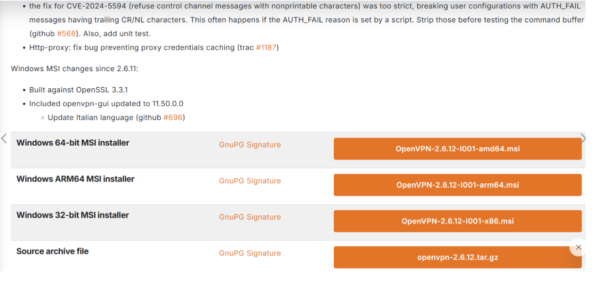

部署图如下：

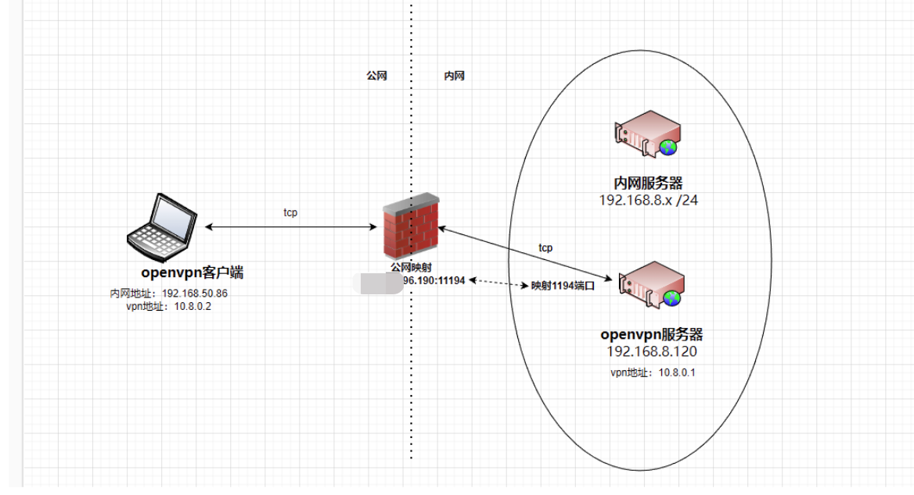

```go
//部署备注如下：
部署分为服务端和客户端，至少需要一个公网ip地址用于公网的客户端连接；
客户端内网ip地址为 192.168.50.86，分配的vpn地址为 10.8.0.2（随机的）；
openvpn服务端内网ip地址为 192.168.8.120，分配的vpn地址为 10.8.0.1（随机的）；
网络防火墙的公网ip为 113.108.196.190，映射关系为其端口 11194 --> openvpn服务器的1194端口；
实现的效果就是：公网的客户端能够通过openvpn连接到内网服务器，并访问到内网服务。
```

### 2、源码安装openvpn

服务器ip为：192.168.8.120

将源码传到服务器上，并解压、编译、安装

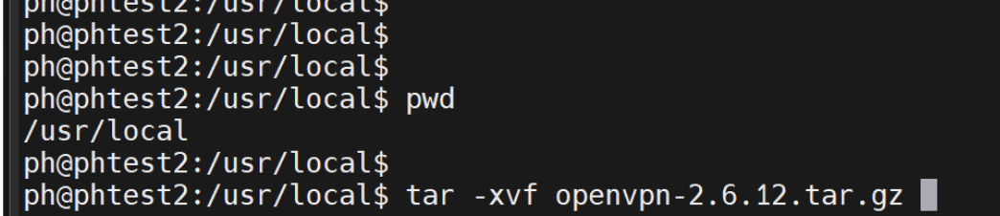

```go
//centos可能会报出现依赖包缺失，可yum在线安装即可（根据实际情况 libcap-ng-devel、libnl-genl等）
//由于centos7.9比较老，按照社区的做法需要添加参数--disable-dco才能避免报错（根据实际情况）
// ./configure --disable-dco --disable-lz4 OPENSSL_LIBS="-L/usr/local/openssl/lib64/ -lssl -lcrypt" OPENSSL_CFLAGS="-I/usr/local/openssl/include/" （根据实际情况）
cd openvpn-2.6.12
sudo apt install libssl-dev liblzo2-dev libpam0g-dev pkg-config libnl-genl* libcap-ng*
sudo ./configure --disable-lz4
sudo make && make install
```


```go
//验证版本与查看按照目录文件等
openvpn --version
which openvpn
```

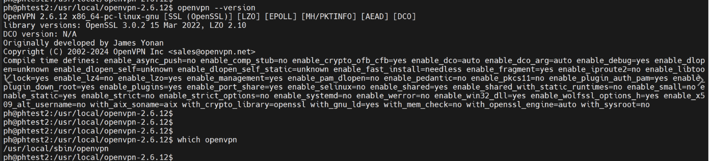

### 3、证书工具easy-rsa

```go
sudo apt install easy-rsa
//把easy证书程序拷贝到/etc/openvpn目录下，为了方便管理
sudo mkdir -p /etc/openvpn/easy-rsa
sudo cp -r ./* /etc/openvpn/easy-rsa/
```

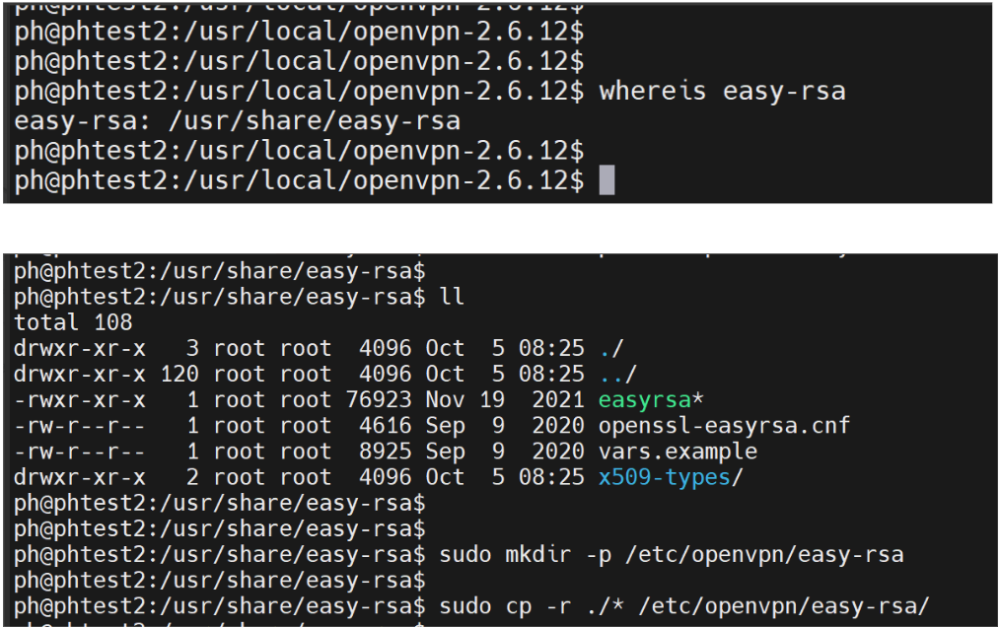

### 4、证书初始化

```go
//为了方便可将证书的时间调长一些，可调为10年，即3650
cd /etc/openvpn/easy-rsa
sudo vim easyrsa
```

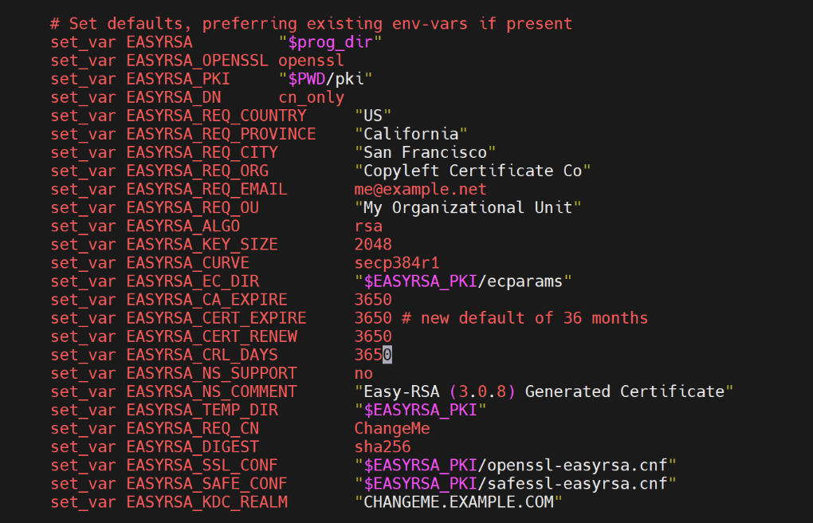

```go
//初始化
sudo ./easyrsa init-pki
//生成CA证书
//用于构建或初始化一个证书授权中心(CA):在OpenVPN或任何需要TLS/SSL加密通信的系统中，CA是一个信任的根，用于签发和验证服务器和客户端的证书，当你运行这个命令时，它会要求你输入一些信息，如CA的名称、有效期等，然后生成CA的私钥和证书。
//生成的证书的作用:CA证书是信任的起点，它用于签署其他证书(如服务器证书和客户端证书)，以证明这些证书是由受信的CA签发的；客户端和服务器在建立TLS连接时会验证对方证书的签名是否由受信任的CA签发。
sudo ./easyrsa build-ca nopass
```

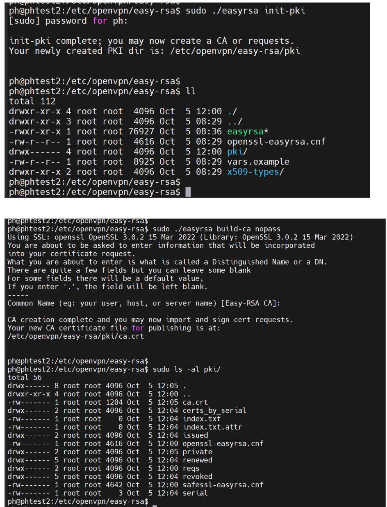

### 5、服务端证书

```go
//生成
//这个命令用于生成服务器端的证书请求(CSR，Cemncadle signingReoues0)。在生成CSR时，通第会要求输入一些信息，如国家、组织、常见名称(CN，通常是服务器的域名或P地址)等，然而，通过添加nopass 参数，这个命令会生成一个不加密的私钥，并且在生成CSR时不会要求输入密码。
//生成的证书请求的作用:CSR是一个包含公钥和证书请求者信息的文件，它发送给CA(证书授权中心)以请求签名。在OpenVPN环境中，服务器端的CSR用于请求CA签发一个服务器证书，以便服务器能够安全地与客户端进行通信。
sudo ./easyrsa gen-req server nopass

//签发
//命令作用:这个命令（或其等效命令) 用于签署之前生成的服务器证书清求，当执行此命令时，它会使用CA的私钥对CSR进行签名，从而生成一个有效的服务器证书。这个过程中，可能需要输入CA的密码(如果CA和私钥被加密了的话)，但在这个例子中，由于CSR是使用 nopass 参数生成的，所以签署过程可能不需要额外的密码输入(这取决于EaSyRSA的具体配置和版本)。
//生成的服务器证书的作用:服务器证书是服务器身份的证明，它包含了服务器的公钥和由CA签发的签名，当客户端尝试连接到服务器时，它会验证服务器证书的签名是否由受信任的CA签发，并检查证书中的信息是否与服务器相匹配。如果验证成功，客户端和服务器就可以使用证书中的公钥和私钥进行安全的加密通信。
sudo ./easyrsa sign-req server server

//生成 gen-dh
//命令作用:这个命令用于生成Diffie-Hellman(DH)参数，在TLS握手过程中，DH密钥交换用于在两个通信方之间安全地协商一个共享密钥，这个密钥将用于后续的加密通信。
//生成的参数的作用:DH参数是TLS握手中密钥交换阶段的关键部分，它们帮助双方在不泄露私钥的情况下协商出一个安全的共享密钥。
sudo ./easyrsa gen-dh

//生成 crl
//命令作用:这个命令用于生成或更新证书吊销列表(CRL)。CRL是一个包含了已经被CA吊销的证书序列号的列表，当客户端或服务器验证对方证书时，它们会检查该证书是否已被列入CRL中。
//生成的列表的作用:CRL提供了一种机制，允许CA撤销已经签发的证书，即使这些证书在有效期内。这对于撤销丢失的私钥、证书被滥用等情况非常重要
sudo ./easyrsa gen-crl
```

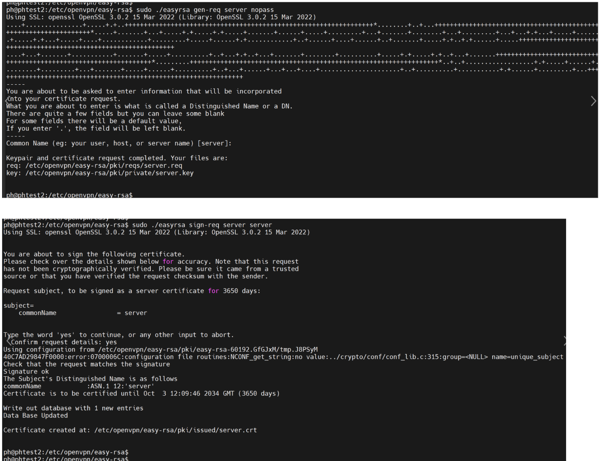

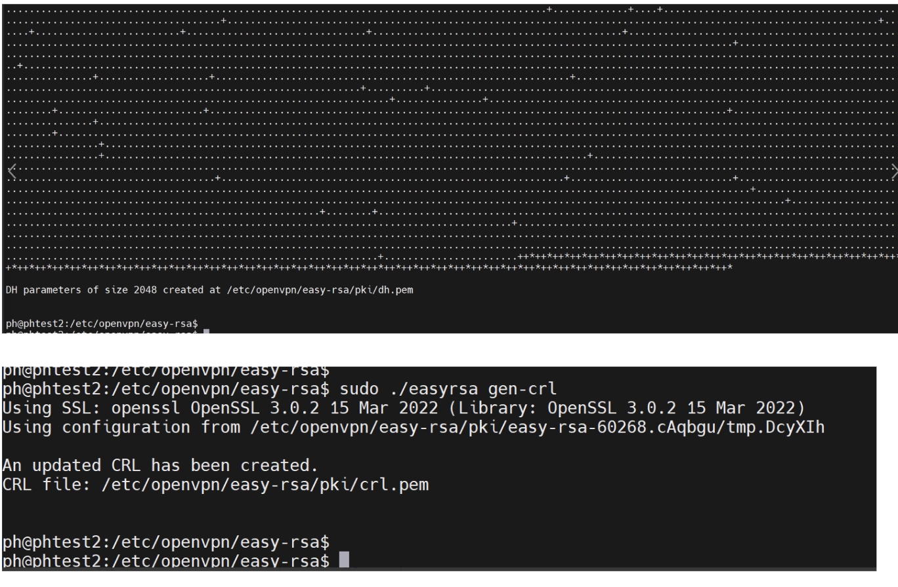

```go
//拷贝证书文件到指定目录
//为了方便统一复制到/etc/openvpn/目录下
cd /etc/openvpn
sudo mkdir -p server
sudo cp  /etc/openvpn/easy-rsa/pki/issued/server.crt /etc/openvpn/server/
sudo cp  /etc/openvpn/easy-rsa/pki/private/server.key /etc/openvpn/server/
sudo cp  /etc/openvpn/easy-rsa/pki/ca.crt /etc/openvpn/
sudo cp  /etc/openvpn/easy-rsa/pki/dh.pem /etc/openvpn/
sudo cp  /etc/openvpn/easy-rsa/pki/crl.pem /etc/openvpn/
```

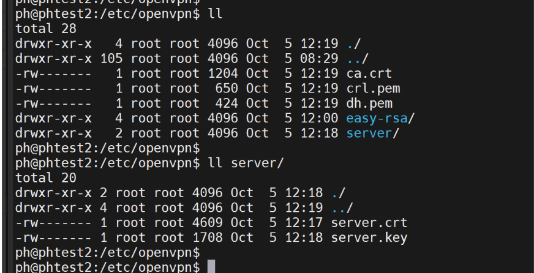

### 6、修改配置文件

```go
//复制一份模板到/etc/openvpn/server目录下
sudo mkdir -p /etc/openvpn/log
sudo cp /usr/local/openvpn-2.6.12/sample/sample-config-files/server.conf  /etc/openvpn/server/
sudo vim /etc/openvpn/server/server.conf
////////////////////////////////////////////
//修改大致内容如下
port 1194 //监听端口，默认为1194
proto tcp //我这里采用tcp,tcp相比udp更加稳定
dev tun //路由模式
ca /etc/openvpn/ca.crt //ca文件
cert /etc/openvpn/server/server.crt //服务器证书
key /etc/openvpn/server/server.key  //This file should be kept secret
dh /etc/openvpn/dh.pem #dh.pem
server 10.8.0.0 255.255.255.0   //vpn的地址段
ifconfig-pool-persist ipp.txt
push "route 192.168.8.0 255.255.255.0" //开放客户端访问内网段为 192.168.8.0/24
client-config-dir /etc/openvpn/ccd   //客户端配置（可选）
route 192.168.50.0 255.255.255.0     //推送给客户端的网络路由（可选）
client-to-client
keepalive 10 120
cipher AES-256-GCM   //新版本支持的算法
comp-lzo
persist-key
persist-tun
status  /etc/openvpn/log/openvpn-status.log //自定义
log         /etc/openvpn/log/openvpn.log //自定义
log-append  /etc/openvpn/log/openvpn.log //自定义
verb 4
explicit-exit-notify 1
crl-verify /etc/openvpn/crl.pem //crl.pem文件
compress migrate      // 解决客户端报错 ”Bad LZO decompression header byte”
```

```go
//客户端配置（可选）
mkdir -p /etc/openvpn/ccd;cd /etc/openvpn/ccd
//其中penghao为客户端名,iroute地址为客户端ip地址段
touch penghao
```

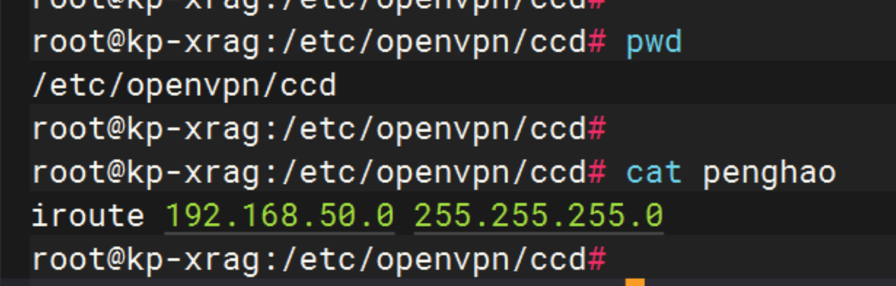

### 7、启动服务

```go
//设置内核ip转发（可能需要）
vim /etc/sysctl.conf
net.ipv4.ip_forward = 1
sysctl -p
//设置防火墙iptables转发规则（可能需要）
//源地址翻译SNAT：把来自10.8.0.0/24的流量在离开网络接口ens160前，修改源ip为192.168.8.120
iptables -t nat -A POSTROUTING -s 10.8.0.0/24 -o ens160 -j SNAT --to-source 192.168.8.120

//最后启动服务,如有报错可查日志/etc/openvpn/log/xxx
sudo /usr/local/sbin/openvpn --daemon --config /etc/openvpn/server/server.conf
//检查如下，有出现一块新的网卡，且进程正常启动了
```

```go
// 或者用 systemd 启动
cat /lib/systemd/system/openvpn.service

[Unit]
Description=test
Documentation=https://github.com/
After=network.target

[Service]
Type=simple
LimitNOFILE=32768
ExecStart=/usr/local/sbin/openvpn  --config /etc/openvpn/server/server.conf
Restart=on-failure

[Install]
WantedBy=multi-user.target
```

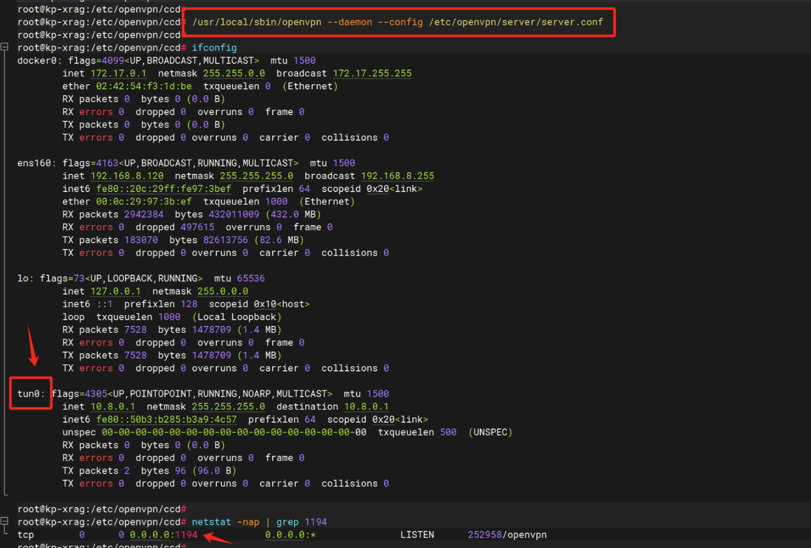

至此openvpn服务端已经按照完毕，客户端安装可参考客户端章节。

\-------------------------------------------

**备注：**==防火墙需要提前开放公网访问的ip+端口号，如下所示（注意协议为tcp或者udp）：==


### 8、参考链接

https://izhaojie.com/2024/06/13/install-ubuntu22-openvpn-server-and-win10-client.html

https://blog.csdn.net/damiaomiao666/article/details/139886164

吊销客户端证书和添加密码认证参考：  [/pictures/openvpn/企业级vpn服务openvpn.pdf](https://wiki.uhowie.com/pictures/openvpn/企业级vpn服务openvpn.pdf)

## 2、客户端安装

### 1、WIN

Openvpn 客户端安装（**win系统**）

- 1、获取客户端证书
- 2、整理客户端证书
- 3、修改配置文件
- 4、启动客户端
- 5、测试连接性
- 6、其他问题

#### 1、获取客户端证书

```go
//需要在服务端上制作证书，并下发给客户端使用，假设前面我们的服务端已经按照好了
cd /etc/openvpn/easy-rsa/
//假设生成名为 penghao 的客户端证书
sudo ./easyrsa gen-req penghao nopass
//签发
sudo ./easyrsa sign-req client penghao
```

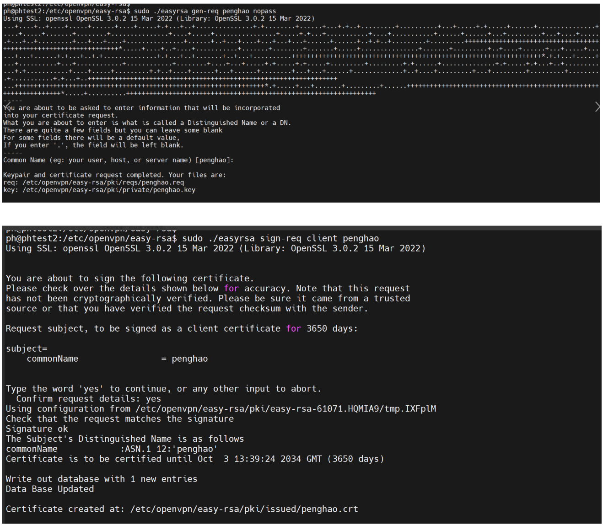

#### 2、整理客户端证书

```go
//将上面签发的客户端证书统一放到/etc/openvpn/client/penghao目录下
sudo mkdir -p /etc/openvpn/client/penghao
sudo cp /etc/openvpn/ca.crt /etc/openvpn/client/penghao/
sudo cp /etc/openvpn/easy-rsa/pki/issued/penghao.crt /etc/openvpn/client/penghao/
sudo cp /etc/openvpn/easy-rsa/pki/private/penghao.key /etc/openvpn/client/penghao/
//提前将penghao目录下几个证书文件下载到本地客户端，用于后面使用
```

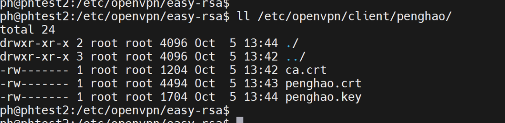

#### 3、修改配置文件

```go
//复制一份模板
sudo cp /usr/local/openvpn-2.6.12/sample/sample-config-files/client.conf /etc/openvpn/client/penghao/
//编辑
sudo vim /etc/openvpn/client/penghao/client.conf
//需修改的大致内容如下
//////////////////////////////
client
dev tun
proto tcp   //协议需要与服务端一致
remote 113.108.196.190 11194  //防火墙开放的外网ip+端口
resolv-retry infinite
nobind
persist-key
persist-tun
ca ca.crt         //ca证书地址
cert penghao.crt  //crt地址
key penghao.key   //key地址
tls-client
cipher AES-256-GCM   //与服务端对应一致
comp-lzo
remote-cert-tls server
verb 3
route 192.168.8.0 255.255.255.0
///////////////////////////////
//将 client.conf 文件也下载到本地客户端连接，并重命名为 penghao.ovpn
```

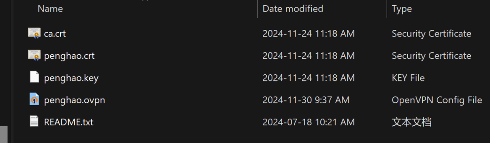

#### 4、启动客户端

启动直接点击连接即可，如果打印日志没有报错且图标颜色变绿，则代表客户端成功连接上了服务端：

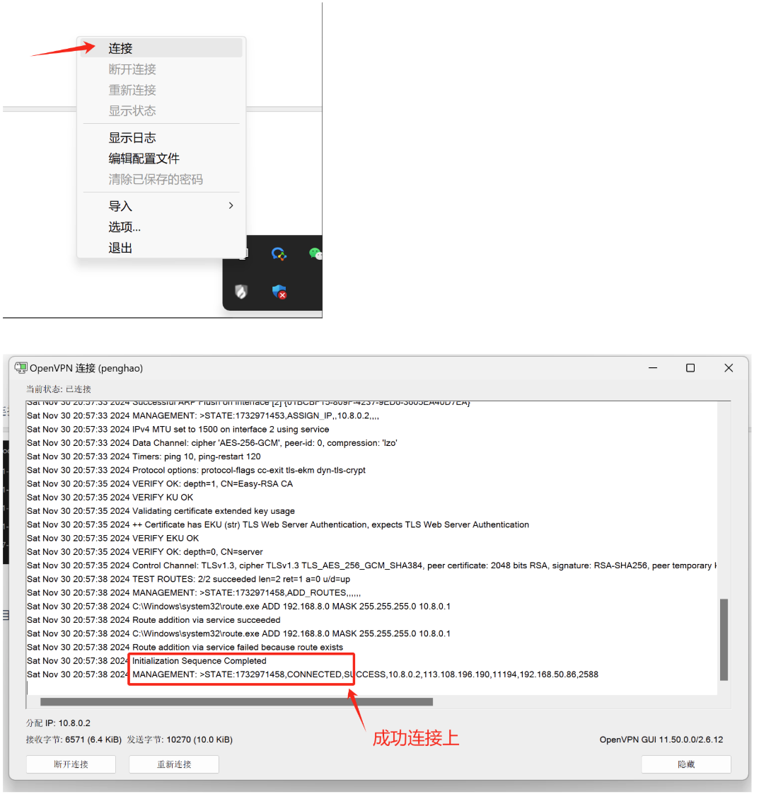

服务端成功打印出日志如下：


#### 5、测试连接性

客户端cmd检查ping vpn的网关地址和内网ip地址，还有检查路由表信息等，最后看是否能打开内网的服务等，如下：

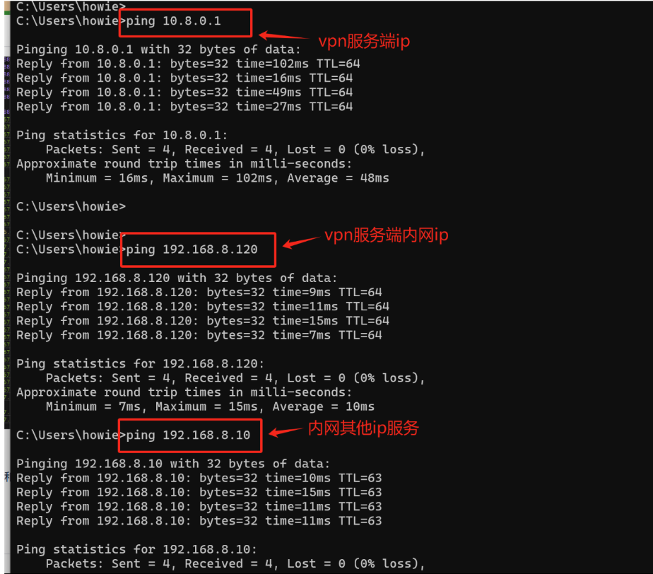

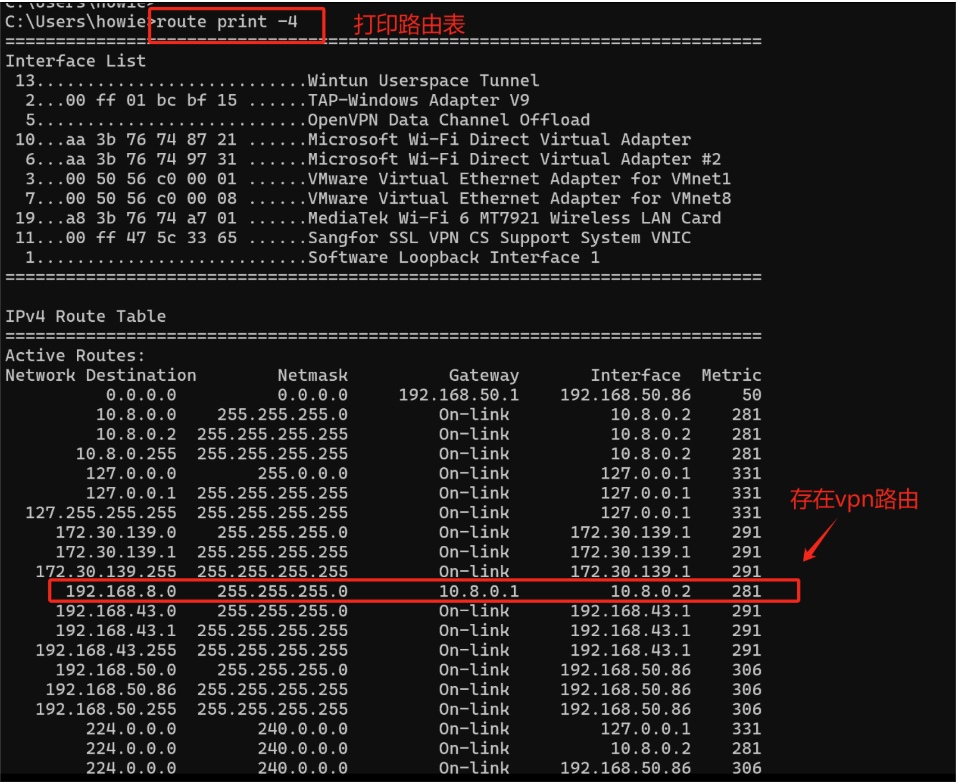


#### 6、其他问题

1、服务端报错日志如下，可行方案之一是将 udp 协议换成 tcp 即可，官方文档说 udp 不稳定会丢包，推荐使用 tcp 协议：

文档链接：https://tldrify.com/m80

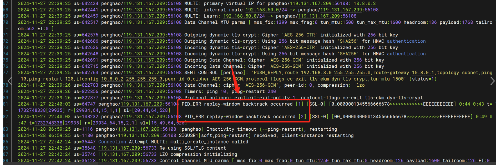

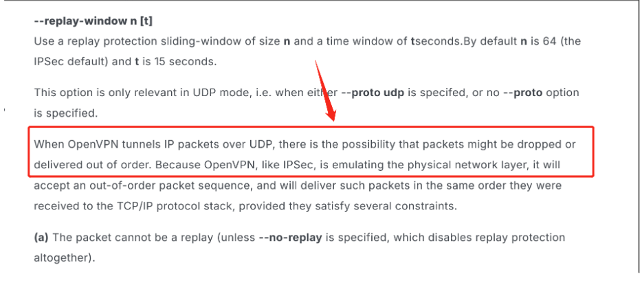

2、服务器报错日志如下，且客户端报错 **“Bad LZO decompression header byte”**，需要在服务器配置中添加 **”compress migrate”**。

相关链接：https://community.openvpn.net/openvpn/wiki/Compression


### 2、MAC

官方下载地址：https://openvpn.net/client/


### 3、LINUX

==待更新…==