# 3x-ui

3x-ui是用于管理 Xray-core 服务器的高级 Web 面板

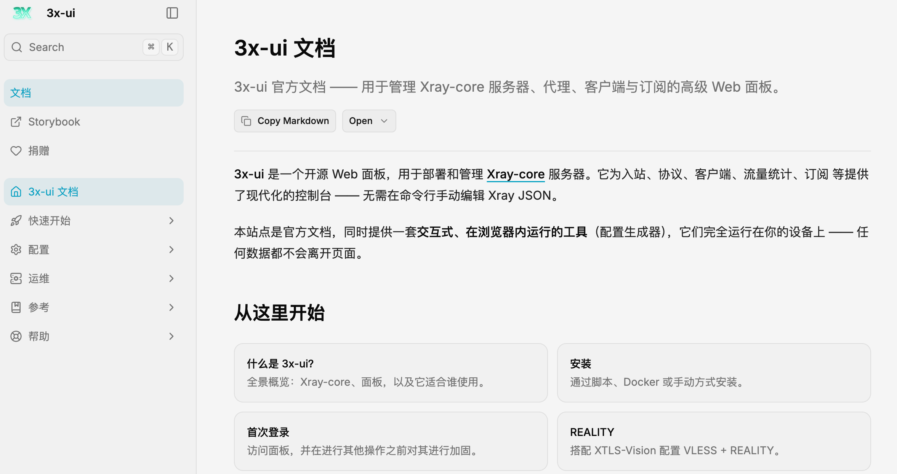

仓库链接：https://github.com/MHSanaei/3x-ui
</br>官方文档：https://docs.sanaei.dev/zh/docs/

## 1、基本用法

### 1、在线安装

笔者选用一台 **hk** 的 rocky 系统的 linux 服务器，用在线脚本安装的方式，执行官方脚本安装

```go
// 安装脚本，指定版本为3.6.0
bash <(curl -Ls https://raw.githubusercontent.com/mhsanaei/3x-ui/master/install.sh) v3.6.0
```

按照指引按照即可，默认全部用默认设置即可，后面登陆面板后都可以进行修改，安装过程中会出现默认的登陆地址和账密，成功登陆系统后的界面如下：

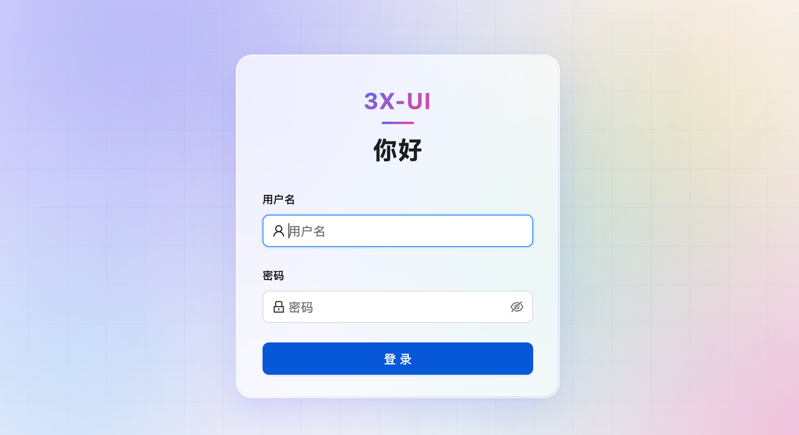

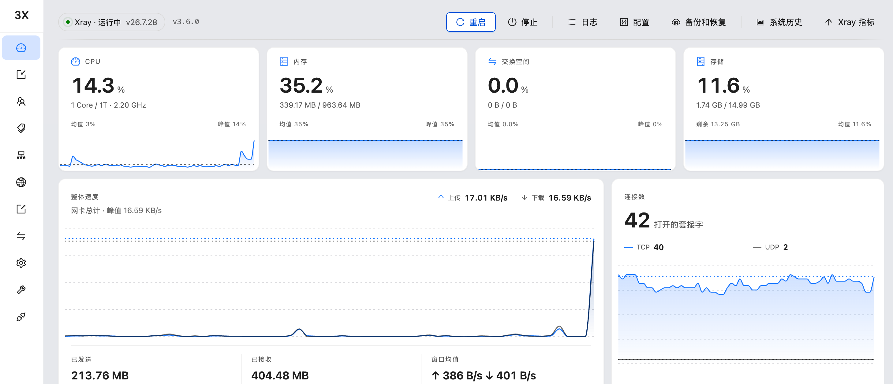

### 2、直连代理

直连代理就是客户端直接连接hk服务器的xray，简单适合大部分用户，只需两个步骤，即添加入站和配置客户端即可，客户端设备再扫码即可使用了，出口网络就是hk的公网ip。

**添加入站：**

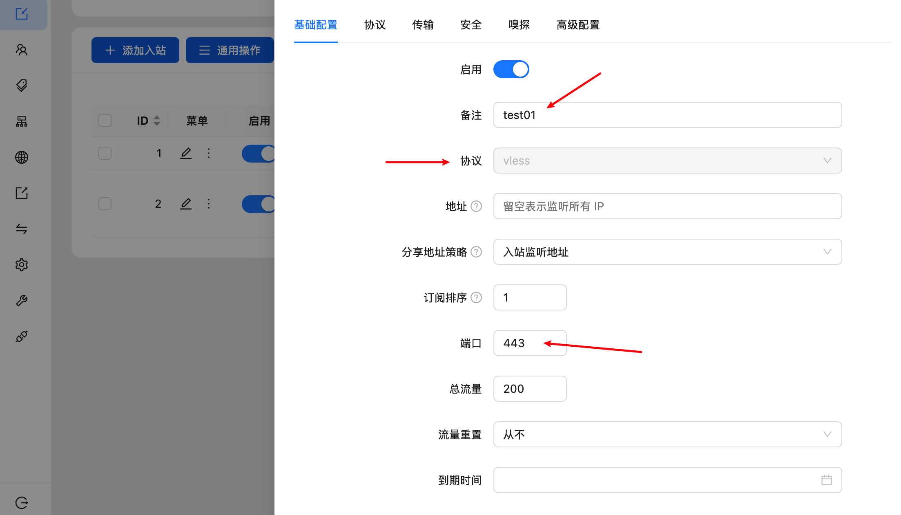

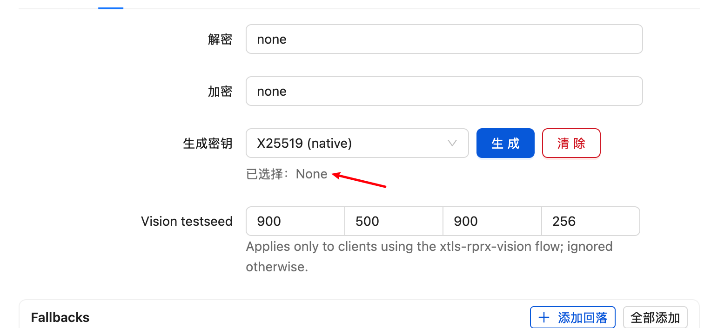

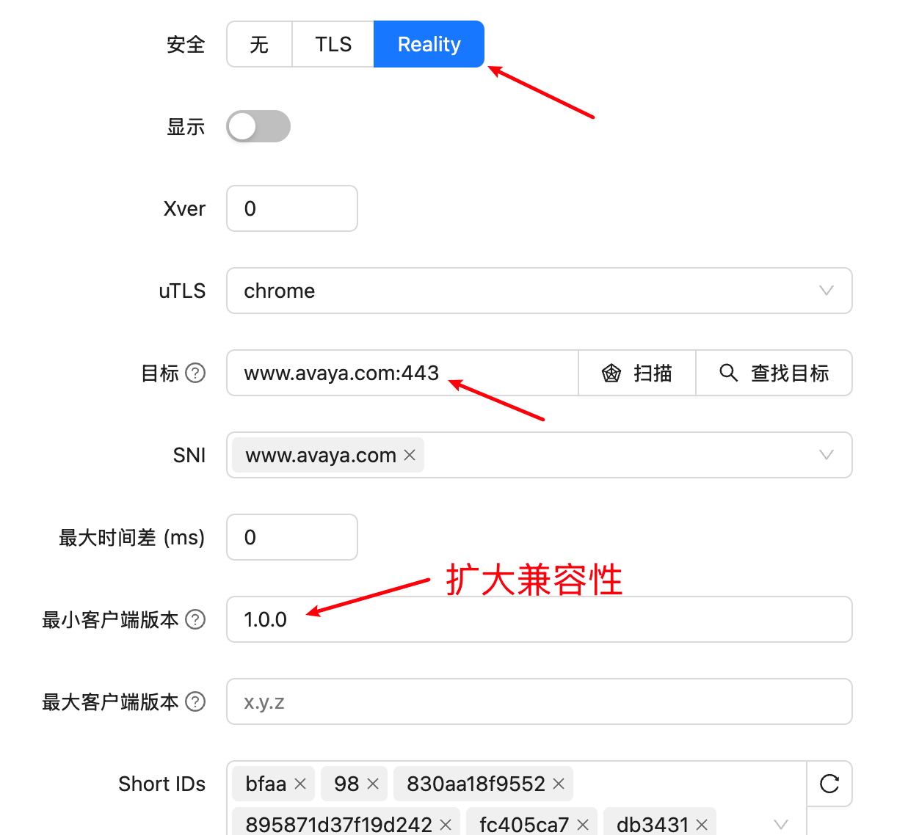

其他保持默认即可，添加完后效果如下：

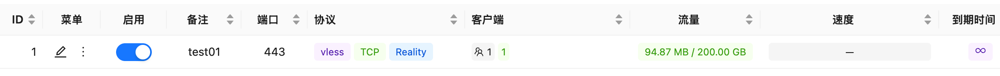

**添加客户端：**

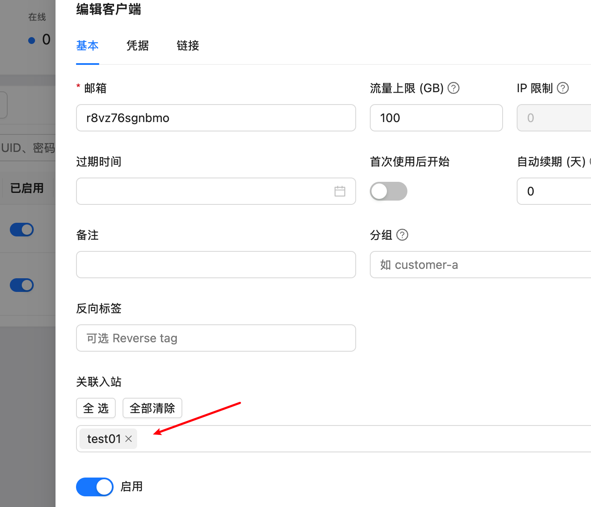

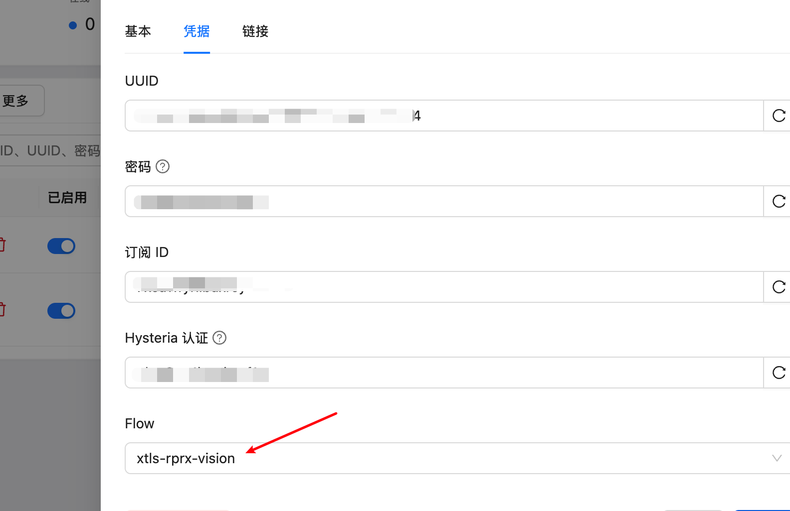

其他保持默认即可，添加完效果如下：

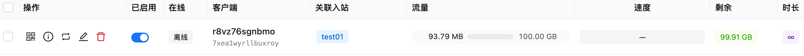

最后把客户端的链接分享就可以连了。

### 3、中转代理

上面是简单代理，如果要用其他国家的网络，最好是用hk服务器做中转，这个时候就要用到中转代理（规则）的方式了，这里中转到美区LA的xray服务，hk的中转端口是8443，前提la的xray已部署好，并暴露443端口。

**1、入站设置：**

与上面一样添加一个入站配置，用于客户端链接hk的中转端口，如下

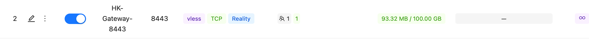

**2、出站设置：**

添加一个出站设置，配置一个xray的客户端连接la的xray服务，所有更改都需要保存并重启面板才能生效！

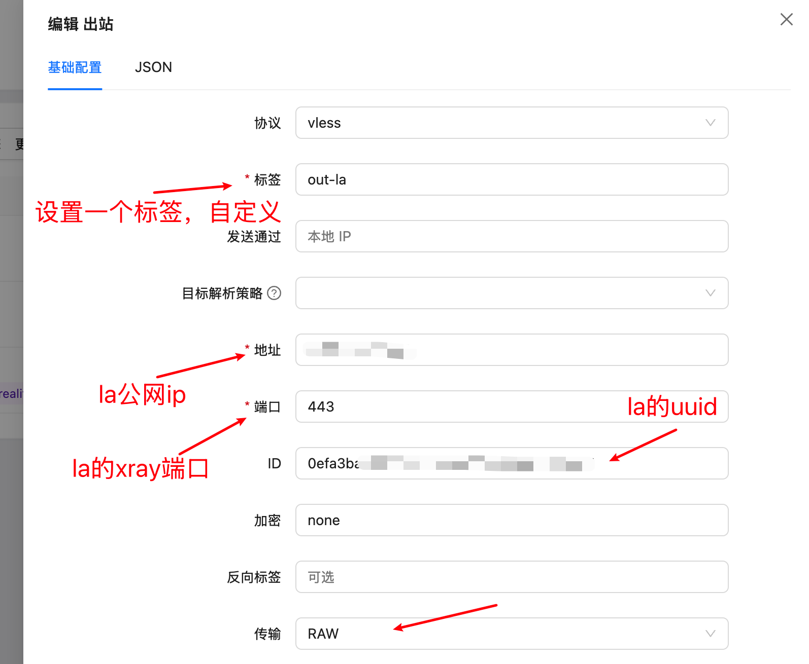

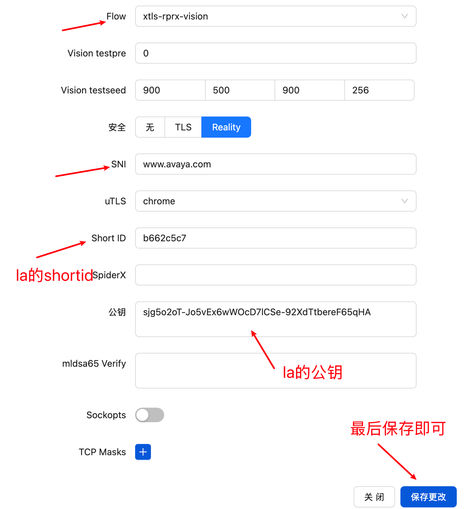

效果如下：

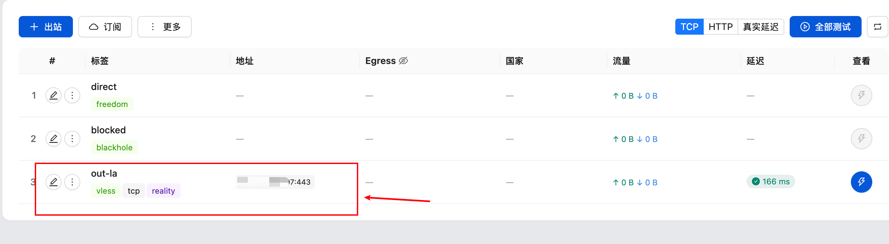

**3、规则配置**

配置一个中转规则，将8443的端口服务转到la的xray服务，所有更改都需要保存并重启面板才能生效！

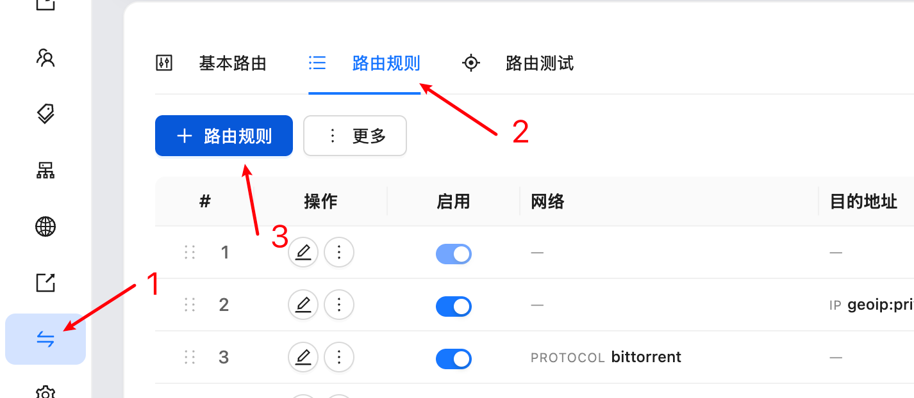

只需要配置这个两个地方即可：

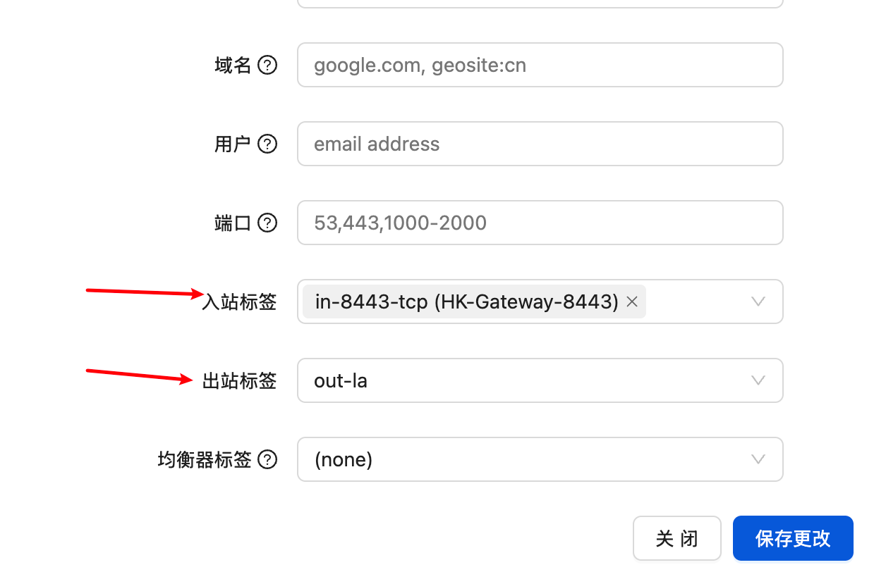

最后的效果如下：

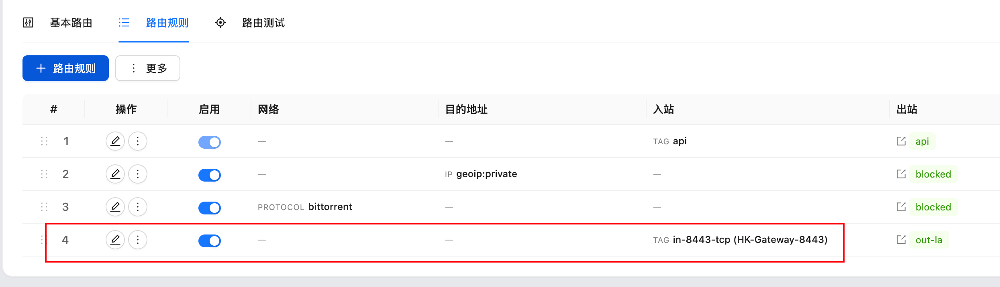

**4、客户端添加**

客户端添加跟前面的一样，主要注意选对应的入站为8443端口那个就行：

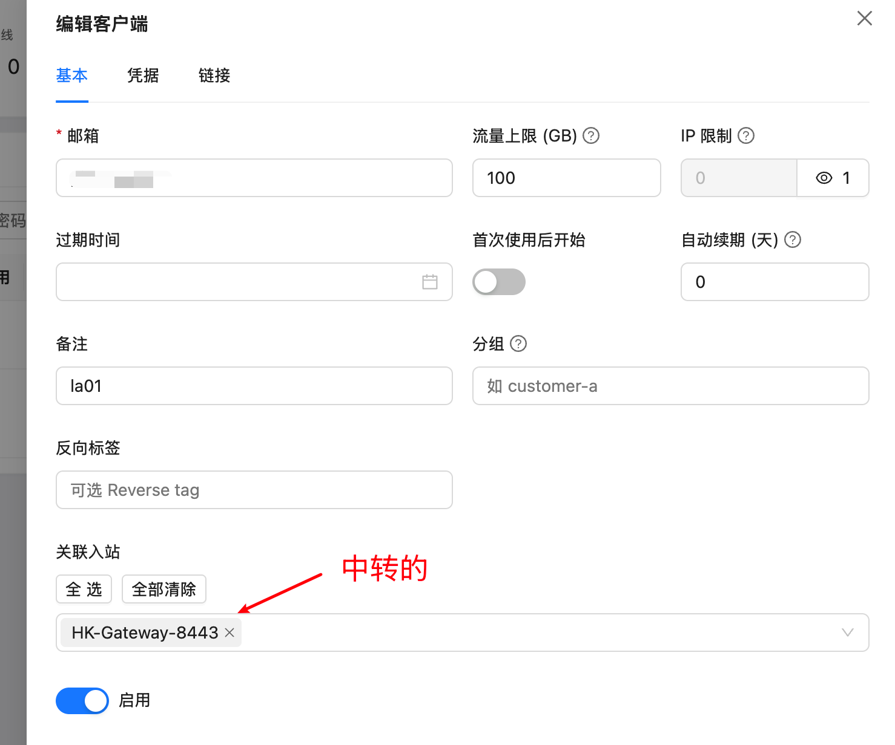

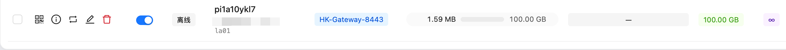


