# Shadowsocks

[TOC]

Shadowsocks是一款非常优秀的代理软件，可以实现所谓的“翻墙”效果，即让大陆的服务器通过代理服务器访问外网，相关介绍如下：

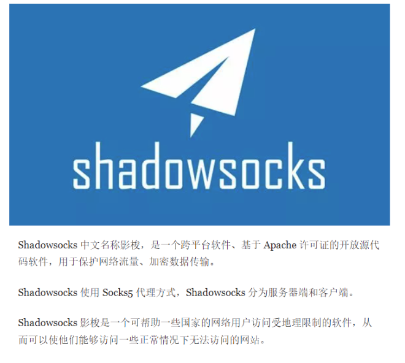

shadowsocks有好几种语言开发的安装包，比如shadowsocks-libev，shadowsocks-rust，go-shadowsocks2等，我们此处选择libev的安装包，因为其是由c语言开发的，占容量小、且性能高、安装简便等优点，此处我们安装是基于centos7.9，内核版本为6.1.82；

Github地址：https://github.com/shadowsocks

官网文档：https://shadowsocks.org/doc/what-is-shadowsocks.html

安装分为两类，即服务端和客户端，此次我们先介绍服务端的安装。

## 1、服务端安装

1、准备一台香港的云服务器；（国外也可）

2、将安装包传到服务器上，如下图所示：

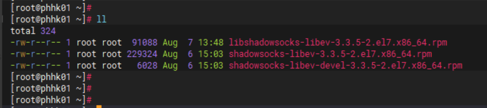

3、先安装一些依赖

```go
yum install epel-release libsodium libev libmbedcrypto* libcares*
```

4、安装程序包

```go
rpm -ivh libshadowsocks-libev-3.3.5-2.el7.x86_64.rpm shadowsocks-libev-devel-3.3.5-2.el7.x86_64.rpm shadowsocks-libev-3.3.5-2.el7.x86_64.rpm
```

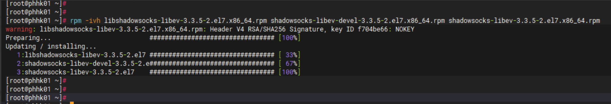

5、检查服务是否安装成功

```go
systemctl status shadowsocks-libev-server
```

6、编辑配置文件

```go
//根据实际需求修改账号信息及加密即可
vim /etc/shadowsocks/shadowsocks-libev-config.json
```

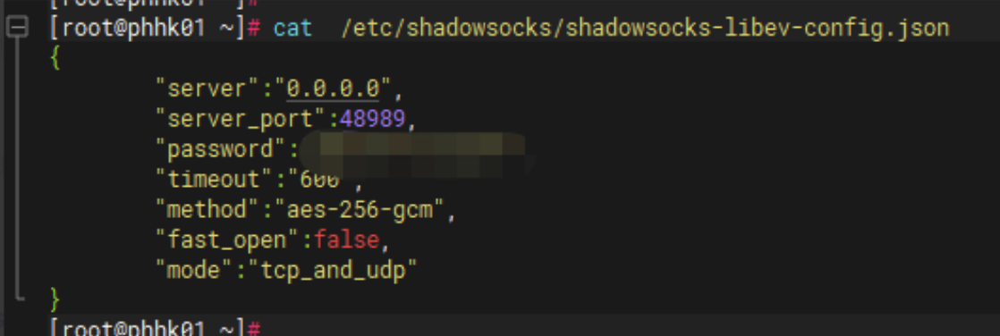

7、重启服务

```go
systemctl restart  shadowsocks-libev-server
```

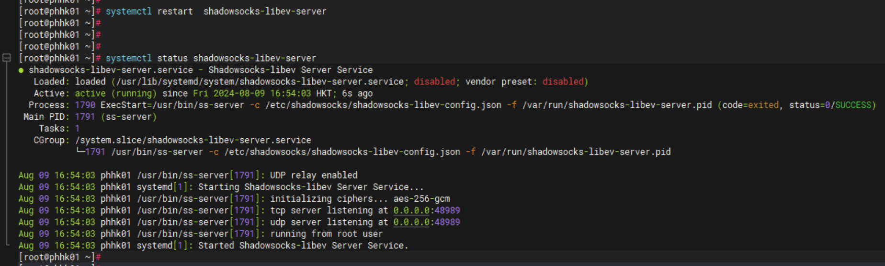

8、安装完毕，服务器安装就是这么简单，注意云服务器要开放对应的端口；

## 2、客户端安装

### 1、IOS

ios端需要在应用商城里面下载APP（可能需要换非国区账号），推荐如下APP：

Potatso

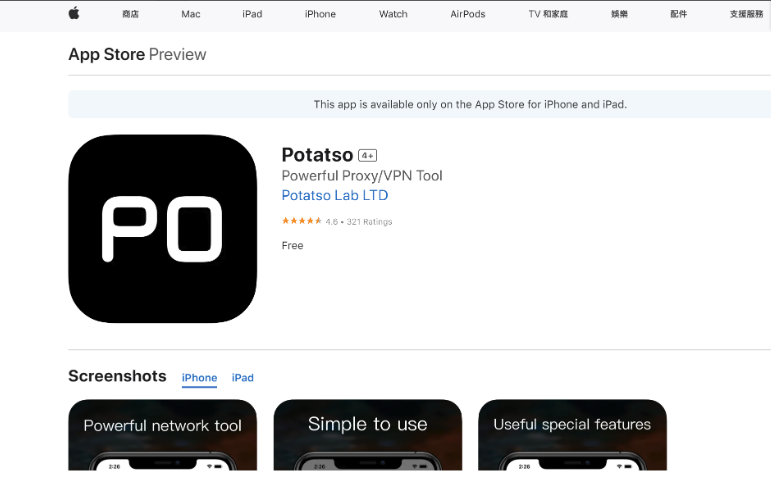

### 2、Linux

linux客户端是指在终端上安装应用连接ss服务器（区别UI界面），与其他客户端操作较不同，相关操作如下；

- 安装 ss 客户端
- 附加：https代理
- 附加：Docker代理

代理架构图：

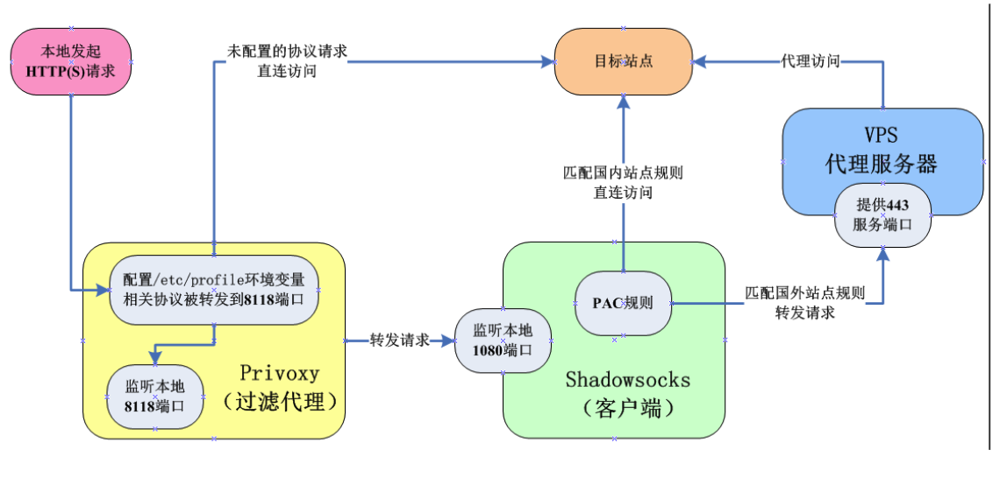

**安装 ss 客户端：**

1、安装shadowsocks客户端 (也可直接用 rust 版本的 rpm 安装，自带有 client 的程序)

```go
yum -y install epel-release
yum -y install python-pip
pip install shadowsocks    //离线安装 pip install shadowsocks.tar.gz
sslocal --version    //验证版本号
```

2、配置文件

```go
mkdir /etc/shadowsocks
vim /etc/shadowsocks/shadowsocks.json
//配置信息如下
{
    "server":"your_server_ip",         #ss服务器IP
    "server_port":your_server_port,    #端口
    "local_address": "192.168.xxx.xxx",      #本地ip（注意用内网ip，不要用127.0.0.1）
    "local_port":1080,                 #本地端口
    "password":"your_server_passwd",   #连接ss密码
    "timeout":300,                     #等待超时
    "method":"rc4-md5",                #加密方式（与服务端要一致）,代理docker服务可能需要 aes-256-gcm
    "fast_open": false,                #true或false。如果你的服务器 Linux 内核在3.7+，可以开启 fast_open 以降低延迟。开启方法： echo 3 > /proc/sys/net/ipv4/tcp_fastopen 开启之后，将 fast_open 的配置设置为 true 即可
    "workers": 1                       #工作线程数
}
```

3、建立启动服务

`````go
vim /etc/systemd/system/shadowsocks.service
//配置如下
[Unit]
Description=Shadowsocks Client Service
After=network.target
[Service]
Type=simple
User=root
ExecStart=/usr/bin/sslocal -c /etc/shadowsocks/shadowsocks.json
[Install]
WantedBy=multi-user.target
`````

4、启动服务

```go
systemctl enable /etc/systemd/system/shadowsocks.service
```

5、简单测试

`````go
//运行命令
curl --socks5 内网ip:1080 http://httpbin.org/ip
//正确情况下返回ss服务端的公网地址，则socks代理成功！
`````

#### 附加：https代理

Shadowsocks 是一个 socket5 服务，因此我们需要使用 Privoxy 把流量转到 http/https 上；

Privoxy是一款带过滤功能的[代理服务器](https://baike.baidu.com/item/代理服务器/97996?fromModule=lemma_inlink)，针对HTTP、HTTPS协议，可以让访问不了外网的服务器通过其代理访问外网；

官方地址：https://www.privoxy.org/

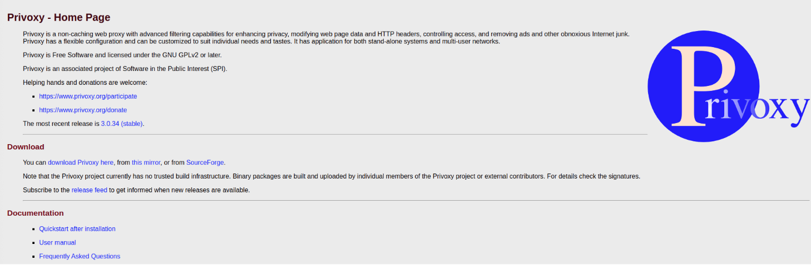

1、安装Privoxy

```go
yum install epel-release
yum install privoxy
```

2、配置文件

```go
vim /etc/privoxy/config
//配置如下
listen-address    内网ip:8118     // ip地址不要用 127.0.0.1
forward-socks5t / 内网ip:1080 .
```

3、设置启动

```go
vim /lib/systemd/system/privoxy.service
//如下
[Unit]
Description=Privoxy Web Proxy With Advanced Filtering Capabilities
Wants=network-online.target
After=network-online.target
[Service]
Type=forking
PIDFile=/run/privoxy.pid
ExecStart=/usr/sbin/privoxy --pidfile /run/privoxy.pid /etc/privoxy/config
```

4、添加全局代理

```go
vim /etc/profile
//如下,如开启全局代理需考虑端口最大连接数目的问题，如果进程太多连接数过多就会导致其他需要代理的服务不可用；
export http_proxy=http://内网ip:8118
export https_proxy=http://内网ip:8118
```

5、启动

```go
source /etc/profile
systemctl enable /lib/systemd/system/privoxy.service
```

6、测试

```go
curl -I www.google.com    //如果返回200说明成功代理了
```

#### 附加：Docker代理

参考资料：https://docs.docker.com/engine/daemon/proxy/

```go
sudo mkdir -p /etc/systemd/system/docker.service.d
vim http-proxy.conf
[Service]
Environment="HTTP_PROXY=http://内网ip:8118"
Environment="HTTPS_PROXY=http://内网:8118"
//重启
sudo systemctl daemon-reload
sudo systemctl restart docker
//尝试拉取一下谷歌镜像，能的话说明代理成功了
```

### 3、MAC

mac客户端下载地址：https://github.com/shadowsocks/ShadowsocksX-NG/releases/

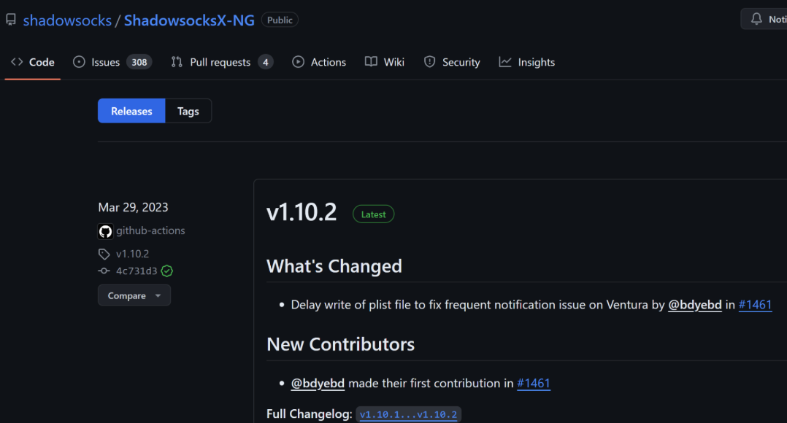

### 4、Ubutun

linux图形客户端下载地址：https://github.com/shadowsocks/shadowsocks-qt5/releases

可能会遇到这种情况，客户端QT5工具连接好ss服务器后，打开浏览器访问谷歌页面打不开，因为浏览器没有做代理，所以需要在终端上执行相关代理命令打开才行；

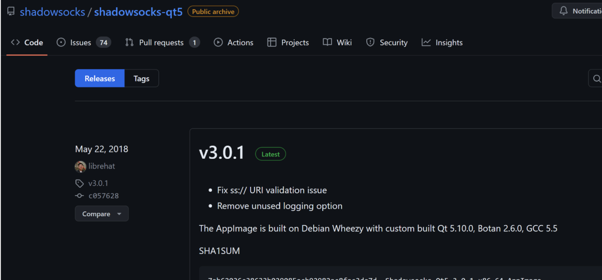

### 5、WIN

下载客户端：https://github.com/shadowsocks/shadowsocks-windows/releases

### 6、安卓

安装客户端下载地址：https://github.com/shadowsocks/shadowsocks-android/releases

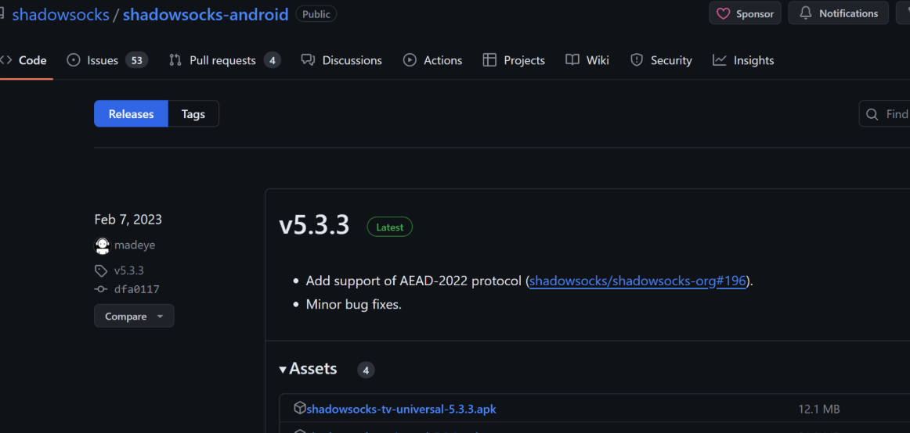

