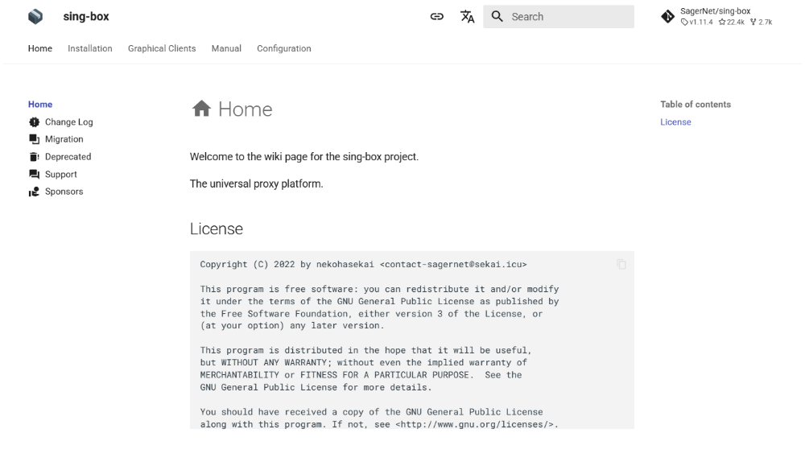
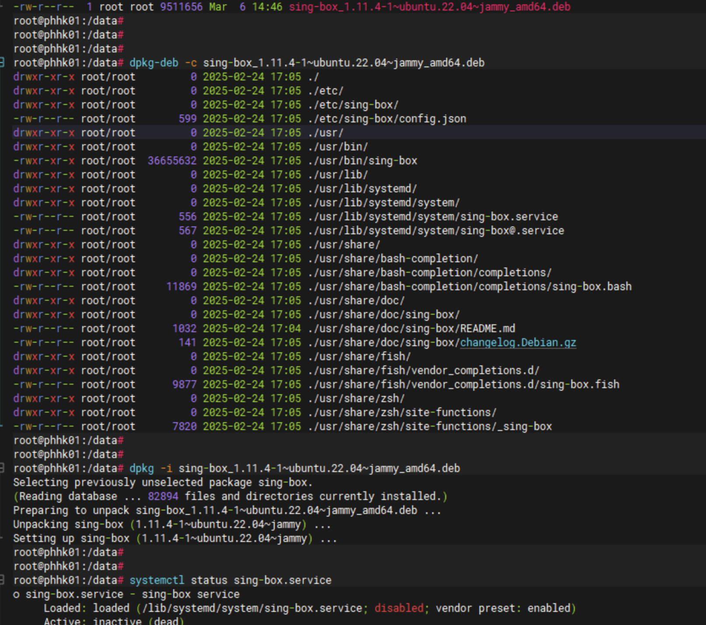

# Sing-box


The universal proxy platform.

github地址：https://github.com/SagerNet/sing-box

文档：https://sing-box.sagernet.org/



## 1、服务端

服务端安装：以 ubuntu-22.04 为例，HK机器作为宿主机。



```go
// 配置文件位于 /etc/sing-box/config.json
vim /etc/sing-box/config.json

{
  "log": {
    "level": "info"
  },
  "dns": {
    "servers": [
      {
        "address": "tls://8.8.8.8"
      }
    ]
  },
  "inbounds": [
    {
      "type": "shadowsocks",
      "listen": "::",
      "listen_port": 8080,
      "sniff": true,
      "network": "tcp",
      "method": "2022-blake3-aes-128-gcm",
      "password": "8JCsPssfgS8tiR333344=="
    }
  ],
  "outbounds": [
    {
      "type": "direct"
    },
    {
      "type": "dns",
      "tag": "dns-out"
    }
  ],
  "route": {
    "rules": [
      {
        "protocol": "dns",
        "outbound": "dns-out"
      }
    ]
  }
}
```

## 2、客户端

客户端下载地址：https://sing-box.sagernet.org/clients/