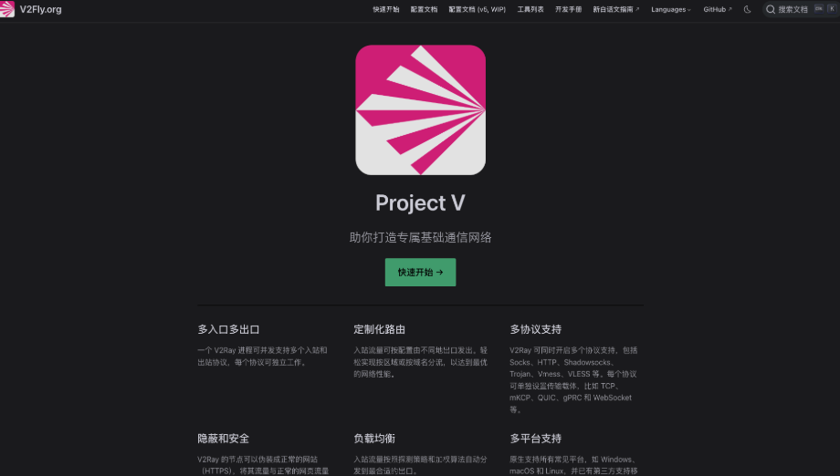
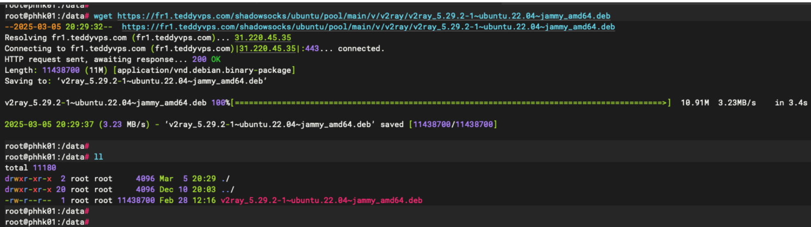
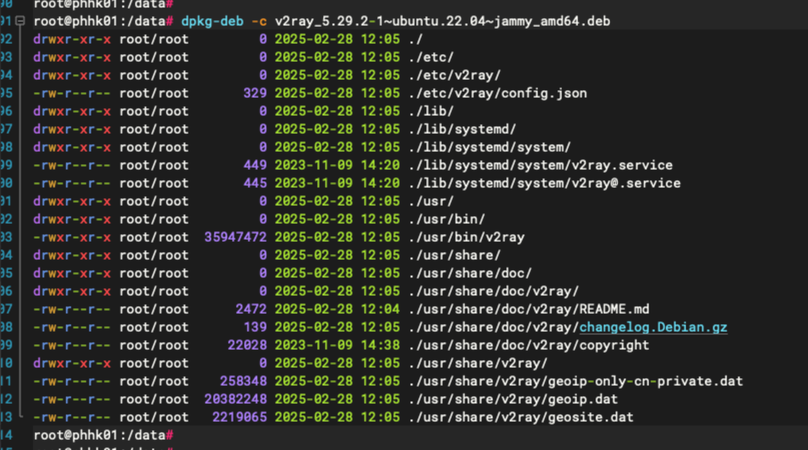
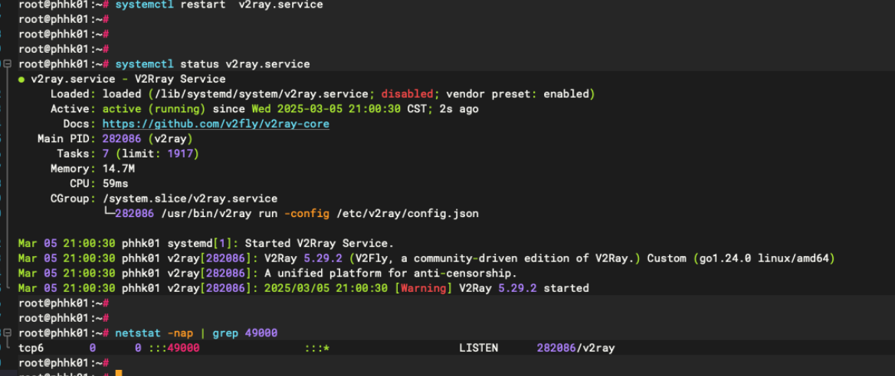

# V2rag


v2rag 是一款网络代理工具。

github地址：https://github.com/v2fly/v2ray-core

文档：https://www.v2fly.org/guide/install.html



## 1、服务端

开始服务端安装，本次os为 ubuntn-22.04，HK服务器，采用编译好的 deb 包安装。

将安装包下载到本地：





```go
// 安装
dpkg -i v2ray_5.29.2-1~ubuntu.22.04~jammy_amd64.deb
systemctl status v2ray.service

// 配置文件在 /etc/v2ray/config.json
// 配置文件详解： https://www.v2fly.org/config/overview.html
vim /etc/v2ray/config.json

{
  "inbounds": [{
    "port": 49000,             // 服务端口
    "protocol": "vmess",
    "settings": {
      "clients": [
        {
          "id": "32baa510-1f0c-4056-a371-e4717c943481",    // 可用 uuidgen 生成
          "level": 1,
          "alterId": 64
        }
      ]
    }
  }],
  "outbounds": [{
    "protocol": "freedom",
    "settings": {}
  }]
}

// 启动服务
systemctl restart  v2ray.service
systemctl status  v2ray.service
```



## 2、客户端

将介绍不同客户端终端的安装及使用。

客户端下载地址：https://github.com/2dust/v2rayN   （目前较活跃分支）

客户端下载地址：https://github.com/Qv2ray/Qv2ray  （主分支停止维护）