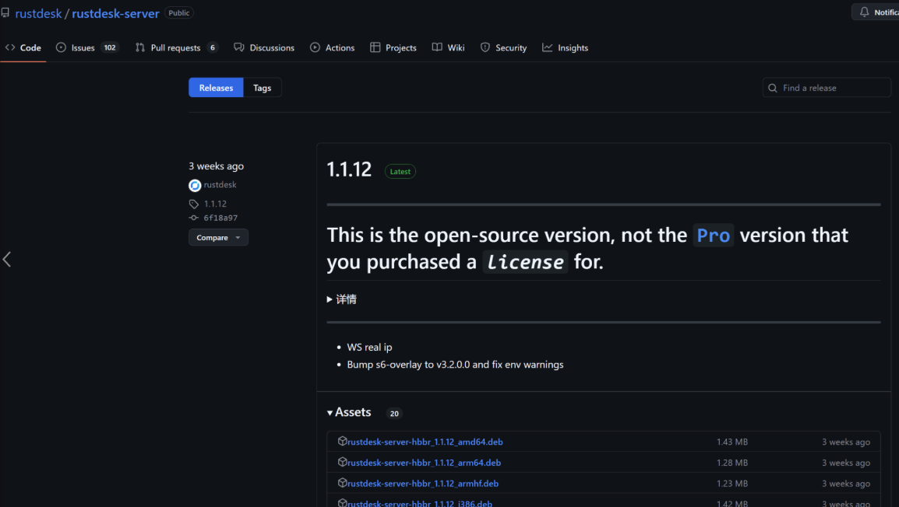
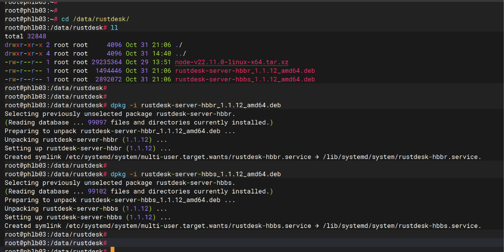
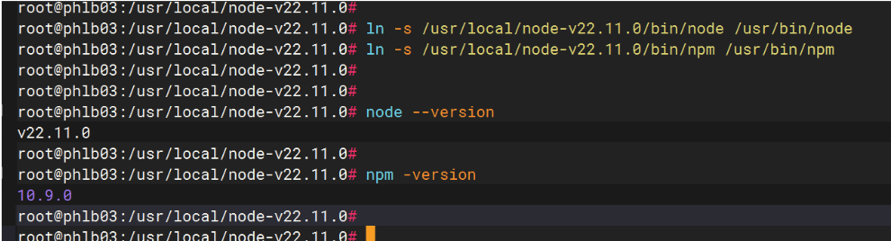
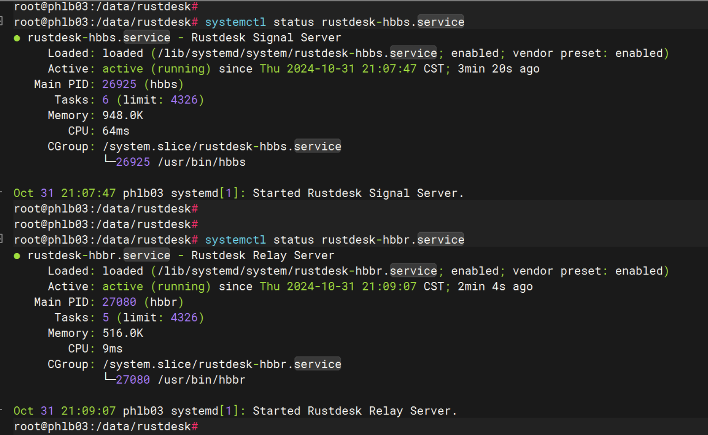
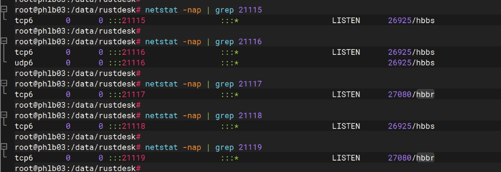
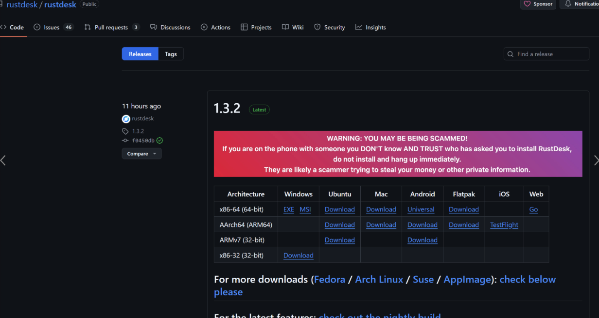
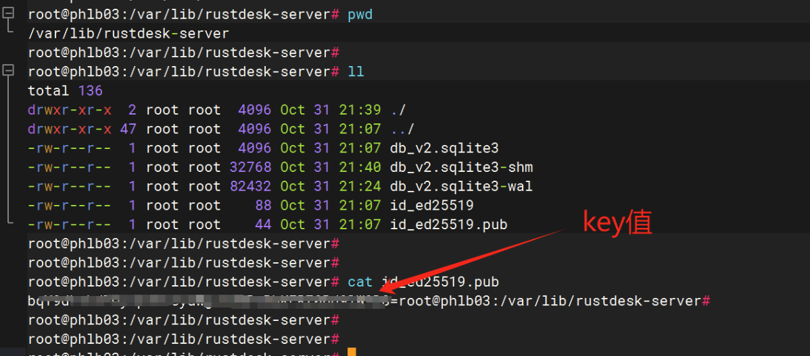
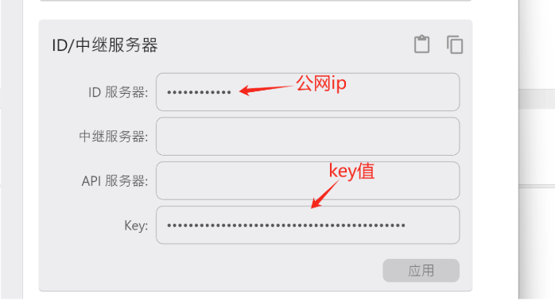
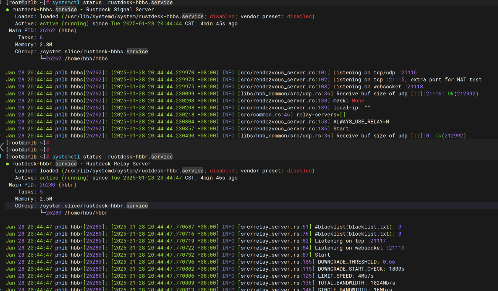
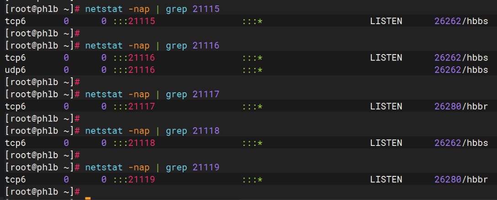

# RustDesk


Rustdesk是一款免费开源的桌面远程软件，可以让用户自己搭建自己的远程服务器使用，既安全又提高体验度；https://rustdesk.com/zh-cn/

**中文安装文档：**https://rustdesk.com/docs/zh-cn/self-host/

**笔者环境为：**os为ubuntu 22.04，rustdesk-server版本为1.1.12，客户端版本为1.3.2；

部署可分为服务端和客户端


## 1、服务端部署

服务端安装包下载地址：https://github.com/rustdesk/rustdesk-server



下载到服务器上，如下所示，然后执行相关的命令即可：



```go
//官方文档建议我们用pm2去管理程序的启动，所以首先我们先下载pm2服务，首先需要nodejs v16的环境
//安装nodejs16+
apt remove node*
wget https://nodejs.org/dist/v22.11.0/node-v22.11.0-linux-x64.tar.xz
tar -xvf node-v22.11.0-linux-x64.tar.xz -C /usr/local
mv node-v22.11.0-linux-x64 node-v22.11.0  &&  cd node-v22.11.0
ln -s /usr/local/node-v22.11.0/bin/node /usr/bin/node
ln -s /usr/local/node-v22.11.0/bin/npm /usr/bin/npm
node --version
npm -version
```



```go
//查看启动状态
systemctl status rustdesk-hbbr.service
systemctl status rustdesk-hbbs.service
```



```go
//默认情况下，hbbs 监听21115(tcp), 21116(tcp/udp), 21118(tcp)，hbbr 监听21117(tcp), 21119(tcp)。务必在防火墙开启这几个端口， 请注意21116同时要开启TCP和UDP。其中21115是hbbs用作NAT类型测试，21116/UDP是hbbs用作ID注册与心跳服务，21116/TCP是hbbs用作TCP打洞与连接服务，21117是hbbr用作中继服务, 21118和21119是为了支持网页客户端。如果您不需要网页客户端（21118，21119）支持，对应端口可以不开。
//如果是云服务器注意打开对应的端口
TCP(21115, 21116, 21117, 21118, 21119)
UDP(21116)
```



## 2、客户端部署

客户端安装包下载地址：https://github.com/rustdesk/rustdesk



```go
//以 win 系统的客户端为例，连接到我们自建的远程服务器，最简单的只需获取两个数值，即 ip地址 和 key 值；
//ip地址即为公网ip，key值需要到服务器上获取
cd /var/lib/rustdesk-server
cat id_ed25519.pub
```



```go
//然后安装要求填到对应的框只能即可连接成功，两台客户端都配置上即可实现相互通信了。
```



## 3、基于centos7.9部署（附加）

记录rustdesk基于centos7.9部署

```go
// 下载安装包
wget https://github.com/rustdesk/rustdesk-server/releases/download/1.1.12/rustdesk-server-linux-amd64.zip
unzip rustdesk-server-linux-amd64.zip  //解压出得目录有3个二进制文件
useradd -m hbb      // 为了安全考虑最好选择非root用户，此处我们创建一个hbb用户并自动创建家目录
cp hbbr /home/hbb  &&  cp hbbs /home/hbb

// 创建systemd启动文件
vim /usr/lib/systemd/system/rustdesk-hbbr.service
[Unit]
Description=Rustdesk Relay Server
[Service]
Type=simple
LimitNOFILE=1000000
ExecStart=/home/hbb/hbbr
WorkingDirectory=/home/hbb/
User=hbb
Group=hbb
Restart=always
StandardOutput=append:/home/hbb/hbbr.log
StandardError=append:/home/hbb/hbbr.error
# Restart service after 10 seconds if node service crashes
RestartSec=10
[Install]
WantedBy=multi-user.target
###################################
vim /usr/lib/systemd/system/rustdesk-hbbs.service
[Unit]
Description=Rustdesk Signal Server
[Service]
Type=simple
LimitNOFILE=1000000
ExecStart=/home/hbb/hbbs
WorkingDirectory=/home/hbb/
User=hbb
Group=hbb
Restart=always
StandardOutput=append:/home/hbb/hbbs.log
StandardError=append:/home/hbb/hbbs.error
# Restart service after 10 seconds if node service crashes
RestartSec=10
[Install]
WantedBy=multi-user.target

// 重新加载配置
systemctl daemon-reload
// 启动hbbr和hbbs服务，注意观察端口,如下图所示
systemctl start rustdesk-hbbr.service
systemctl start rustdesk-hbbs.service
```





