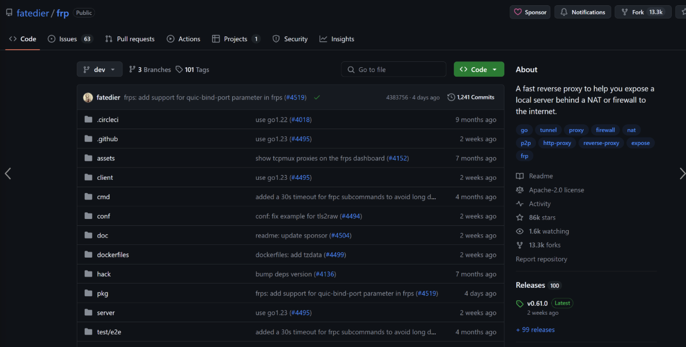
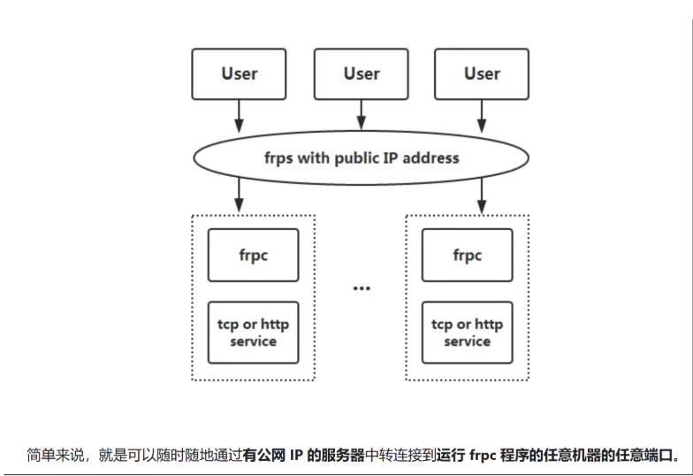
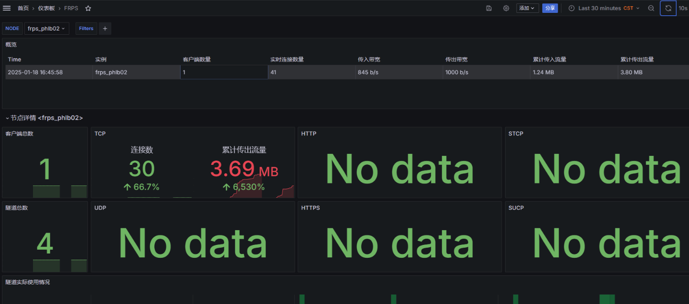

# FRP

frp **是一个可用于内网穿透的高性能的反向代理应用，支持 tcp, udp 协议（亦支持socks5），为 http 和 https 应用协议提供了额外的能力，且尝试性支持了点对点穿透。名称其实就是使用了 Fast Reverse Proxy 的首字母缩写；用GO语言编写的。**

备注：目前社区相比NPS项目还是非常活跃的，笔者前几天NPS服务被ban了几天（估计是运营商检查到了流量），所以用备选方案用了frp，目前来看还是非常不错的，有着部署简便、配置清晰等特点。

Github地址：https://github.com/fatedier/frp

中文文档：https://gofrp.org/zh-cn/docs/





**附：设置promethus监控**

文档：https://gofrp.org/zh-cn/docs/features/common/monitor/

Grafana面板：https://grafana.com/grafana/dashboards/20370-frps/

```go
//frps开启监控开关
enablePrometheus = true

//prometheus
- job_name: 'frp'
    scrape_interval: 5s
    metrics_path: /metrics
    static_configs:
      - targets: ['frps地址:端口号']
        labels:
          instance: 'frps_phlb02'
    basic_auth:
      username: 'frp面板用户名'
      password: 'frp面板密码'
```



**附：服务端配置**

```go
//cat frps.toml
bindPort = 7001
auth.token = "123456"
vhostHTTPPort = 7002
webServer.addr = "0.0.0.0"
webServer.port = 8081
webServer.user = "admin"
webServer.password = "admin"
enablePrometheus = true
```

**附：客户端配置**

```go
//cat frpc.toml
serverAddr = "111.111.111.111"
serverPort = 7001
auth.token = "123456"

[[proxies]]
name = "wiki"
type = "tcp"
localIP = "192.168.10.1"
localPort = 8090
remotePort = 8090
transport.useEncryption = true
transport.useCompression = true

[[proxies]]
name = "plugin_socks5"
type = "tcp"
remotePort = 3000
transport.useEncryption = true
transport.useCompression = true
[proxies.plugin]
type = "socks5"
username = "admin"
password = "admin123"
```


