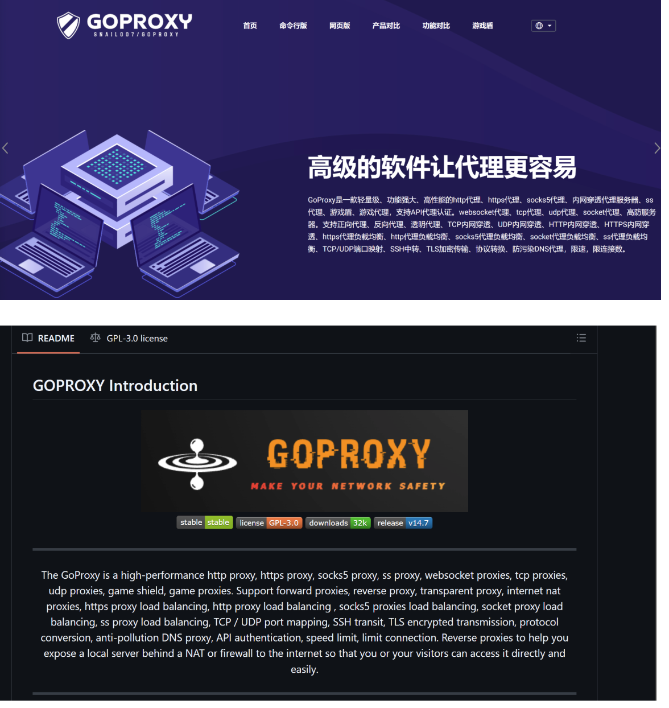

# Goproxy

GoProxy是golang实现的高性能http,https,websocket,tcp,socks5代理服务器,支持内网穿透,链式代理,通讯加密,智能HTTP,SOCKS5代理,黑白名单,限速,限流量,限连接数,跨平台,KCP支持,认证API。

开源地址：https://github.com/snail007/goproxy

中文文档：https://snail007.host900.com/goproxy/manual/zh/#/

官网网址：https://www.goproxy.win/

