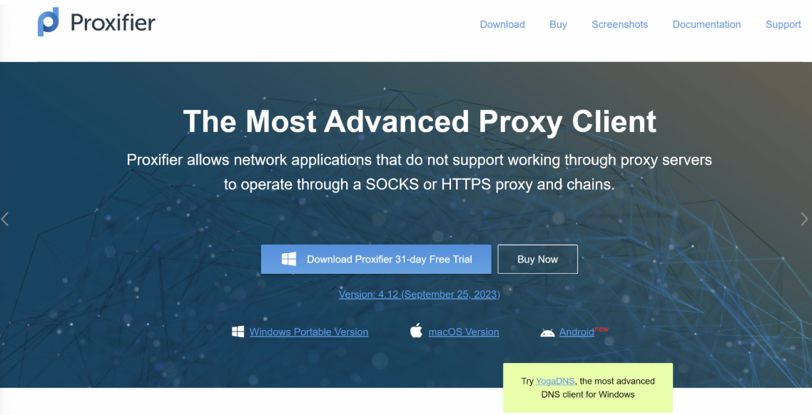
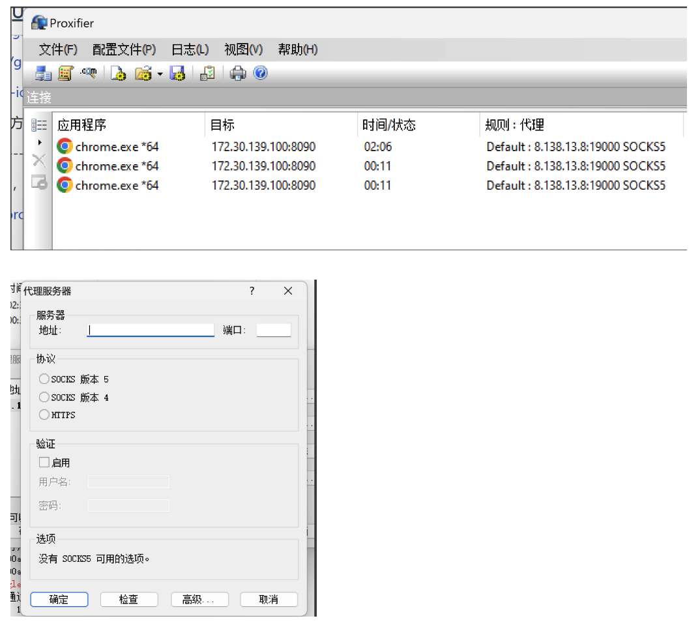

# NPS

nps是一款轻量级、高性能、功能强大的内网穿透代理服务器。支持tcp、udp、socks5、http等几乎所有流量转发，可用来访问内网网站、本地支付接口调试、ssh访问、远程桌面，内网dns解析、内网socks5代理等等……，并带有功能强大的web管理端。

目前nps的开源社区最新版本为v0.26.10，社区已经几年没有活跃了，且带有漏洞；不过有其他的分支还在活跃中，修复了漏洞，可进行下载和安装。

非常适合家里没有公网ip（就是只有wifi），但是有一台云服务器，想在公网环境访问内网环境的爱好者。


官方github地址：https://github.com/ehang-io/nps

现还在活跃分支：https://github.com/yisier/nps

安装文档：https://ehang-io.github.io/nps/#/

具体安装和使用可参考官方文档，较为简单，可快速实现内网穿透等工作，非常适合入门，还是很好用的。

**备注：**如果想用**socks5连接**的话，客户端可以考虑用**Proxifier**这款软件，以下为该软件的介绍：

官方地址：https://www.proxifier.com/



只需在配置文件中配上服务器的相关信息就能访问内网中的服务了：



**附：nps服务端配置**

```go
// cat /etc/nps.conf
appname = nps
#Boot mode(dev|pro)
runmode = dev
#HTTP(S) proxy port, no startup if empty
http_proxy_ip=0.0.0.0
http_proxy_port=8080
https_proxy_port=8443
https_just_proxy=false
#default https certificate setting
https_default_cert_file=conf/epaifa.com.pem
https_default_key_file=conf/epaifa.com.key
##bridge
bridge_type=tcp
bridge_port=8024
bridge_ip=0.0.0.0
# Public password, which clients can use to connect to the server
# After the connection, the server will be able to open relevant ports and parse related domain names according to its own configuration file.
public_vkey=1232bdh2378
#Traffic data persistence interval(minute)
#Ignorance means no persistence
flow_store_interval=1
# log level LevelEmergency->0  LevelAlert->1 LevelCritical->2 LevelError->3 LevelWarning->4 LevelNotice->5 LevelInformational->6 LevelDebug->7
log_level=6
log_path=/tmp/nps.log
#Whether to restrict IP access, true or false or ignore
#ip_limit=true
#p2p
#p2p_ip=127.0.0.1
#p2p_port=6000
#web
web_host=phlb.tutupengpeng.com
web_username=admin
web_password=xxxx
web_port=8081
web_ip=0.0.0.0
web_base_url=/nps
web_open_ssl=true
web_cert_file=/etc/nps/conf/phlb.tutupengpeng.com.pem
web_key_file=/etc/nps/conf/phlb.tutupengpeng.com.key
# if web under proxy use sub path. like http://host/nps need this.
#web_base_url=/nps
#Web API unauthenticated IP address(the len of auth_crypt_key must be 16)
#Remove comments if needed
#auth_key=test
auth_key=123qwuirbewj
#获取服务端authKey时的aes加密密钥，16位
auth_crypt_key =l1BMC+F%boX)SXPo
#allow_ports=9001-9009,10001,11000-12000
#Web management multi-user login
allow_user_login=true
allow_user_register=false
allow_user_change_username=false
#extension
#流量限制
allow_flow_limit=false
#带宽限制
allow_rate_limit=false
#客户端最大隧道数限制
allow_tunnel_num_limit=false
allow_local_proxy=true
#客户端最大连接数
allow_connection_num_limit=false
#每个隧道监听不同的服务端端口
allow_multi_ip=true
system_info_display=true
#获取用户真实ip
http_add_origin_header=true
#cache
http_cache=false
http_cache_length=100
#get origin ip
#http_add_origin_header=false
#pprof debug options
#pprof_ip=0.0.0.0
#pprof_port=9999
#client disconnect timeout
disconnect_timeout=120
#管理面板开启验证码校验
open_captcha=true
# 是否开启tls
tls_enable=true
tls_bridge_port=8025
```

