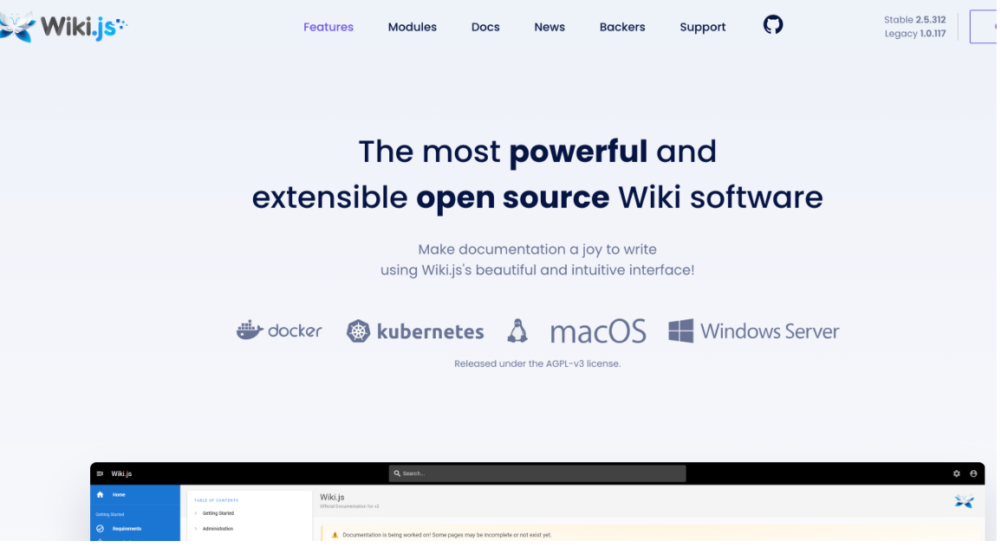
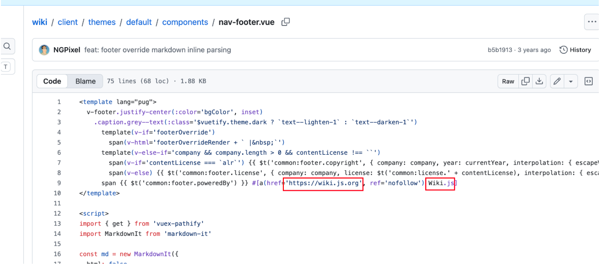
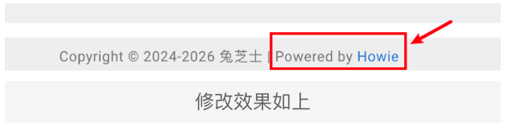
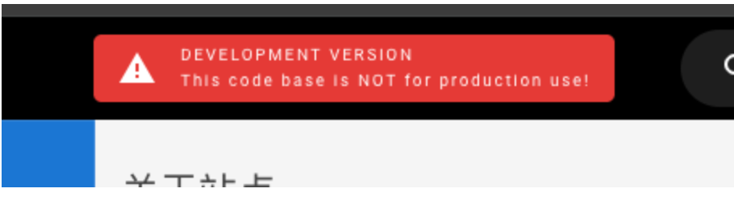

# Wiki.js


Wiki.js是一个强大且简洁的开源wiki软件，本站点即基于wikijs技术部署，下面我们将简要介绍部署过程。

开源地址：https://github.com/Requarks/wiki
官网网站：https://js.wiki/



## 1、安装前注意事项

安装前官网说明事项：https://docs.requarks.io/install/requirements

本次本地安装环境为：

| mysql   | 8.0.44   |
| ------- | -------- |
| node    | v24.18.0 |
| npm     | 11.16.0  |
| wiki-js | v2.5.314 |

## 2、获取安装介质

此处我们选择源码编译和安装，为什么不选择RPM或者Docker的方式？因为我们要修改官网默认的页脚，只能通过修改源代码重新编译的方式才能解决。

获取源码：https://github.com/requarks/wiki/archive/refs/tags/v2.5.312.tar.gz   （我们此处以 v2.5.312 版本为例，本地为MacOS系统）

将源码包放置在本地，修改官网默认页脚，修改成自己定制的域名和显示即可，修改完需要重新编译才能生效，修改位置如下图所示：



修改效果：



因为我们用的是源码编译安装，安全完毕后head这里会出现“开发分支提示”，如下图，我们需要在编译之前修改源码文件去除这一提示：



```go
vim src/client/components/common/nav-header.vue
// 搜索 prod 字样，将那几行代码删除即可。
```

## 3、编译和安装

```go
// （可选）设置国内下载源
sudo npm config get registry
sudo npm config set registry https://registry.npmmirror.com
// 安装依赖
sudo npm install --legacy-peer-deps
// 编译代码
sudo npm run build
// 启动命令
NODE_ENV=production nohup node server > nohup.out 2>&1 &
```

```go
// 附带config配置如下

#######################################################################
# Wiki.js - CONFIGURATION                                             #
#######################################################################
# Full documentation + examples:
# https://docs.requarks.io/install

# ---------------------------------------------------------------------
# Port the server should listen to
# ---------------------------------------------------------------------

port: xxxxx

# ---------------------------------------------------------------------
# Database
# ---------------------------------------------------------------------
# Supported Database Engines:
# - postgres = PostgreSQL 9.5 or later
# - mysql = MySQL 8.0 or later (5.7.8 partially supported, refer to docs)
# - mariadb = MariaDB 10.2.7 or later
# - mssql = MS SQL Server 2012 or later
# - sqlite = SQLite 3.9 or later

db:
  type: mysql

  # PostgreSQL / MySQL / MariaDB / MS SQL Server only:
  host: 127.0.0.1
  port: 3306
  user: root
  pass: xxxxxxxxx
  db: wiki
  ssl: false

  # Optional - PostgreSQL / MySQL / MariaDB only:
  # -> Uncomment lines you need below and set `auto` to false
  # -> Full list of accepted options: https://nodejs.org/api/tls.html#tls_tls_createsecurecontext_options
  sslOptions:
    auto: true
    # rejectUnauthorized: false
    # ca: path/to/ca.crt
    # cert: path/to/cert.crt
    # key: path/to/key.pem
    # pfx: path/to/cert.pfx
    # passphrase: xyz123

  # Optional - PostgreSQL only:
  schema: public

  # SQLite only:
  storage: path/to/database.sqlite

#######################################################################
# ADVANCED OPTIONS                                                    #
#######################################################################
# Do not change unless you know what you are doing!

# ---------------------------------------------------------------------
# SSL/TLS Settings
# ---------------------------------------------------------------------
# Consider using a reverse proxy (e.g. nginx) if you require more
# advanced options than those provided below.

ssl:
  enabled: false
  port: 3443

  # Provider to use, possible values: custom, letsencrypt
  provider: custom

  # ++++++ For custom only ++++++
  # Certificate format, either 'pem' or 'pfx':
  format: pem
  # Using PEM format:
  key: wiki.uhowie.com.crt
  cert: wiki.uhowie.com.key
  # Using PFX format:
  pfx: path/to/cert.pfx
  # Passphrase when using encrypted PEM / PFX keys (default: null):
  passphrase: null
  # Diffie Hellman parameters, with key length being greater or equal
  # to 1024 bits (default: null):
  dhparam: null

  # ++++++ For letsencrypt only ++++++
  domain: wiki.yourdomain.com
  subscriberEmail: admin@example.com

# ---------------------------------------------------------------------
# Database Pool Options
# ---------------------------------------------------------------------
# Refer to https://github.com/vincit/tarn.js for all possible options

pool:
  # min: 2
  # max: 10

# ---------------------------------------------------------------------
# IP address the server should listen to
# ---------------------------------------------------------------------
# Leave 0.0.0.0 for all interfaces

bindIP: 0.0.0.0

# ---------------------------------------------------------------------
# Log Level
# ---------------------------------------------------------------------
# Possible values: error, warn, info (default), verbose, debug, silly

logLevel: error

# ---------------------------------------------------------------------
# Log Format
# ---------------------------------------------------------------------
# Output format for logging, possible values: default, json

logFormat: default

# ---------------------------------------------------------------------
# Offline Mode
# ---------------------------------------------------------------------
# If your server cannot access the internet. Set to true and manually
# download the offline files for sideloading.

offline: false

# ---------------------------------------------------------------------
# High-Availability
# ---------------------------------------------------------------------
# Set to true if you have multiple concurrent instances running off the
# same DB (e.g. Kubernetes pods / load balanced instances). Leave false
# otherwise. You MUST be using PostgreSQL to use this feature.

ha: false

# ---------------------------------------------------------------------
# Data Path
# ---------------------------------------------------------------------
# Writeable data path used for cache and temporary user uploads.
dataPath: ./data

# ---------------------------------------------------------------------
# Body Parser Limit
# ---------------------------------------------------------------------
# Maximum size of API requests body that can be parsed. Does not affect
# file uploads.

bodyParserLimit: 5mb

server:
  trustProxy: true
```

