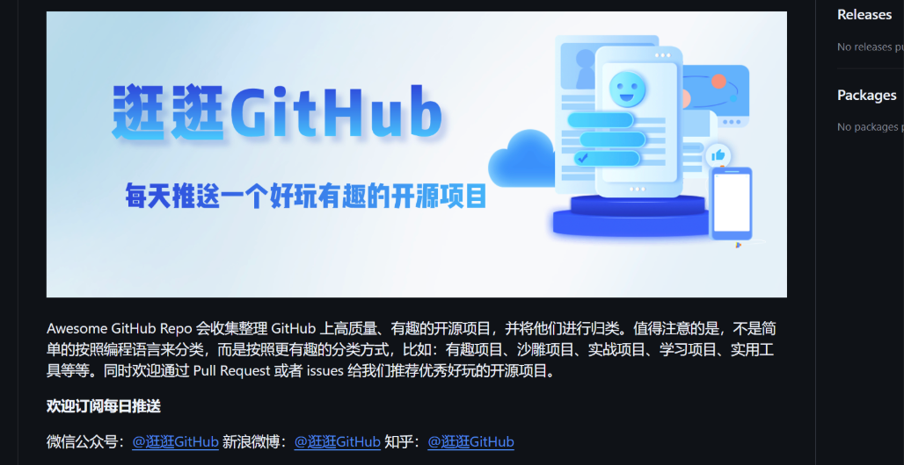
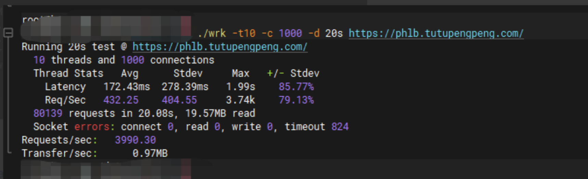

# 实用工具


分享好用的开源等软件和工具

## Github社区工具

每日优秀的Github项目推荐：https://github.com/Wechat-ggGitHub/Awesome-GitHub-Repo



### **1、Docker-OSX**

Docker容器运行Mac VMos系统

地址：https://github.com/sickcodes/Docker-OSX

### **2、GPT-SoVITS** 

GPT-SoVITS 是一个基于少量语音数据（1 分钟左右）即可训练出高质量 TTS（文本转语音）模型的开源项目

地址：https://github.com/RVC-Boss/GPT-SoVITS

### **3、So-VITS-SVC**

So-VITS-SVC 是一个开源的语音转换项目，其全称为 SoftVC VITS Singing Voice Conversion，专注于通过深度学习模型实现语音转换，尤其适用于歌声转换

地址：https://github.com/svc-develop-team/so-vits-svc

### **4、Redis内存分析**

https://github.com/sripathikrishnan/redis-rdb-tools

### **5、日志工具**

Logviewer：https://github.com/sevdokimov/log-viewer

### **6、微信公众号文章下载**

github地址：https://github.com/qiye45/wechatDownload

### **7、用摄像头传输文件的开源项目**

地址：https://github.com/sz3/libcimbar

解码器安卓应用：https://github.com/sz3/cfc

### **8、轻量的网页打包工具**

基于 Rust Tauri 框架开发的网页打包工具：Pake, 一键将网页打包成很小的桌面 App。相比传统的 Electron 套壳打包，使用 Pake 要更小更轻量

地址：https://github.com/tw93/Pake

### **9、数据可视化神器**

开源项目 jsoncrack 可将各种数据格式（如 JSON、YAML、XML、CSV 等）转换为交互式图表

地址：https://github.com/AykutSarac/jsoncrack.com

### 10、一站式视频翻译和配音工具

VideoLingo 是一款一站式视频翻译和配音工具，生成 Netflix 级的高质量字幕和配音，告别生硬机翻和多行字幕，让全球知识跨越语言障碍共享

地址：https://github.com/Huanshere/VideoLingo

### **11、开源的人脸编辑 AI 神器**

它是一个强大的开源 AI 项目，专注于人脸置换和增强技术。它通过深度学习算法实现对图片和视频中的人脸进行识别、替换、增强等操作；FaceFusion 支持多种功能，包括人脸交换、表情控制、唇形同步和年龄修改等，广泛应用于娱乐、创意设计和研究领域。

地址：https://github.com/facefusion/facefusion

### **12、数学公式秒变可视化图表**

Penrose 是一个平台，人们 只需输入纯文本符号即可创建精美的图表。开发者的目标是让非专业人士也能轻松创建和探索高质量的图表，并深入了解具有挑战性的技术概念

地址：https://github.com/penrose/penrose

### **13、让搭载浏览器的任何显示器成为你的扩展屏**

Deskreen turns any device with a web browser into a secondary screen for your computer. 

代码：https://github.com/pavlobu/deskreen?tab=readme-ov-file

官网：https://deskreen.com/lang-zh_CN

### **14、压测软件**

Ohayou(おはよう), HTTP load generator, inspired by rakyll/hey with tui animation.

地址：https://github.com/hatoo/oha

## 性能检测

### wrk （HTTP 压测工具）

地址：https://github.com/wg/wrk

安装：git https://github.com/wg/wrk.git && make

用法：./wrk -t10 -c 1000 -d 20s https://phlb.tutupengpeng.com/

-t  线程数

-c 请求数

-d 持续时间



### krr（k8s资源推荐工具）

地址：https://github.com/robusta-dev/krr?tab=readme-ov-file

## 抓包工具

### Wireshark

https://www.wireshark.org/

### Charles

https://www.charlesproxy.com/

### Fiddler

https://www.telerik.com/fiddler-b

### QPA

[http://www.l7dpi.com](http://www.l7dpi.com/)

### Microsoft Network Monitor

https://www.manageengine.com/network-monitoring/microsoft-network-monitoring.html

### Reqable（Fiddler + Charles + Postman）

https://github.com/reqable/reqable-app

### kyanos

官网：https://kyanos.io/

开源社区：https://github.com/hengyoush/kyanos?tab=readme-ov-file

## 数据库

### DuckDB

官网：https://duckdb.org/

文档：https://duckdb.org/docs/

## 系统安装

### Rufus（u盘启动器）

https://rufus.ie/

### proxmox（pve虚拟机）

[https://www.proxmox.com](https://www.proxmox.com/)

### 大量免费镜像下载（网友提供）

地址：[cios.dhitechnical.com](http://cios.dhitechnical.com/)

## 网络安全

### Xrag

https://docs.xray.cool/Introduction

```go
//对接企微的代码
from flask import Flask, request
import requests
import datetime
import logging

app = Flask(__name__)

def push_ftqq(content):
    resp = requests.post("https://qyapi.weixin.qq.com/cgi-bin/webhook/send?key=xxxxxxxx",
                         json={"msgtype": "markdown",
                               "markdown": {"content": content}})
    if resp.json()["errno"] != 0:
        raise ValueError("push wechat group failed, %s" % resp.text)

@app.route('/webhook', methods=['POST'])
def xray_webhook():
    data = request.json
    typed = data["type"]
    if typed == "web_statistic":
        return 'ok'
    vuln = data["data"]
    content = """## xray 发现漏洞

URL: {url}

插件: {plugin}

创建时间: {create_time}

""".format(url=vuln["detail"]["addr"], plugin=vuln["plugin"],
           create_time=str(datetime.datetime.fromtimestamp(vuln["create_time"] / 1000)))
    try:
        push_ftqq(content)
    except Exception as e:
        logging.exception(e)
    return 'ok'


if __name__ == '__main__':
    app.run()
```

### Nessus

http://www.nessus.org/

### ClamAV

https://www.clamav.net/

### 河马杀毒

官方站点：https://www.shellpub.com/

linux教程：https://www.shellpub.com/doc/hm_linux_usage.html

win教程：https://blog.shellpub.com/2020/07/14/hm_windows_usage.html

## HTTPS证书

```go
//获取免费的https证书的站点
1、Let's Encrypt
2、Cloudflare
3、ZeroSSL
4、SSL For Free
5、httpsok-SSL
//httpsok一行命令，轻松搞定SSL证书自动续签。
地址：https://httpsok.com/p/4c9d
```

## Fail2ban

见子章节 [Fail2ban](https://wiki.uhowie.com/tech/tools/fail2ban)

## SafeLine雷池

免费开源的WAF软件

地址：https://github.com/chaitin/SafeLine